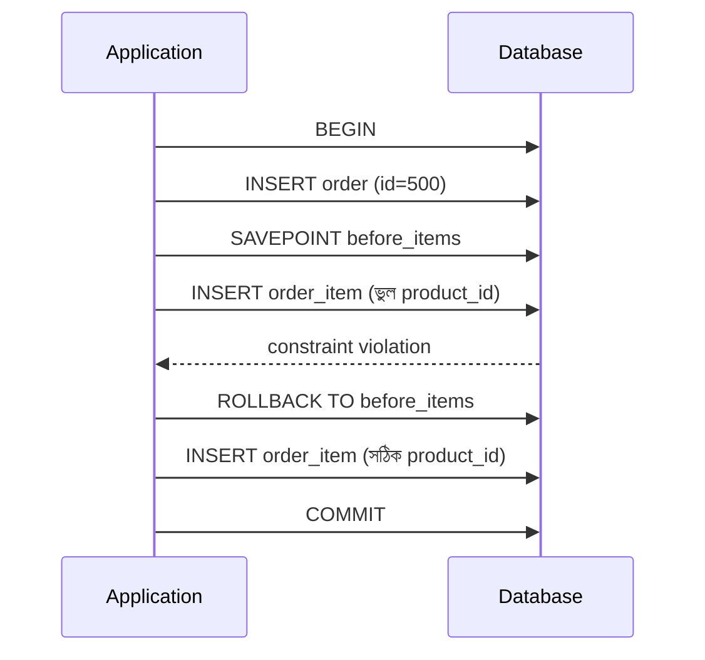

# ০২. TCL: COMMIT, ROLLBACK, SAVEPOINT

Module 19-এর প্রায় প্রতিটা লেসনে আমরা `BEGIN ... COMMIT` ব্লক ব্যবহার করেছি, কিন্তু কখনো থেমে ব্যাখ্যা করিনি এই তিনটা শব্দ ঠিক কী করে। এখন সময় হয়েছে সেই **TCL (Transaction Control Language)** নিয়ে গভীরভাবে বোঝার।

`BEGIN` (কোথাও `START TRANSACTION`) বলে দেয় — "এখান থেকে যা যা কমান্ড চলবে, সেগুলো একটা দলে বাঁধা, এখনো স্থায়ী না"। `COMMIT` বলে — "এই দলের সব পরিবর্তন এখন স্থায়ী করে দাও"। `ROLLBACK` বলে — "এই দলের সব পরিবর্তন বাতিল করে আগের অবস্থায় ফিরে যাও"।

এটাকে একটা ওয়ার্ড ডকুমেন্টের "ড্রাফট মোড"-এর মতো ভাবতে পারো — তুমি অনেক এডিট করে ফেললে, কিন্তু "Save" না চাপা পর্যন্ত আসল ফাইলে কিছু বদলায় না। ভুল করে ফেললে "Undo" চেপে সবকিছু ফেরত আনা যায় — সেটাই `ROLLBACK`।

```sql
BEGIN;
  UPDATE inventory SET quantity = quantity - 5 WHERE product_id = 3;
  UPDATE inventory SET quantity = quantity + 5 WHERE product_id = 3 AND warehouse_id = 2;
  -- এখানে যদি বুঝতে পারি ভুল product_id ব্যবহার হয়েছে
ROLLBACK;
-- এখন দুটো UPDATE-ই বাতিল, ডাটাবেজ আগের মতোই আছে
```

কিন্তু বড় Transaction-এ মাঝে মাঝে পুরোটা বাতিল না করে শুধু একটা অংশ বাতিল করতে চাই — এর জন্য আছে `SAVEPOINT`, যেটাকে "চেকপয়েন্ট" ভাবা যায়:

```sql
BEGIN;
  INSERT INTO orders (customer_id, status) VALUES (1, 'pending') RETURNING id; -- id = 500

  SAVEPOINT before_items;
  INSERT INTO order_items (order_id, product_id, quantity, unit_price)
    VALUES (500, 999, 1, 100.00);  -- ধরি product_id ভুল, এটা আসলে নেই

  ROLLBACK TO before_items;  -- শুধু order_items-এর ইনসার্টটাই বাতিল হলো, order-টা টিকে রইলো

  INSERT INTO order_items (order_id, product_id, quantity, unit_price)
    VALUES (500, 7, 1, 499.00);  -- সঠিক product_id দিয়ে আবার চেষ্টা
COMMIT;
```



Module 20-এর লেসন ১-এ শেখা DCL role-গুলো Transaction-এর ওপরও প্রভাব ফেলে — যদি একজন ইউজারের `INSERT` অনুমতিই না থাকে, তার Transaction-এর ভেতরের `INSERT` স্টেটমেন্টেই এরর হয়ে পুরো ব্লক ব্যর্থ হবে।

একটা গুরুত্বপূর্ণ বাস্তব নিয়ম — Node.js/Express অ্যাপ্লিকেশনে Transaction ব্যবহার করার সময় সবসময় `try/catch` (Module 5-এ শেখা async/await প্যাটার্ন) দিয়ে wrap করা উচিত, যাতে কোনো এরর হলে অ্যাপ্লিকেশন কোড নিজে `ROLLBACK` চালাতে পারে:

```js
const client = await pool.connect();
try {
  await client.query('BEGIN');
  await client.query('UPDATE inventory SET quantity = quantity - $1 WHERE product_id = $2', [5, 3]);
  await client.query('INSERT INTO orders (customer_id) VALUES ($1)', [1]);
  await client.query('COMMIT');
} catch (err) {
  await client.query('ROLLBACK');
  throw err;
} finally {
  client.release();
}
```

এই কোডটা ঠিক Module 19-এর প্রতিটা ডোমেইনে আমরা যে SQL ব্লক দেখিয়েছিলাম, সেটারই Node.js-সাইড বাস্তবায়ন। এখন Transaction-এর ভেতরের একক কমান্ডগুলোর দিকে ফিরি — বিশেষ করে যখন একাধিক টেবিল থেকে একসাথে ডেটা আনতে হয়, তখন লাগে JOIN, যেটা আমরা পরের লেসনে শিখবো।
