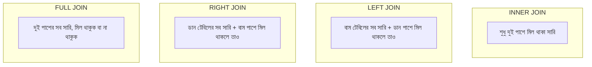

# ০৪. Types of JOINs: INNER, LEFT, RIGHT, FULL

আগের লেসনের JOIN-টা আসলে একটা নির্দিষ্ট ধরন — **INNER JOIN** (শুধু লিখলে `JOIN` মানেও ডিফল্টে `INNER JOIN`)। এর মানে হলো — দুই টেবিলেই যেখানে মিল আছে, শুধু সেই সারিগুলোই ফলাফলে আসবে। যার কোনো Order নেই, সেই Customer পুরোপুরি বাদ পড়ে যাবে।

কিন্তু বাস্তবে অনেক প্রশ্ন থাকে যেখানে "মিল না থাকা" সারিগুলোও দরকার — যেমন "সব কাস্টমার দেখাও, তাদের অর্ডার থাকুক বা না থাকুক" (মার্কেটিং টিম হয়তো জানতে চায় কে কখনো অর্ডার করেনি)। এখানেই আসে বাকি তিন ধরনের JOIN।



**LEFT JOIN** — বাম দিকের (FROM-এ লেখা) টেবিলের সব সারি রাখা হয়, ডান দিকে মিল না পাওয়া গেলে সেই কলামগুলো `NULL` হয়ে যায়:

```sql
SELECT customers.name, orders.id AS order_id
FROM customers
LEFT JOIN orders ON customers.id = orders.customer_id;
-- যাদের কোনো অর্ডার নেই, তাদের order_id NULL দেখাবে, কিন্তু নামটা তালিকায় থাকবে
```

এটা দিয়ে খুব সহজে "কখনো অর্ডার করেনি এমন কাস্টমার" বের করা যায়:

```sql
SELECT customers.name
FROM customers
LEFT JOIN orders ON customers.id = orders.customer_id
WHERE orders.id IS NULL;
```

**RIGHT JOIN** ঠিক উল্টো — ডান দিকের টেবিলের সব সারি রাখা হয়। বাস্তবে `RIGHT JOIN` কম ব্যবহার হয়, কারণ টেবিলের ক্রম বদলে `LEFT JOIN` দিয়েই একই কাজ করা যায় — তাই বেশিরভাগ ডেভেলপার `LEFT JOIN`-কেই default অভ্যাস হিসেবে ব্যবহার করে, পড়তে সহজ হয় বলে।

**FULL JOIN** (বা `FULL OUTER JOIN`) দুই পাশের সবকিছু রাখে — Module 19-এর Job Portal উদাহরণে যদি জানতে চাও "সব Candidate আর সব Job Posting, তাদের মধ্যে Application থাকুক বা না থাকুক":

```sql
SELECT candidates.name, job_postings.title
FROM candidates
FULL JOIN applications ON candidates.id = applications.candidate_id
FULL JOIN job_postings ON job_postings.id = applications.job_id;
```

একটা তুলনা যেটা মনে রাখলে সহজ হয় — Module 9-এ শেখা JavaScript array-এর `.filter()` মেথডের সাথে INNER JOIN-এর একটা মিল আছে: `.filter()` শুধু শর্ত পূরণ করা উপাদান রাখে, ঠিক যেমন INNER JOIN শুধু মিল থাকা সারি রাখে। কিন্তু LEFT JOIN-এর কোনো সরাসরি array মেথড তুলনা নেই — এটা SQL-এর নিজস্ব একটা শক্তিশালী ক্ষমতা, যেটা সহজ লুপ দিয়ে অনুকরণ করা বেশ কষ্টকর।

JOIN-এর ভেতরের ফলাফল যখন আরেকটা কোয়েরির ইনপুট হিসেবে দরকার হয়, তখন আরেকটা কৌশল কাজে লাগে — Subquery, যেটাই পরের লেসনের বিষয়।
