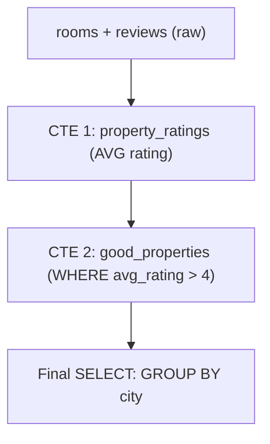

# ০৭. Understanding Common Table Expressions (CTEs)

আগের লেসনে যে nested query লিখেছিলাম, সেটা একবার পড়ে বুঝা একটু কষ্টকর ছিল — ভেতরের কোয়েরি আগে খুঁজে বের করতে হয়, তারপর বাইরেরটা। **CTE (Common Table Expression)** এই একই কাজ করে, কিন্তু কোয়েরিটাকে ওপর থেকে নিচে, ধাপে ধাপে পড়ার মতো করে সাজায় — অনেকটা Module 5-এ শেখা `async/await`-এর মতো, যেটা callback-এর "ভেতরে ভেতরে" নেস্টিং সরিয়ে কোডকে একটার পর একটা ধাপ হিসেবে পড়ার সুযোগ দিয়েছিল।

CTE লেখা হয় `WITH` কীওয়ার্ড দিয়ে, একটা নাম দিয়ে, তারপর মূল কোয়েরিতে সেই নামটা ব্যবহার করে। আগের লেসনের Seller টোটাল সেলসের কোয়েরিটা CTE দিয়ে লিখলে:

```sql
WITH seller_totals AS (
  SELECT products.seller_id, SUM(order_items.quantity * order_items.unit_price) AS total_sales
  FROM order_items
  JOIN products ON products.id = order_items.product_id
  GROUP BY products.seller_id
)
SELECT seller_id, total_sales
FROM seller_totals
WHERE total_sales > 10000;
```

লক্ষ্য করো — এখানে কোনো nested বন্ধনী নেই, পড়তে হচ্ছে ওপর থেকে নিচে: "প্রথমে seller_totals নামে একটা হিসাব তৈরি করো, তারপর তার থেকে ফিল্টার করে দেখাও।" এটাই CTE-র সবচেয়ে বড় সুবিধা — readability।

CTE-র আরেকটা শক্তি হলো, একাধিক CTE একসাথে চেইন করা যায়, প্রতিটা আগেরটার ওপর নির্ভর করে — Module 19-এর Booking সিস্টেমের উদাহরণ দিয়ে দেখি, "প্রতিটা Property-র গড় রেটিং বের করো, তারপর যেসব Property-র গড় রেটিং ৪-এর বেশি তাদের City-ভিত্তিক গণনা দেখাও":

```sql
WITH property_ratings AS (
  SELECT rooms.property_id, AVG(reviews_rating) AS avg_rating
  FROM rooms
  -- ধরে নিচ্ছি রুম-ভিত্তিক রেটিং একটা যোগ করা কলাম আছে, উদাহরণের সরলতার জন্য
  GROUP BY rooms.property_id
),
good_properties AS (
  SELECT properties.city, property_ratings.property_id
  FROM property_ratings
  JOIN properties ON properties.id = property_ratings.property_id
  WHERE property_ratings.avg_rating > 4
)
SELECT city, COUNT(*) AS good_property_count
FROM good_properties
GROUP BY city;
```



তিনটা ধাপ — প্রতিটা নিজের নামে, একটার পর একটা — ঠিক যেমন একটা রেসিপির ধাপগুলো নাম্বার দিয়ে লেখা থাকে, কোনোটা এলোমেলোভাবে অন্যটার ভেতরে গুঁজে দেয়া না।

আরেকটা বিশেষ ধরনের CTE আছে — **Recursive CTE**, যেটা নিজেকে নিজেই বারবার কল করে, যতক্ষণ না একটা শর্ত পূরণ হয়। এটা কাজে লাগে যখন ডেটার মধ্যে গাছের (tree) মতো গঠন থাকে — যেমন Module 19-এর লেসন ৩-এর Blogpost হোমওয়ার্কে Comment-এর reply-of-reply, বা একটা organization chart-এ ম্যানেজারের ম্যানেজার খুঁজে বের করা। এই কোর্সের পরিধিতে আমরা সেটা বিস্তারিত করবো না, কিন্তু নাম জেনে রাখা ভালো — ভবিষ্যতে জটিল hierarchical ডেটা সামলানোর সময় এটাই খুঁজবে।

এখন পর্যন্ত আমরা যা শিখেছি সব "কোন সারিগুলো দেখাবো" আর "কীভাবে গ্রুপ করবো" নিয়ে। কিন্তু কখনো কখনো দরকার হয় প্রতিটা সারির পাশে তার "র‍্যাংক" বা "চলমান যোগফল" দেখানো, গ্রুপে না ভেঙে — এই শক্তিশালী ক্ষমতাটাই আসে Window Function থেকে, যেটাই এই মডিউলের শেষ এবং সবচেয়ে চমকপ্রদ লেসন।
