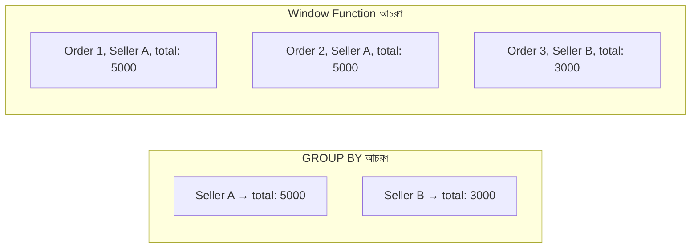

# ০৮. Implementing Window Functions

Module 17-এ আমরা `GROUP BY` শিখেছিলাম — কিন্তু `GROUP BY`-এর একটা সীমাবদ্ধতা আছে: এটা অনেকগুলো সারিকে একটামাত্র সারিতে "গুঁড়িয়ে" ফেলে। যেমন "প্রতিটা Seller-এর মোট বিক্রি" জানতে চাইলে, প্রতিটা আলাদা অর্ডারের সারি হারিয়ে যায়, শুধু একটা যোগফল থাকে।

কিন্তু অনেক সময় দরকার হয় দুটোই একসাথে — প্রতিটা অর্ডারের সারিও রাখা, আবার তার পাশে একটা এগ্রিগেট তথ্যও (যেমন "এই সেলারের এখন পর্যন্ত সবচেয়ে বেশি বিক্রি কত" অথবা "এই মাসে এই সেলারের অর্ডারগুলোর মধ্যে এই অর্ডারটা কততম")। এই কাজটাই করে **Window Function** — এটা সারিগুলোকে গুঁড়িয়ে ফেলে না, বরং প্রতিটা সারির "চারপাশে একটা জানালা (window)" তৈরি করে সেই জানালার ভেতরের ডেটা দিয়ে হিসাব করে।

সিনট্যাক্সের মূল অংশ হলো `OVER (...)`:

```sql
SELECT
  seller_id,
  order_id,
  amount,
  SUM(amount) OVER (PARTITION BY seller_id) AS seller_total,
  RANK() OVER (PARTITION BY seller_id ORDER BY amount DESC) AS rank_in_seller
FROM sales;
```

`PARTITION BY seller_id` অংশটা `GROUP BY`-এর মতোই কাজ করছে — সেলার অনুযায়ী ভাগ করছে — কিন্তু সারিগুলো গুঁড়িয়ে যাচ্ছে না, প্রতিটা সারি টিকে থাকছে, শুধু তার পাশে গ্রুপ-লেভেল হিসাব (এখানে `seller_total`) যোগ হচ্ছে।



`RANK()` একটা জনপ্রিয় Window Function, যেটা প্রতিটা Partition-এর ভেতরে ক্রম অনুযায়ী নাম্বার বসিয়ে দেয় — Module 19-এর Job Portal উদাহরণ দিয়ে দেখি, "প্রতিটা Company-র জন্য তাদের সবচেয়ে বেশি Application পাওয়া Job Posting খুঁজে বের করো":

```sql
WITH ranked_jobs AS (
  SELECT
    job_postings.company_id,
    job_postings.title,
    COUNT(applications.id) AS application_count,
    RANK() OVER (
      PARTITION BY job_postings.company_id
      ORDER BY COUNT(applications.id) DESC
    ) AS rnk
  FROM job_postings
  LEFT JOIN applications ON applications.job_id = job_postings.id
  GROUP BY job_postings.company_id, job_postings.id, job_postings.title
)
SELECT company_id, title, application_count
FROM ranked_jobs
WHERE rnk = 1;
```

এখানে লক্ষ্য করো — আমরা Module 20-এর লেসন ৭-এ শেখা CTE, Module 20-এর লেসন ৪-এর LEFT JOIN, Module 17-এর GROUP BY, আর এই লেসনের Window Function — সবগুলো একসাথে ব্যবহার করে ফেললাম একটা বাস্তব প্রশ্নের উত্তর দিতে। এটাই দেখায় কেন SQL শেখাটা "একটা একটা করে টুকরো শেখা" না, বরং শেষে সব টুকরো একসাথে জোড়া লাগানোর একটা দক্ষতা।

আরেকটা দরকারি Window Function হলো `ROW_NUMBER()`, যেটা প্রতিটা Partition-এ ১, ২, ৩... করে গোনে (ties থাকলেও আলাদা নাম্বার দেয়, `RANK()`-এর মতো একই নাম্বার শেয়ার করে না), আর `LAG()`/`LEAD()`, যেগুলো দিয়ে "আগের সারি" বা "পরের সারি"-র মান পাওয়া যায় — যেমন "গত মাসের তুলনায় এই মাসের বিক্রি কত বাড়লো" হিসাব করতে।

এই লেসন দিয়েই Module 20 — এবং এর সাথে গোটা এই কোর্সের ডাটাবেজ ও SQL অংশ — শেষ হলো। শুরু করেছিলাম Module 15-এ "কেন আমাদের একটা ডাটাবেজ দরকার" প্রশ্ন দিয়ে, তারপর স্কিমা ডিজাইন, নরমালাইজেশন, ERD, আর সবশেষে Transaction, JOIN, Subquery, CTE, আর Window Function-এর মতো শক্তিশালী টুল দিয়ে শেষ করলাম। এখন তোমার কাছে একটা সম্পূর্ণ ব্যাকএন্ড ডেভেলপারের টুলবক্স আছে — Node.js/Express দিয়ে API বানানো, TypeScript/OOP দিয়ে কোড গোছানো, JWT দিয়ে নিরাপদ authentication, আর SQL দিয়ে যেকোনো জটিল ডেটা প্রশ্নের উত্তর বের করা। এটাই এই কোর্সের শেষ মডিউল — অভিনন্দন!
