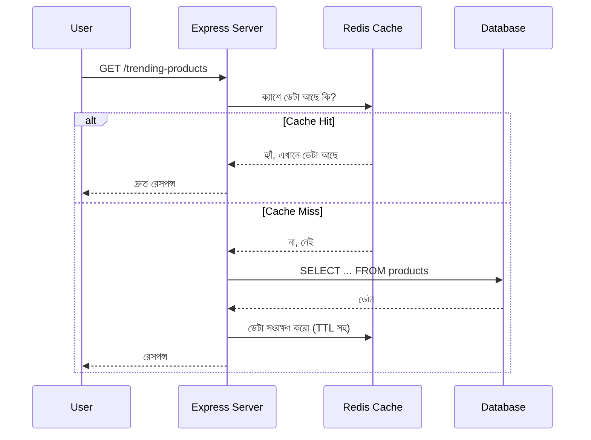

# ২১.০৬. Database Caching Strategies

আগের লেসনে (২১.০৫) আমরা কুয়েরিকে দ্রুত করার নানা কৌশল দেখেছি — সঠিক কলাম আনা, ইনডেক্স ঠিকভাবে ব্যবহার করা, N+1 এড়ানো। কিন্তু একটা প্রশ্ন থেকে যায় — একটা কুয়েরি যতই অপ্টিমাইজড হোক, যদি সেটা প্রতি সেকেন্ডে হাজারবার চালাতে হয় (যেমন হোমপেজের "আজকের ট্রেন্ডিং প্রোডাক্ট" লিস্ট, যেটা প্রতিটা ভিজিটরের জন্য একই থাকে), তাহলে ডাটাবেসের উপর অপ্রয়োজনীয় চাপ পড়ে। এই সমস্যার সমাধান হলো **ক্যাশিং (Caching)**।

ক্যাশিং-এর ধারণাটা বোঝার জন্য একটা রেস্টুরেন্টের উপমা নেওয়া যাক। ধরো প্রতিদিন সকালে ১০০ জন কাস্টমার এসে জিজ্ঞেস করে "আজকের স্পেশাল মেনু কী?" যদি রাঁধুনি প্রতিবার রান্নাঘরে গিয়ে চেক করে আসে, সেটা অপচয়। এর বদলে, রেস্টুরেন্ট একটা বোর্ডে সকালে একবার লিখে রাখে "আজকের স্পেশাল: বিরিয়ানি" — আর ১০০ জনই সেই বোর্ড দেখে উত্তর পায়, রান্নাঘরে না গিয়েই। এই বোর্ডটাই ক্যাশ — একটা দ্রুত-অ্যাক্সেসযোগ্য জায়গা যেখানে "প্রায়ই জিজ্ঞাসিত" ডেটার একটা কপি রাখা থাকে, যাতে বারবার আসল উৎস (এখানে ডাটাবেস) পর্যন্ত যেতে না হয়।



এই দুটো অবস্থাকে বলা হয় **Cache Hit** (ক্যাশে ডেটা পাওয়া গেলো) আর **Cache Miss** (ক্যাশে ডেটা নেই, তাই আসল ডাটাবেসে যেতে হলো)। বাস্তবে সবচেয়ে জনপ্রিয় ক্যাশিং টুল হলো **Redis** — একটা ইন-মেমরি (RAM-ভিত্তিক) key-value স্টোর, যা ডিস্ক-ভিত্তিক ডাটাবেসের চেয়ে বহুগুণ দ্রুত, কারণ RAM থেকে ডেটা পড়া ডিস্ক থেকে পড়ার চেয়ে হাজার গুণ দ্রুত।

```ts
import { createClient } from "redis";
import express from "express";

const app = express();
const redis = createClient();
await redis.connect();

app.get("/trending-products", async (req, res) => {
  const cacheKey = "trending-products";

  // ১. প্রথমে ক্যাশ চেক করা
  const cached = await redis.get(cacheKey);
  if (cached) {
    return res.json(JSON.parse(cached)); // Cache Hit — সরাসরি ফেরত
  }

  // ২. Cache Miss — ডাটাবেস থেকে আনা
  const products = await db.query(
    "SELECT id, name, price FROM products ORDER BY views DESC LIMIT 10"
  );

  // ৩. ক্যাশে সংরক্ষণ, ৬০ সেকেন্ডের জন্য (TTL)
  await redis.setEx(cacheKey, 60, JSON.stringify(products));

  res.json(products);
});
```

এখানে `setEx(cacheKey, 60, ...)`-এর `60` সংখ্যাটা হলো **TTL (Time To Live)** — অর্থাৎ এই ক্যাশ করা ডেটা মাত্র ৬০ সেকেন্ড "তাজা" থাকবে, তারপর নিজে থেকেই মুছে যাবে। কেন এই সীমা দরকার? কারণ ক্যাশিং-এর সবচেয়ে বড় ঝুঁকি হলো **stale data** — পুরনো, বাসি ডেটা দেখানো। যদি একটা প্রোডাক্টের দাম পাল্টায়, কিন্তু ক্যাশ সেটা এখনো পুরনো দাম দেখাচ্ছে, ইউজার ভুল তথ্য পাবে। TTL এই ঝুঁকিটা নিয়ন্ত্রণ করে — নির্দিষ্ট সময় পর ক্যাশ নিজে থেকেই "বাতিল" হয়ে যায়, আর পরের রিকোয়েস্টে ডাটাবেস থেকে আবার তাজা ডেটা আনা হয়।

কখনো কখনো ডেটা পাল্টানোর সাথে সাথেই ক্যাশ বাতিল করা দরকার হয় — একে বলে **Cache Invalidation**। যেমন কোনো প্রোডাক্টের দাম আপডেট হলে, সেই মুহূর্তেই সংশ্লিষ্ট ক্যাশ মুছে ফেলা উচিত, TTL শেষ হওয়ার জন্য অপেক্ষা না করে:

```ts
app.put("/products/:id", async (req, res) => {
  await db.query("UPDATE products SET price = $1 WHERE id = $2", [
    req.body.price,
    req.params.id,
  ]);

  // ডেটা পাল্টানোর সাথে সাথেই পুরনো ক্যাশ বাতিল করা
  await redis.del("trending-products");

  res.json({ message: "Product updated" });
});
```

কোন ডেটা ক্যাশ করা উচিত, আর কোনটা না — এটাও গুরুত্বপূর্ণ একটা সিদ্ধান্ত। যে ডেটা **বেশি পড়া হয়, কম পাল্টায়** (যেমন হোমপেজের ক্যাটাগরি লিস্ট, সেটিংস), সেটা ক্যাশিং-এর আদর্শ প্রার্থী। কিন্তু যে ডেটা **প্রতি মুহূর্তে পাল্টায়** (যেমন লাইভ স্টক প্রাইস, ব্যাংক ব্যালেন্স), সেটা ক্যাশ করা বিপজ্জনক — কারণ সামান্য দেরিও ভুল সিদ্ধান্তের দিকে নিয়ে যেতে পারে।

সংক্ষেপে — ক্যাশিং হলো "একই প্রশ্নের উত্তর বারবার না খুঁজে, একবার মনে রাখা" কৌশল, যা ডাটাবেসের চাপ কমায় আর রেসপন্স টাইম উল্লেখযোগ্যভাবে কমিয়ে দেয়। তবে এটা যেমন ইনডেক্সের মতো বিনামূল্যে আসে না, তেমনি stale data-র ঝুঁকিও বহন করে, যা TTL আর সঠিক invalidation কৌশল দিয়ে নিয়ন্ত্রণ করতে হয়। পরের লেসনে আমরা দেখবো ডাটাবেস আসলে ভেতরে ভেতরে একটা কুয়েরিকে কীভাবে চালায় তার পূর্ণাঙ্গ পরিকল্পনা — Analyzing Query Execution Plans।
