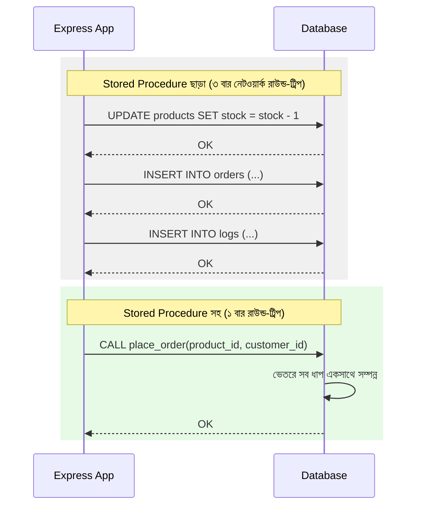

# ২১.০৯. What are Stored Procedures? (Performance Benefits)

এখন পর্যন্ত আমরা যেভাবে ডাটাবেসের সাথে কথা বলেছি, তার ধরনটা এরকম — আমাদের Node.js/Express অ্যাপ্লিকেশন (Module 4-5) একটা SQL স্ট্রিং তৈরি করে, সেটা নেটওয়ার্কের মধ্য দিয়ে ডাটাবেস সার্ভারে পাঠায়, ডাটাবেস সেটা চালায়, ফলাফল আবার নেটওয়ার্কের মধ্য দিয়ে ফেরত পাঠায়। এই পুরো প্রক্রিয়ায় যদি একটার বদলে পাঁচটা কুয়েরি একসাথে চালানোর দরকার হয় (যেমন একটা অর্ডার তৈরি করা, স্টক কমানো, লগ লেখা), তাহলে পাঁচবার নেটওয়ার্কে যাওয়া-আসা করতে হয়। এই সমস্যার একটা সমাধান হলো **Stored Procedure**।

একটা Stored Procedure হলো এমন একটা SQL কোডের ব্লক, যেটা ডাটাবেস সার্ভারের **ভেতরেই** সংরক্ষিত থাকে, একটা নাম দিয়ে, ঠিক যেমন Module 13-14-এ আমরা TypeScript-এ একটা ফাংশন লিখে সেটাকে নাম দিয়ে বারবার কল করতাম। পার্থক্য হলো, এই "ফাংশন" থাকে ডাটাবেসের ভেতরে, অ্যাপ্লিকেশন কোডে না।

একটা উপমা দিয়ে বোঝা যাক। কল্পনা করো তুমি একটা রেস্টুরেন্টে খাবার অর্ডার করছো। একভাবে হতে পারে — তুমি রাঁধুনির কাছে গিয়ে প্রতিটা ধাপ নিজে বলে দাও: "এই চালটা ধুয়ে নাও, তারপর এই মসলা দাও, তারপর এই তাপমাত্রায় রান্না করো" — প্রতিটা নির্দেশনার জন্য আলাদা করে রান্নাঘরে যাওয়া-আসা। অথবা, তুমি শুধু বলতে পারো "একটা বিরিয়ানি দাও" — আর রাঁধুনি জানে পুরো রেসিপিটা, একবারেই সব ধাপ নিজে সম্পন্ন করে ফেলে। Stored Procedure হলো এই দ্বিতীয় পদ্ধতি — পুরো "রেসিপি" ডাটাবেসেই সংরক্ষিত, অ্যাপ্লিকেশন শুধু নাম ধরে ডাকে।



PostgreSQL-এ একটা Stored Procedure এভাবে লেখা যায়:

```sql
CREATE OR REPLACE PROCEDURE place_order(
    p_customer_id INT,
    p_product_id INT
)
LANGUAGE plpgsql
AS $$
BEGIN
    -- ধাপ ১: স্টক কমানো
    UPDATE products SET stock = stock - 1 WHERE id = p_product_id;

    -- ধাপ ২: নতুন অর্ডার তৈরি করা
    INSERT INTO orders (customer_id, product_id, status, created_at)
    VALUES (p_customer_id, p_product_id, 'pending', NOW());

    -- ধাপ ৩: লগ রাখা
    INSERT INTO logs (message) VALUES ('New order placed');
END;
$$;
```

আর অ্যাপ্লিকেশন থেকে এটা কল করা হয় এভাবে:

```ts
await pool.query("CALL place_order($1, $2)", [customerId, productId]);
```

এখন প্রশ্ন হলো — এতে পারফরম্যান্সের লাভ কোথায়? প্রথমত, যেমন উপরের ডায়াগ্রামে দেখানো হলো, **নেটওয়ার্ক রাউন্ড-ট্রিপ কমে যায়** — একাধিক কুয়েরির বদলে একটাই কল। দ্বিতীয়ত, ডাটাবেস ইঞ্জিন একটা Stored Procedure-কে **precompile** করে রাখে — অর্থাৎ কুয়েরি প্ল্যান আগে থেকেই তৈরি থাকে, প্রতিবার নতুন করে "কীভাবে চালাবো" ভাবতে হয় না, যা ২১.০৭-এ শেখা এক্সিকিউশন প্ল্যানের প্রসঙ্গে গুরুত্বপূর্ণ। তৃতীয়ত, এটা **atomicity** নিশ্চিত করতে সাহায্য করে — সব ধাপ একসাথে সফল হয়, নাহলে সব ব্যর্থ হয় (transaction-এর ধারণা, যা আমরা আগের মডিউলগুলোতে ছুঁয়ে গিয়েছিলাম)।

তবে Stored Procedure-এর একটা বাস্তব সীমাবদ্ধতাও আছে যা উল্লেখ করা জরুরি — এতে লজিক ডাটাবেসের ভেতরে চলে যায়, অ্যাপ্লিকেশন কোড থেকে দূরে। এতে **ভার্সন কন্ট্রোল, টেস্টিং, আর ডিবাগিং** কিছুটা কঠিন হয়ে যায়, কারণ এই কোড Git-এ TypeScript ফাইলের মতো সহজে ট্র্যাক করা যায় না। তাই বাস্তব প্রজেক্টে, Stored Procedure ব্যবহার করা হয় নির্বাচিতভাবে — যেখানে পারফরম্যান্স খুব গুরুত্বপূর্ণ, বা যেখানে একাধিক অ্যাপ্লিকেশন (যেমন ওয়েব আর মোবাইল, দুটোই) একই জটিল ডেটা-অপারেশন শেয়ার করে।

এই লেসনে আমরা দেখলাম কীভাবে জটিল, বহু-ধাপের লজিক ডাটাবেসের ভেতরে সংরক্ষণ করে পারফরম্যান্স বাড়ানো যায়। পরের লেসনে আমরা দেখবো আরেকটা ডাটাবেস-সাইড কৌশল — Views, যা জটিল কুয়েরিকে একটা সহজ, পুনর্ব্যবহারযোগ্য "ভার্চুয়াল টেবিল"-এ রূপান্তর করে।
