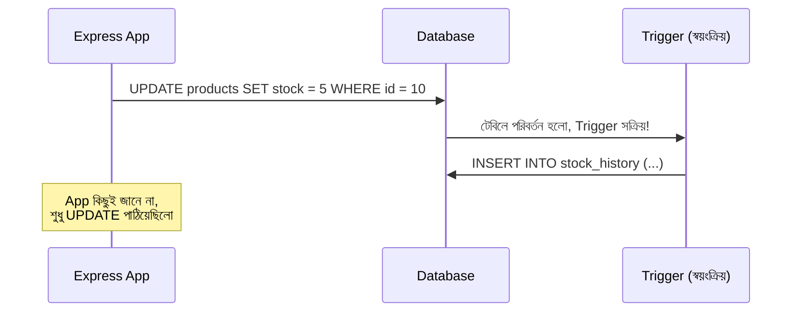

# ২১.১১. What are Triggers? (Automatic actions on insert/update/delete)

আগের দুই লেসনে আমরা দেখেছি কীভাবে অ্যাকশন (Stored Procedure, ২১.০৯) আর কুয়েরি (View, ২১.১০) ডাটাবেসের ভেতরে সংরক্ষণ করা যায়, যেগুলো আমরা **নিজে থেকে ডেকে** চালাই। কিন্তু কখনো কখনো আমরা চাই ডাটাবেস নিজে থেকেই একটা কাজ করুক, কোনো নির্দিষ্ট ঘটনা ঘটলেই — কাউকে ডাকতে হবে না। এই ধরনের "স্বয়ংক্রিয় প্রতিক্রিয়া" তৈরি করে **Trigger**।

একটা Trigger-কে বোঝার সবচেয়ে সহজ উপায় হলো বাড়ির স্মোক ডিটেক্টরের উপমা। তুমি স্মোক ডিটেক্টরকে প্রতিদিন গিয়ে জিজ্ঞেস করো না "আগুন লেগেছে কি?" — এটা নিজে থেকেই বাতাসে ধোঁয়া টের পেলে অ্যালার্ম বাজায়, কোনো মানুষের হস্তক্ষেপ ছাড়াই। ঠিক তেমনি, একটা Trigger ডাটাবেসকে বলে দেয় — "যখনই এই টেবিলে একটা INSERT/UPDATE/DELETE ঘটবে, তখনই স্বয়ংক্রিয়ভাবে এই কাজটা করো।"



সবচেয়ে ব্যবহারিক একটা উদাহরণ — একটা `products` টেবিলের স্টক পরিবর্তনের ইতিহাস স্বয়ংক্রিয়ভাবে লগ রাখা। প্রথমে একটা ফাংশন লিখতে হয় যা Trigger চালু হলে কাজ করবে, তারপর সেই ফাংশনটাকে একটা নির্দিষ্ট টেবিল আর ইভেন্টের সাথে যুক্ত করতে হয়:

```sql
-- ধাপ ১: Trigger ফাংশন — কী করতে হবে তার সংজ্ঞা
CREATE OR REPLACE FUNCTION log_stock_change()
RETURNS TRIGGER AS $$
BEGIN
    INSERT INTO stock_history (product_id, old_stock, new_stock, changed_at)
    VALUES (OLD.id, OLD.stock, NEW.stock, NOW());
    RETURN NEW;
END;
$$ LANGUAGE plpgsql;

-- ধাপ ২: Trigger — কোন টেবিলে, কোন ইভেন্টে ফাংশনটা চলবে
CREATE TRIGGER trg_stock_change
AFTER UPDATE OF stock ON products
FOR EACH ROW
EXECUTE FUNCTION log_stock_change();
```

এখানে `OLD` আর `NEW` দুটো বিশেষ কীওয়ার্ড — `OLD` মানে পরিবর্তনের আগে রো-টা কেমন ছিলো, `NEW` মানে পরিবর্তনের পরে কেমন হলো। এই দুটো তুলনা করে Trigger বুঝতে পারে ঠিক কী পাল্টেছে। এখন থেকে, অ্যাপ্লিকেশন যখনই `products` টেবিলে `stock` কলাম আপডেট করবে (যেমন কেউ একটা প্রোডাক্ট কিনলে), স্বয়ংক্রিয়ভাবে `stock_history` টেবিলে একটা রেকর্ড যোগ হয়ে যাবে — অ্যাপ্লিকেশন কোডে আলাদা কোনো লজিক না লিখেই।

```ts
// অ্যাপ্লিকেশন কোড শুধু এইটুকুই জানে
await pool.query("UPDATE products SET stock = stock - 1 WHERE id = $1", [
  productId,
]);
// stock_history-তে লগ হওয়াটা সম্পূর্ণ Trigger-এর দায়িত্ব,
// Express কোডে এর কোনো ছাপ নেই
```

Trigger তিনটা প্রধান ইভেন্টের সাথে যুক্ত করা যায় — `INSERT`, `UPDATE`, `DELETE` — এবং প্রতিটাকে `BEFORE` বা `AFTER` হিসেবে চালানো যায়। `BEFORE` Trigger ব্যবহার করা হয় ডেটা যাচাই বা পরিবর্তনের জন্য (যেমন একটা মান স্বয়ংক্রিয়ভাবে ঠিক করে দেওয়া, ইনসার্টের আগেই), আর `AFTER` Trigger ব্যবহার করা হয় প্রতিক্রিয়া (side-effect) ঘটানোর জন্য, যেমন লগ রাখা বা নোটিফিকেশন পাঠানো, যেহেতু মূল কাজ ততক্ষণে হয়ে গেছে।

Trigger-এর একটা চমৎকার ব্যবহারিক দিক হলো এটা নিশ্চিত করে যে একটা নিয়ম **কখনো এড়িয়ে যাওয়া যায় না** — কারণ এটা অ্যাপ্লিকেশন কোডে নির্ভর করে না। যদি ভবিষ্যতে দশটা ভিন্ন জায়গা থেকে (ওয়েব অ্যাপ, মোবাইল অ্যাপ, অ্যাডমিন স্ক্রিপ্ট) স্টক আপডেট করা হয়, প্রতিটা জায়গাতেই লগিং কোড আলাদাভাবে লেখার দরকার নেই — Trigger ডাটাবেস স্তরেই এই নিয়ম নিশ্চিত করে।

তবে সতর্কতার একটা কথা — Trigger অতিরিক্ত ব্যবহার করলে সিস্টেমের আচরণ বোঝা কঠিন হয়ে যায়, কারণ একটা সাধারণ `UPDATE` কমান্ডের পেছনে "লুকানো" আরও কাজ চলতে থাকে, যা কোড পড়ে সরাসরি বোঝা যায় না — এটাকে বলা হয় **"hidden magic"**, আর এটা ডিবাগিং-কে কঠিন করে তোলে। তাই Trigger ব্যবহার করা উচিত সংযতভাবে, শুধু সেই ক্ষেত্রে যেখানে নিয়মটা সত্যিই সবসময়, সব পথ থেকেই কার্যকর হওয়া জরুরি।

এই লেসন পর্যন্ত আমরা দেখলাম ডাটাবেস কীভাবে নিজের মধ্যেই লজিক আর স্বয়ংক্রিয় প্রতিক্রিয়া রাখতে পারে। এখন আমরা মডিউলের একটা নতুন অংশে প্রবেশ করবো — ডাটাবেস নিরাপত্তা। পরের লেসনে আমরা দেখবো কীভাবে ডাটাবেসের নিজস্ব স্তরে ব্যবহারকারীর পরিচয় যাচাই আর অনুমতি নিয়ন্ত্রণ করা হয় — User Authentication & Authorization।
