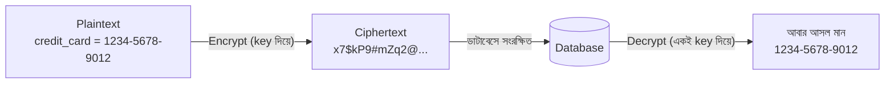

# ২১.১৪. Encryption Techniques in Databases

আগের লেসনে আমরা দেখেছি কীভাবে SQL Injection ঠেকিয়ে ডেটা চুরি হওয়া প্রতিরোধ করা যায়। কিন্তু নিরাপত্তায় সবসময় একটা "যদি" রেখে পরিকল্পনা করতে হয় — যদি সব সুরক্ষা ভেদ করে কোনোভাবে ডেটাবেসের একটা ব্যাকআপ ফাইল চুরি হয়ে যায়, বা কোনো কর্মচারী অসৎভাবে সরাসরি ডাটাবেস ফাইল অ্যাক্সেস করে, তখন কী হবে? এই "শেষ প্রতিরক্ষা স্তর"-টাই তৈরি করে **Encryption (এনক্রিপশন)**।

এনক্রিপশনকে বোঝার সবচেয়ে সহজ উপমা একটা তালাবদ্ধ ডায়েরির মতো। কল্পনা করো তোমার একটা ডায়েরি আছে যেখানে গোপন কথা লেখা, আর সেটাকে তুমি একটা বিশেষ কোডে লিখেছো — যাতে কেউ ডায়েরিটা চুরি করলেও, কোড না জানলে কিছুই বুঝতে পারবে না। শুধু তোমার কাছে থাকা "চাবি" (key) দিয়েই আসল লেখাটা পড়া সম্ভব। ডাটাবেস এনক্রিপশনও একই নীতিতে কাজ করে — সংবেদনশীল ডেটাকে এমনভাবে রূপান্তরিত করে রাখা হয় যে, সঠিক key ছাড়া সেটা অর্থহীন অক্ষরের সমষ্টি মাত্র।



ডাটাবেস এনক্রিপশনের প্রধানত দুটো স্তর আছে। প্রথমটা **Encryption at Rest** — ডেটা যখন ডিস্কে "বিশ্রামে" থাকে (কোনো একটিভ প্রসেসিং হচ্ছে না), তখন সেটা এনক্রিপ্ট করা থাকে। Azure SQL Database এবং বেশিরভাগ আধুনিক ক্লাউড ডাটাবেস (যা আমরা এই মডিউলের শেষ দিকে দেখবো) ডিফল্টভাবেই **Transparent Data Encryption (TDE)** চালু রাখে — পুরো ডাটাবেস ফাইলটাই এনক্রিপ্টেড থাকে ডিস্কে, অ্যাপ্লিকেশন কোডে কোনো পরিবর্তন ছাড়াই। "Transparent" শব্দটার মানেই হলো — এটা এতটাই স্বচ্ছভাবে কাজ করে যে ডেভেলপারকে আলাদা করে কিছু লিখতে হয় না, ডাটাবেস ইঞ্জিন নিজেই ডিস্কে লেখার আগে এনক্রিপ্ট করে, পড়ার সময় ডিক্রিপ্ট করে।

দ্বিতীয় স্তরটা **Encryption in Transit** — ডেটা যখন এক জায়গা থেকে আরেক জায়গায় "ভ্রমণ" করছে (যেমন অ্যাপ্লিকেশন সার্ভার থেকে ডাটাবেস সার্ভারে, নেটওয়ার্কের মধ্য দিয়ে), তখন সেই যাত্রাপথে কেউ যেন আড়ি পেতে ডেটা পড়ে না ফেলে, তার জন্য SSL/TLS ব্যবহার করা হয় — ঠিক যেমন HTTPS ওয়েবসাইটের ব্রাউজার আর সার্ভারের মধ্যে যোগাযোগ এনক্রিপ্ট করে।

```ts
// Node.js থেকে SSL/TLS সহ ডাটাবেস কানেকশন — Encryption in Transit
const pool = new Pool({
  host: "myserver.database.windows.net",
  database: "shop_db",
  user: "app_backend",
  password: process.env.DB_PASSWORD,
  ssl: {
    rejectUnauthorized: true, // নিশ্চিত করা যে সংযোগটা যাচাইকৃত সার্টিফিকেট দিয়ে এনক্রিপ্টেড
  },
});
```

এই দুটো স্তরের বাইরেও, কিছু নির্দিষ্ট কলাম এত বেশি সংবেদনশীল হতে পারে (যেমন জাতীয় পরিচয়পত্র নম্বর, ক্রেডিট কার্ড নম্বর) যে ডেভেলপার নিজে থেকেই সেগুলোকে **Application-Level Encryption** দিয়ে সুরক্ষিত রাখে, ডাটাবেসে পাঠানোর আগেই এনক্রিপ্ট করে:

```ts
import crypto from "crypto";

const ALGORITHM = "aes-256-cbc";
const SECRET_KEY = process.env.ENCRYPTION_KEY; // ৩২ বাইটের গোপন key

function encrypt(text: string): string {
  const iv = crypto.randomBytes(16);
  const cipher = crypto.createCipheriv(ALGORITHM, Buffer.from(SECRET_KEY, "hex"), iv);
  const encrypted = Buffer.concat([cipher.update(text, "utf8"), cipher.final()]);
  return iv.toString("hex") + ":" + encrypted.toString("hex");
}

// ডাটাবেসে সংরক্ষণের আগে সংবেদনশীল তথ্য এনক্রিপ্ট করা
const encryptedNID = encrypt("1990123456789");
await pool.query("INSERT INTO citizens (nid) VALUES ($1)", [encryptedNID]);
```

এখানে একটা গুরুত্বপূর্ণ পার্থক্য বোঝা দরকার — **Encryption vs Hashing**। Module 12-এ JWT নিয়ে কাজ করার সময়, বা লগইন সিস্টেমে পাসওয়ার্ড সংরক্ষণের সময়, আমরা **Hashing** (যেমন bcrypt) ব্যবহার করি, Encryption না। পার্থক্যটা মৌলিক — Encryption **reversible** (key দিয়ে আবার আসল মান ফেরত পাওয়া যায়), কিন্তু Hashing **one-way** (একবার হ্যাশ করা মান থেকে আসল পাসওয়ার্ড আর ফেরত পাওয়া সম্ভব না)। পাসওয়ার্ডের ক্ষেত্রে আমরা কখনোই আসল মান ফেরত পেতে চাই না — শুধু যাচাই করতে চাই "এই ইনপুট হ্যাশ করলে কি একই ফলাফল আসে?" তাই পাসওয়ার্ডের জন্য Hashing, কিন্তু ক্রেডিট কার্ড নম্বরের মতো ডেটার জন্য Encryption — কারণ পরে আমাদের সেই আসল নম্বরটা প্রয়োজন হতে পারে (যেমন পেমেন্ট প্রসেস করার সময়)।

সংক্ষেপে — এনক্রিপশন হলো নিরাপত্তার একটা "শেষ দুর্গ", যা নিশ্চিত করে যে অন্য সব সুরক্ষা ভেদ হয়ে গেলেও, চুরি হওয়া ডেটা আক্রমণকারীর কাছে অর্থহীন থাকে। পরের লেসনে আমরা দেখবো আরেকটা গুরুত্বপূর্ণ নিরাপত্তা কাঠামো, যা নির্ধারণ করে কে কোন ডেটা দেখতে বা পরিবর্তন করতে পারবে, সংগঠিত ভূমিকার (role) মাধ্যমে — Role-Based Access Control (RBAC)।
