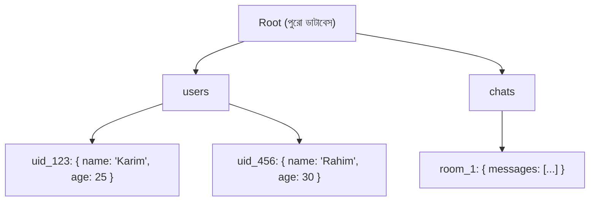
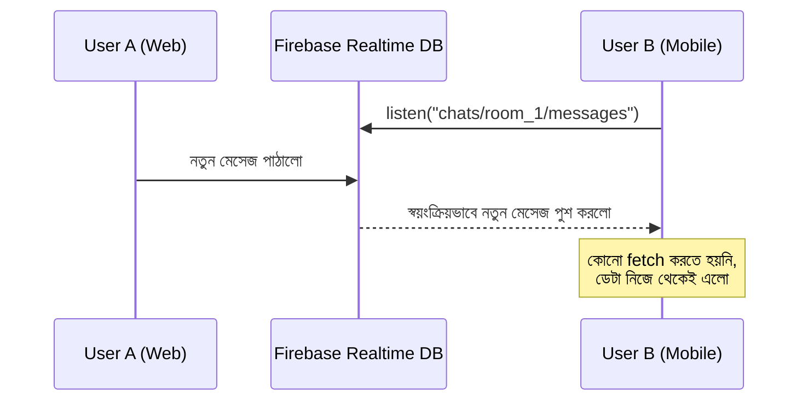

# ২১.১৮. Firebase Realtime Database Overview

আগের লেসনে আমরা ক্লাউড ডাটাবেসের দুটো বড় ধারার কথা বলেছিলাম — NoSQL আর Managed SQL। এই লেসনে আমরা প্রথম NoSQL সমাধানটা হাতে-কলমে দেখবো — Google-এর **Firebase Realtime Database**।

Firebase Realtime Database বোঝার আগে, চলো একটা ফারাক স্পষ্ট করি যা আমাদের এত দিনের শেখা সবকিছুর বিপরীত। Module 16-20 জুড়ে আমরা ডেটাকে দেখেছি টেবিল, রো, কলাম হিসেবে — সুনির্দিষ্ট স্কিমা (schema) মেনে, যেখানে প্রতিটা রো-র গঠন একই রকম হতে হয়। Firebase Realtime Database সম্পূর্ণ ভিন্নভাবে চিন্তা করে — এটা পুরো ডাটাবেসকে দেখে **একটামাত্র বিশাল JSON ট্রি** হিসেবে। এটা অনেকটা একটা ফোল্ডার সিস্টেমের মতো — প্রতিটা "ফোল্ডার" (key) এর ভেতরে আরও ফোল্ডার বা আসল ডেটা (value) থাকতে পারে, ঠিক যেভাবে JavaScript-এর একটা অবজেক্টের ভেতরে আরেকটা অবজেক্ট নেস্টেড থাকতে পারে (Module 4-5-এ আমরা যা দেখেছি)।



একটা টিপিক্যাল Realtime Database-এ ডেটা দেখতে অনেকটা এরকম হয়:

```json
{
  "users": {
    "uid_123": {
      "name": "Karim",
      "age": 25,
      "online": true
    },
    "uid_456": {
      "name": "Rahim",
      "age": 30,
      "online": false
    }
  }
}
```

এখানে গুরুত্বপূর্ণ একটা পার্থক্য বোঝা দরকার — এখানে কোনো `JOIN` নেই, কোনো ফরেন কী নেই, কোনো নরমালাইজেশন নীতি (Module 18-19-এ যা আমরা শিখেছি) মানার বাধ্যবাধকতা নেই। ডেটা যেভাবে অ্যাপ্লিকেশনে ব্যবহার হবে, সেভাবেই সাজানো হয় — একে বলে ডেটাকে **denormalize** করে রাখা, কারণ SQL-এ যা ভাঙা টুকরো টুকরো টেবিলে রাখতে হতো (২১.০৮-এ আমরা যেমন denormalization-এর কথা বলেছিলাম পারফরম্যান্সের জন্য), এখানে সেটাই স্বাভাবিক নিয়ম।

কিন্তু "Realtime" নামটার আসল জাদু লুকিয়ে আছে এর সবচেয়ে বিশেষ বৈশিষ্ট্যে — **live synchronization**। এখানে তুমি একবার ডেটা "শোনা" (listen) শুরু করলে, ডেটা পাল্টানোর সাথে সাথে সব সংযুক্ত ক্লায়েন্ট স্বয়ংক্রিয়ভাবে নতুন ডেটা পেয়ে যায় — আলাদা করে বারবার `fetch` করার দরকার নেই। এটা একটা লাইভ ক্রিকেট স্কোরবোর্ডের মতো — তুমি স্টেডিয়ামে বসে বারবার স্কোরবোর্ডের দিকে তাকাচ্ছো না "স্কোর পাল্টেছে কিনা" জিজ্ঞেস করার জন্য — বোর্ডটাই নিজে থেকে আপডেট হয়ে যায়, তোমার চোখের সামনেই।



Node.js/Express ব্যাকএন্ড থেকে Firebase Admin SDK দিয়ে Realtime Database-এ ডেটা লেখা যায় এভাবে:

```ts
import { initializeApp, cert } from "firebase-admin/app";
import { getDatabase } from "firebase-admin/database";

const app = initializeApp({
  credential: cert("./serviceAccountKey.json"),
  databaseURL: "https://my-project.firebaseio.com",
});

const db = getDatabase(app);

// নতুন ইউজার যোগ করা
async function addUser(uid: string, name: string) {
  await db.ref(`users/${uid}`).set({
    name,
    online: true,
    joinedAt: Date.now(),
  });
}

// নির্দিষ্ট ইউজারের তথ্য পড়া
async function getUser(uid: string) {
  const snapshot = await db.ref(`users/${uid}`).once("value");
  return snapshot.val();
}
```

Realtime Database কখন ব্যবহার করা উচিত? এটা এমন অ্যাপ্লিকেশনের জন্য চমৎকার যেখানে **তাৎক্ষণিক, লাইভ আপডেট** সবচেয়ে গুরুত্বপূর্ণ — চ্যাট অ্যাপ, লাইভ অকশন, কোলাবোরেটিভ এডিটিং (যেমন একসাথে অনেকে একটা ডকুমেন্টে কাজ করা), অনলাইন প্রেজেন্স ইনডিকেটর ("Karim is online")। কিন্তু জটিল কুয়েরি (যেমন "৩০ বছরের বেশি বয়সী, ঢাকায় থাকা, গত মাসে অর্ডার করা কাস্টমার") এখানে করা কঠিন এবং অদক্ষ, কারণ এই ডাটাবেস জটিল ফিল্টারিং বা JOIN-এর জন্য ডিজাইন করা হয়নি — এটার শক্তি গতিতে এবং সরলতায়, জটিল রিলেশনাল কুয়েরিতে না।

এই লেসনে আমরা দেখলাম কীভাবে একটা লাইভ, JSON-ভিত্তিক ডাটাবেস কাজ করে। পরের লেসনে আমরা দেখবো Firebase-এরই আরেকটা প্রোডাক্ট, যা Realtime Database-এর সীমাবদ্ধতাগুলো (যেমন জটিল কুয়েরির অভাব) সমাধান করার জন্য তৈরি হয়েছে — Cloud Firestore।
