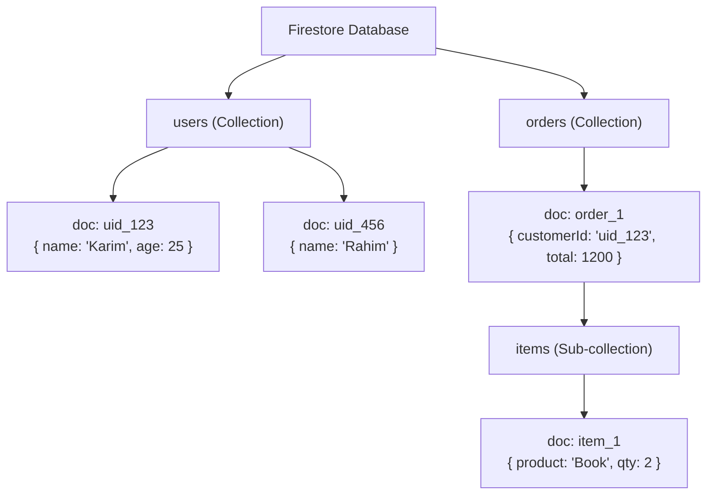
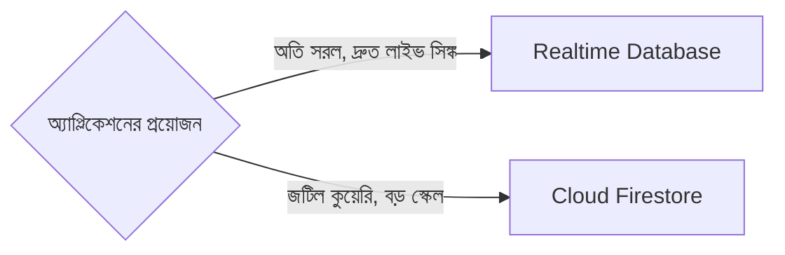

# ২১.১৯. Firebase Cloud Firestore Fundamentals

আগের লেসনে আমরা Firebase Realtime Database দেখলাম, আর একটা সীমাবদ্ধতার কথা বলেছিলাম — এটা একটামাত্র বিশাল JSON ট্রি হওয়ায়, জটিল কুয়েরি বা বড় স্কেলে ডেটা সংগঠিত রাখা কঠিন হয়ে পড়ে। Google এই সমস্যাগুলো সমাধানের জন্য পরবর্তীতে তৈরি করে **Cloud Firestore** — Firebase-এরই আরেকটা ডাটাবেস প্রোডাক্ট, যেটা ধারণাগতভাবে Realtime Database-এর "পরবর্তী প্রজন্ম" (পুরোনোটাকে প্রতিস্থাপন করেনি, বরং পাশাপাশি রাখা হয়েছে ভিন্ন ব্যবহারের জন্য)।

Firestore-এ ডেটা সংগঠিত হয় **Collections** আর **Documents** দিয়ে, একটা বিশাল JSON ট্রি-র বদলে। এটা বোঝার জন্য একটা ফাইলিং ক্যাবিনেটের উপমা নেওয়া যাক — একটা ক্যাবিনেটে অনেকগুলো ড্রয়ার (Collection) থাকে, যেমন "Users" ড্রয়ার, "Orders" ড্রয়ার। প্রতিটা ড্রয়ারের ভেতরে অনেকগুলো আলাদা ফাইল (Document) থাকে, প্রতিটার নিজস্ব একটা ID, আর প্রতিটা ফাইলের ভেতরে থাকে key-value আকারে তথ্য। এটা অনেকটা SQL-এর টেবিল-রো ধারণার সাথে মিলে যায় — Collection ≈ Table, Document ≈ Row — কিন্তু একটা বড় পার্থক্য হলো Firestore-এ **স্কিমা-বিহীনতা (schemaless)** বজায় থাকে, অর্থাৎ একই Collection-এর দুটো Document-এর গঠন সম্পূর্ণ ভিন্ন হতে পারে।



লক্ষ্য করো `D2`-তে `age` নেই — এটা সম্পূর্ণ বৈধ, কারণ Firestore কোনো নির্দিষ্ট স্কিমা জোর করে না, যা Module 16-এ শেখা SQL টেবিলের কড়াকড়ি নিয়মের একদম বিপরীত (SQL-এ প্রতিটা রো-তে একই কলাম থাকতে বাধ্য, নাহলে `NULL`)।

Firebase Admin SDK দিয়ে Node.js থেকে Firestore ব্যবহার করা যায় এভাবে:

```ts
import { initializeApp, cert } from "firebase-admin/app";
import { getFirestore } from "firebase-admin/firestore";

const app = initializeApp({ credential: cert("./serviceAccountKey.json") });
const db = getFirestore(app);

// নতুন Document তৈরি করা
async function createOrder(customerId: string, total: number) {
  const docRef = await db.collection("orders").add({
    customerId,
    total,
    status: "pending",
    createdAt: new Date(),
  });
  return docRef.id;
}

// জটিল কুয়েরি — Realtime Database-এ যা কঠিন ছিলো, এখানে সহজ
async function getPendingOrdersOver1000() {
  const snapshot = await db
    .collection("orders")
    .where("status", "==", "pending")
    .where("total", ">", 1000)
    .orderBy("total", "desc")
    .get();

  return snapshot.docs.map((doc) => ({ id: doc.id, ...doc.data() }));
}
```

এই `.where().where().orderBy()` চেইনটাই Firestore-এর সবচেয়ে বড় উন্নতি Realtime Database-এর তুলনায় — এটা SQL-এর `WHERE ... AND ... ORDER BY`-র সাথে ধারণাগতভাবে মিলে যায় (Module 17-এ যা আমরা শিখেছি), কিন্তু NoSQL-এর নমনীয়তা বজায় রেখে। তবে একটা গুরুত্বপূর্ণ পার্থক্য মনে রাখা দরকার — Firestore-এ এই ধরনের multi-field কুয়েরির জন্য প্রায়ই **Composite Index** তৈরি করতে হয় (হ্যাঁ, এখানেও ২১.০২-এ শেখা সেই একই মৌলিক ধারণা কাজ করে, যদিও Firestore নিজে থেকেই বেশিরভাগ সময় প্রয়োজনীয় ইনডেক্স সাজেস্ট করে দেয়)।

Firestore-এর আরেকটা শক্তিশালী বৈশিষ্ট্য হলো **Sub-collections** — একটা Document-এর ভেতরে আরেকটা Collection রাখা যায় (উপরের ডায়াগ্রামে `items` সাব-কালেকশন দেখানো হয়েছে), যা জটিল, নেস্টেড সম্পর্ক প্রকাশ করতে সাহায্য করে, একটা অর্ডারের ভেতরে তার লাইন-আইটেমগুলো সংগঠিত রাখার মতো।

Realtime Database বনাম Firestore বেছে নেওয়ার প্রশ্নে একটা সহজ নিয়ম মনে রাখা যায় — যদি অ্যাপ্লিকেশনের মূল প্রয়োজন **অতি দ্রুত, সরল লাইভ সিঙ্ক** (যেমন প্রেজেন্স স্ট্যাটাস), Realtime Database উপযুক্ত। কিন্তু যদি প্রয়োজন হয় **জটিল কুয়েরি, বড় স্কেল, আর ভালোভাবে সংগঠিত ডেটা কাঠামো**, Firestore এগিয়ে থাকে — এবং বর্তমানে Google নতুন প্রজেক্টের জন্য সাধারণত Firestore-ই সুপারিশ করে।



এই লেসনে আমরা NoSQL ক্লাউড ডাটাবেসের দুটো রূপ দেখলাম। পরের লেসনে আমরা সম্পূর্ণ ভিন্ন দিকে যাবো — SQL-ভিত্তিক ম্যানেজড ক্লাউড ডাটাবেস, শুরু হবে Azure SQL Database Basics দিয়ে।
