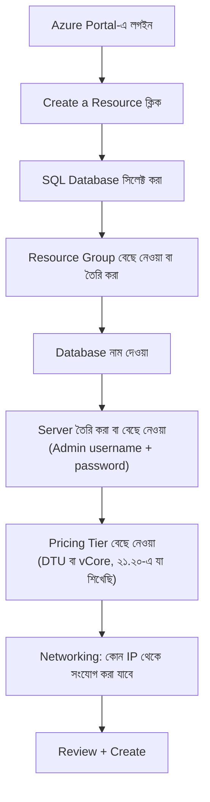
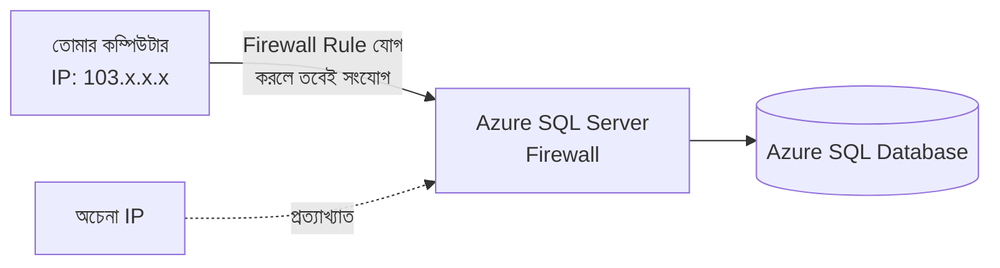

# ২১.২১. Setting up Azure SQL Database

আগের লেসনে আমরা Azure SQL Database কী, আর কেন গুরুত্বপূর্ণ তা তত্ত্বগতভাবে বুঝেছি। এই লেসনে আমরা হাতে-কলমে দেখবো কীভাবে সত্যিকারের একটা Azure SQL Database তৈরি করতে হয় — অনেকটা Module 2-তে আমরা যেমন একটা Cloud VM-এ Node.js সার্ভার ডেপলয় করেছিলাম, ঠিক তেমনই একটা হাতে-কলমে অনুশীলন, শুধু এবার একটা ওয়েব সার্ভারের বদলে একটা ডাটাবেস তৈরি করবো।

প্রথম ধাপ হলো একটা **Azure অ্যাকাউন্ট** তৈরি করা (Microsoft নতুন ইউজারদের জন্য প্রায়ই ফ্রি ক্রেডিট দেয়, যা শেখার জন্য যথেষ্ট)। অ্যাকাউন্ট তৈরির পর, Azure Portal-এ লগইন করে "Create a Resource" বাটনে গিয়ে "SQL Database" খুঁজে বের করতে হয়।



এখানে কয়েকটা ধাপ বিশেষভাবে মনোযোগ দাবি করে। **Resource Group** হলো Azure-এর একটা সংগঠন-পদ্ধতি — একই প্রজেক্টের সব রিসোর্স (ডাটাবেস, ওয়েব সার্ভার, স্টোরেজ) একটা গ্রুপে রাখা হয়, যাতে পরিচালনা আর বিলিং সহজ হয়। এটা একটা ফাইল ক্যাবিনেটের একটা নির্দিষ্ট ড্রয়ারের মতো — সবকিছু এলোমেলো না রেখে প্রজেক্ট অনুযায়ী আলাদা করে রাখা।

দ্বিতীয় গুরুত্বপূর্ণ ধাপ হলো **Server** তৈরি করা এবং একটা admin username আর password সেট করা। এই পাসওয়ার্ডটা অত্যন্ত সংবেদনশীল — এটাই মূলত ডাটাবেস সার্ভারের "মাস্টার চাবি", তাই একটা শক্তিশালী পাসওয়ার্ড বেছে নেওয়া, আর এটা কখনো কোড রিপোজিটরিতে (Git-এ) সরাসরি না রাখা অত্যন্ত জরুরি — এটা Module 12-এ শেখা environment variable-এর ধারণার সরাসরি প্রয়োগ।

সবচেয়ে গুরুত্বপূর্ণ, এবং প্রায়ই নতুনদের বিভ্রান্ত করা ধাপ হলো **Networking / Firewall** সেটিংস। ডিফল্টভাবে, একটা Azure SQL Database ইন্টারনেটের কোনো সংযোগই গ্রহণ করে না — এটা একটা সুরক্ষিত ডিফল্ট (২১.১২-তে আমরা "Least Privilege" নীতির কথা বলেছিলাম, এটা তারই একটা রূপ)। তোমাকে স্পষ্টভাবে বলে দিতে হয় কোন কোন IP address থেকে সংযোগ অনুমোদিত — যেমন তোমার নিজের কম্পিউটারের IP, অথবা তোমার Node.js অ্যাপ্লিকেশন যেখানে হোস্ট করা আছে সেই সার্ভারের IP।



Firewall Rule Azure CLI দিয়েও যোগ করা যায়, যা অনেক সময় পোর্টালে ক্লিক করার চেয়ে দ্রুত এবং স্ক্রিপ্টেবল:

```bash
# Azure CLI দিয়ে একটা ফায়ারওয়াল রুল যোগ করা
az sql server firewall-rule create \
  --resource-group my-resource-group \
  --server my-sql-server \
  --name AllowMyIP \
  --start-ip-address 103.112.45.10 \
  --end-ip-address 103.112.45.10
```

ডাটাবেস তৈরি হয়ে গেলে, Azure একটা **Connection String** প্রদান করে — একটা টেক্সট যাতে সার্ভারের ঠিকানা, ডাটাবেসের নাম, লগইন তথ্যের সবকিছু এক জায়গায় থাকে:

```
Server=tcp:my-sql-server.database.windows.net,1433;
Database=shop_db;
User ID=admin_user;
Password={your_password};
Encrypt=true;
```

লক্ষ্য করো `Encrypt=true` অংশটা — এটা ২১.১৪-এ শেখা Encryption in Transit-এর সরাসরি প্রয়োগ, নিশ্চিত করে যে অ্যাপ্লিকেশন আর ডাটাবেসের মধ্যে ভ্রমণ করা ডেটা SSL/TLS দিয়ে সুরক্ষিত।

একবার ডাটাবেস তৈরি হয়ে গেলে, Azure পোর্টালের **Query Editor** টুল দিয়ে সরাসরি ব্রাউজার থেকেই SQL চালিয়ে দেখা যায় — টেবিল তৈরি করা, ডেটা ইনসার্ট করা — যা এই মডিউলে শেখা সব SQL সিনট্যাক্স দিয়েই সম্ভব, কোনো নতুন ভাষা শেখার দরকার নেই।

এই লেসনে আমরা একটা Azure SQL Database তৈরির পুরো প্রক্রিয়া ধাপে ধাপে দেখলাম — অ্যাকাউন্ট তৈরি থেকে শুরু করে Firewall Rule পর্যন্ত। পরের এবং এই মডিউলের শেষ লেসনে আমরা দেখবো কীভাবে আমাদের Node.js/Express অ্যাপ্লিকেশন থেকে সরাসরি এই ডাটাবেসের সাথে সংযোগ করে বাস্তব কাজ করা যায় — Connecting and Managing Azure SQL।
