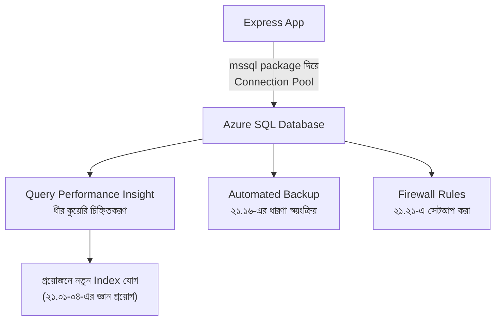

# ২১.২২. Connecting and Managing Azure SQL

আগের লেসনে আমরা একটা Azure SQL Database সেটআপ করেছি — সার্ভার তৈরি, ফায়ারওয়াল রুল, কানেকশন স্ট্রিং। এই মডিউলের শেষ লেসনে আমরা সেই ডাটাবেসকে বাস্তবে ব্যবহার করবো — আমাদের Node.js/Express অ্যাপ্লিকেশন থেকে সংযোগ করে, এই পুরো মডিউলে শেখা প্রায় প্রতিটা কৌশল একসাথে প্রয়োগ করে একটা সংক্ষিপ্ত সারমর্ম তৈরি করবো।

Node.js থেকে Azure SQL Database-এ সংযোগ করার জন্য `mssql` নামের প্যাকেজ ব্যবহার করা হয় (Module 3-4-এ আমরা শিখেছি কীভাবে npm প্যাকেজ ইনস্টল আর ব্যবহার করতে হয়):

```bash
npm install mssql
```

```ts
import sql, { ConnectionPool } from "mssql";

const config: sql.config = {
  server: "my-sql-server.database.windows.net",
  database: "shop_db",
  user: "admin_user",
  password: process.env.DB_PASSWORD, // Module 12-এর env variable অভ্যাস
  options: {
    encrypt: true, // ২১.১৪-এ শেখা Encryption in Transit
  },
  pool: {
    max: 10, // ২১.০৮-এ শেখা Connection Pooling
    min: 0,
    idleTimeoutMillis: 30000,
  },
};

let pool: ConnectionPool;

async function getPool() {
  if (!pool) {
    pool = await sql.connect(config);
  }
  return pool;
}
```

এখন আমরা একটা সম্পূর্ণ Express রুট বানাবো যা এই মডিউলে শেখা একাধিক ধারণা একসাথে ব্যবহার করে — Parameterized Query (SQL Injection প্রতিরোধ, ২১.১৩), সঠিক কলাম আনা (২১.০৫), আর Least Privilege ইউজার (২১.১২):

```ts
import express from "express";
const app = express();
app.use(express.json());

app.get("/products", async (req, res) => {
  try {
    const pool = await getPool();

    // Parameterized query — ইউজারের ইনপুট সরাসরি স্ট্রিং-এ জোড়া লাগানো হচ্ছে না
    const category = req.query.category as string;
    const result = await pool
      .request()
      .input("category", sql.NVarChar, category)
      .query(
        "SELECT id, name, price FROM products WHERE category = @category"
      );

    res.json(result.recordset);
  } catch (err) {
    console.error(err);
    res.status(500).json({ message: "Something went wrong" });
  }
});

app.post("/orders", async (req, res) => {
  const { customerId, productId } = req.body;
  const pool = await getPool();

  // Stored Procedure কল করা (২১.০৯-এ শেখা ধারণা)
  await pool
    .request()
    .input("customerId", sql.Int, customerId)
    .input("productId", sql.Int, productId)
    .execute("place_order");

  res.status(201).json({ message: "Order placed" });
});
```

এখানে `@category` হলো `mssql` প্যাকেজের প্লেসহোল্ডার সিনট্যাক্স (PostgreSQL-এ যেমন আমরা `$1` দেখেছিলাম ২১.১৩-এ, SQL Server-এ এটা `@নাম` আকারে হয়) — নীতিটা একদম একই, শুধু সিনট্যাক্স ভিন্ন।

Azure SQL Database "ম্যানেজ" করা মানে শুধু কানেক্ট করাই না — এটা একটা চলমান দায়িত্ব, যার মধ্যে পড়ে **Monitoring**। Azure Portal-এর "Query Performance Insight" টুল স্বয়ংক্রিয়ভাবে সবচেয়ে ধীর কুয়েরিগুলো চিহ্নিত করে দেখায় — অনেকটা ২১.০৭-এ শেখা `EXPLAIN ANALYZE`-এর একটা ভিজ্যুয়াল, স্বয়ংক্রিয় সংস্করণ, যেখানে তোমাকে ম্যানুয়ালি প্রতিটা কুয়েরি টেস্ট করতে হয় না।



এই ডায়াগ্রামটাই আসলে গোটা মডিউল ২১-এর একটা সারসংক্ষেপ — একটা বাস্তব ক্লাউড ডাটাবেস পরিচালনা করতে গেলে, ইনডেক্সিং, কুয়েরি অপ্টিমাইজেশন, নিরাপত্তা, ব্যাকআপ — এই সবকিছুই একসাথে কাজ করে, আলাদা আলাদা বিষয় হিসেবে না।

Azure SQL Database ম্যানেজমেন্টের আরেকটা গুরুত্বপূর্ণ দিক হলো **Scaling** — যদি অ্যাপ্লিকেশনের ট্রাফিক বাড়ে, Azure পোর্টাল থেকে বা CLI দিয়ে সহজেই Pricing Tier পরিবর্তন করা যায়, প্রায় কোনো ডাউনটাইম ছাড়াই:

```bash
# ডাটাবেসের Service Tier আপগ্রেড করা (Azure CLI)
az sql db update \
  --resource-group my-resource-group \
  --server my-sql-server \
  --name shop_db \
  --service-objective S3
```

এই লেসন দিয়ে আমরা Module 21-এর একটা পূর্ণ চক্র সম্পন্ন করলাম — শুরু হয়েছিলো একটা একক টেবিলের একটা কলামে ইনডেক্স বসানো দিয়ে (২১.০১), আর শেষ হচ্ছে একটা সম্পূর্ণ ক্লাউড-হোস্টেড, নিরাপদ, স্কেলযোগ্য প্রোডাকশন ডাটাবেস পরিচালনা করে। এই মডিউলে শেখা প্রতিটা ধারণা — ইনডেক্সিং, কুয়েরি অপ্টিমাইজেশন, ক্যাশিং, স্টোরড প্রসিডিউর, ভিউ, ট্রিগার, নিরাপত্তা, RBAC, ব্যাকআপ, আর ক্লাউড ডাটাবেস — একসাথে মিলে একজন ব্যাকএন্ড ডেভেলপারকে শুধু "কোড লেখা" থেকে "একটা নির্ভরযোগ্য, দ্রুত, নিরাপদ সিস্টেম বানানো"-র দিকে নিয়ে যায়। পরবর্তী মডিউলে আমরা সম্পূর্ণ নতুন একটা দিকে যাবো — সফটওয়্যার ডিজাইন প্যাটার্ন, যেখানে আমরা শিখবো কীভাবে কোডের গঠন নিজেই আরও পরিষ্কার, পুনর্ব্যবহারযোগ্য আর রক্ষণাবেক্ষণযোগ্য করে তোলা যায়।
