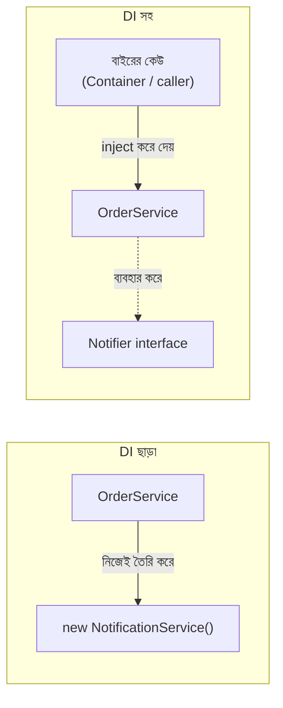

# ২২.০২. Software Design Patterns - DI (Dependency Injection)

Module 13-তে আমরা Encapsulation শিখেছিলাম — একটা ক্লাস তার নিজের ডেটা আর লজিক নিজের ভেতরে গুটিয়ে রাখে। এটা খুবই দরকারি ধারণা, কিন্তু বাস্তব সিস্টেমে কোনো ক্লাস একা একা কাজ করে না। একটা `OrderService` ক্লাসের হয়তো `PaymentService`-এর দরকার হয়, `PaymentService`-এর দরকার হয় `NotificationService`-এর। এই "একটা ক্লাসের অন্য একটা ক্লাসের দরকার হওয়া"-কেই বলে **dependency** — নির্ভরতা। প্রশ্নটা হলো, এই নির্ভরতা তৈরি করার সবচেয়ে ভালো উপায় কী?

চলো প্রথমে "খারাপ" পদ্ধতিটা দেখি, কারণ সমস্যাটা অনুভব না করলে সমাধানের গুরুত্ব বোঝা যায় না।

```typescript
class NotificationService {
  send(message: string) {
    console.log(`Sending notification: ${message}`);
  }
}

class OrderService {
  private notifier: NotificationService;

  constructor() {
    // OrderService নিজেই NotificationService তৈরি করছে
    this.notifier = new NotificationService();
  }

  placeOrder(item: string) {
    console.log(`Order placed for ${item}`);
    this.notifier.send(`Your order for ${item} is confirmed`);
  }
}
```

উপর থেকে দেখলে এই কোডে কিছু ভুল মনে হবে না — কাজ তো করছেই। কিন্তু এখানে একটা সূক্ষ্ম কিন্তু ভয়ংকর সমস্যা লুকিয়ে আছে। `OrderService` ক্লাসটা শুধু তার নিজের কাজ (অর্ডার প্লেস করা) করছে না — সে নিজেই সিদ্ধান্ত নিচ্ছে কীভাবে `NotificationService` তৈরি হবে, ঠিক কোন `new` কল দিয়ে। ধরো, ভবিষ্যতে তুমি ইমেইল আর SMS দুই মাধ্যমেই নোটিফিকেশন পাঠাতে চাও, অথবা টেস্টিং-এর সময় আসল নোটিফিকেশন না পাঠিয়ে একটা "নকল" (mock) সার্ভিস ব্যবহার করতে চাও — তাহলে তোমাকে `OrderService`-এর ভেতরে ঢুকে কোড বদলাতে হবে। অথচ `OrderService`-এর আসল দায়িত্ব তো অর্ডার সামলানো, নোটিফিকেশন সার্ভিস কীভাবে তৈরি হবে সেটা নয়।

এই সমস্যাটার একটা রূপক দিয়ে বোঝা যাক। ধরো তুমি একটা রেস্টুরেন্টের শেফ। "Dependency তৈরি নিজে করা" মানে হলো শেফ নিজেই ক্ষেতে গিয়ে সবজি চাষ করা, নিজেই বাজারে গিয়ে মাছ কেনা, তারপর রান্না করা। এটা টেকনিক্যালি সম্ভব, কিন্তু ভয়াবহ অদক্ষ, আর শেফের আসল দক্ষতা (রান্না) থেকে তার মনোযোগ সরিয়ে দেয়। বাস্তবে কী হয়? একটা সাপ্লাই চেইন থাকে — কেউ একজন (বা একটা সিস্টেম) শেফের রান্নাঘরে প্রয়োজনীয় উপকরণ **পৌঁছে দেয়** (inject করে), শেফ শুধু সেগুলো ব্যবহার করে রান্না করে। শেফকে জানতে হয় না উপকরণ কোথা থেকে এলো, কীভাবে এলো।

এটাই **Dependency Injection (DI)**-এর মূল ধারণা — একটা ক্লাস তার নিজের dependency নিজে তৈরি করবে না, বরং বাইরে থেকে সেটা তাকে "সরবরাহ" (inject) করা হবে। একই কোড, DI প্রয়োগ করে লিখলে দেখতে এমন হবে:

```typescript
class NotificationService {
  send(message: string) {
    console.log(`Sending notification: ${message}`);
  }
}

class OrderService {
  // constructor-এর মাধ্যমে dependency গ্রহণ করা হচ্ছে, নিজে তৈরি করা হচ্ছে না
  constructor(private notifier: NotificationService) {}

  placeOrder(item: string) {
    console.log(`Order placed for ${item}`);
    this.notifier.send(`Your order for ${item} is confirmed`);
  }
}

// এখন OrderService ব্যবহার করার সময়, আমরা বাইরে থেকে dependency সরবরাহ করছি
const notifier = new NotificationService();
const orderService = new OrderService(notifier);
orderService.placeOrder("Laptop");
```

এখন `OrderService` জানেই না `NotificationService` কীভাবে তৈরি হয়েছে — সে শুধু জানে তার কাছে একটা এমন অবজেক্ট আছে যার `send()` মেথড আছে। এই সামান্য পরিবর্তনটা কিন্তু বিশাল প্রভাব ফেলে। এখন আমরা Module 14-এর Interface ধারণা ব্যবহার করে এটাকে আরও শক্তিশালী করতে পারি:

```typescript
interface Notifier {
  send(message: string): void;
}

class EmailNotifier implements Notifier {
  send(message: string) {
    console.log(`Email: ${message}`);
  }
}

class SmsNotifier implements Notifier {
  send(message: string) {
    console.log(`SMS: ${message}`);
  }
}

class OrderService {
  constructor(private notifier: Notifier) {}

  placeOrder(item: string) {
    console.log(`Order placed for ${item}`);
    this.notifier.send(`Your order for ${item} is confirmed`);
  }
}

// একই OrderService, ভিন্ন ভিন্ন notifier দিয়ে চালানো যাচ্ছে
const orderWithEmail = new OrderService(new EmailNotifier());
const orderWithSms = new OrderService(new SmsNotifier());
```

লক্ষ্য করো, এখানে Polymorphism (Module 14) আর Dependency Injection হাতে হাত ধরে কাজ করছে। `OrderService` শুধু `Notifier` interface-টা চেনে, তার পেছনে আসলে `EmailNotifier` না `SmsNotifier` চলছে সেটা তার কাছে গুরুত্বহীন। এই কারণেই টেস্টিং এত সহজ হয়ে যায় — টেস্টের সময় আমরা একটা "ফেক" `Notifier` বানিয়ে দিতে পারি, যেটা আসলে কোনো মেসেজ পাঠায় না, শুধু রেকর্ড রাখে যে `send()` কল হয়েছিলো কিনা।

এই পুরো প্রবাহটাকে ডায়াগ্রামে দেখা যাক:



এখন স্বাভাবিক প্রশ্ন — ছোট প্রজেক্টে আমরা তো হাতে হাতেই (`new OrderService(new EmailNotifier())`) dependency সরবরাহ করে ফেললাম, এত কষ্ট করে dependency বানানোর দরকার কী? সমস্যাটা দেখা যায় যখন সিস্টেম বড় হয়। ধরো তোমার কাছে ৫০টা ক্লাস আছে, আর তাদের মধ্যে জটিল নির্ভরতার জাল আছে — `OrderService`-এর দরকার `PaymentService`, যার দরকার `Logger`, যার দরকার `ConfigService`। প্রতিটা ক্লাস ব্যবহারের আগে হাতে হাতে এই পুরো চেইন তৈরি করা বিরক্তিকর আর ভুলপ্রবণ হয়ে যায়। এই সমস্যার সমাধানের জন্যই তৈরি হয় **DI Container** (বা Injector) — একটা কেন্দ্রীয় ব্যবস্থা, যে জানে কোন ক্লাসের কোন dependency দরকার, আর প্রয়োজনের সময় সেটা স্বয়ংক্রিয়ভাবে তৈরি করে সরবরাহ করে দেয়।

এখানেই আমরা এই মডিউলের সবচেয়ে গুরুত্বপূর্ণ সংযোগ তৈরি করবো — Module 23-এ আমরা যে NestJS ফ্রেমওয়ার্ক শিখবো, তার পুরো কেন্দ্রীয় ইঞ্জিনটাই একটা built-in DI Container। NestJS-এ তুমি একটা ক্লাসের উপরে `@Injectable()` নামের একটা decorator (যেটা আমরা এই মডিউলের শেষ লেসনে বিস্তারিত শিখবো) বসিয়ে দাও, আর ফ্রেমওয়ার্ক নিজেই বুঝে নেয় কখন সেটার instance বানাতে হবে, কার কার কাছে সেটা পাঠাতে হবে। যেই ম্যানুয়াল কাজ আমরা উপরের উদাহরণে হাতে করলাম (`new OrderService(new EmailNotifier())`), NestJS সেটা স্বয়ংক্রিয়ভাবে করে দেয় — একে বলে **Inversion of Control (IoC)**, কারণ কে কাকে তৈরি করবে সেই নিয়ন্ত্রণটা প্রোগ্রামারের হাত থেকে ফ্রেমওয়ার্কের হাতে চলে যায়।

Dependency Injection বোঝা মানে শুধু একটা প্যাটার্ন শেখা না — এটা একটা নতুন দৃষ্টিভঙ্গি অর্জন করা, যেখানে প্রতিটা ক্লাসকে তুমি প্রশ্ন করবে: "এটা কি নিজের কাজের বাইরের দায়িত্ব নিজের কাঁধে তুলে নিচ্ছে?" পরের লেসনে আমরা দেখবো এমনই আরেকটা creational pattern, Factory Pattern, যেটা dependency তৈরি করার প্রক্রিয়াটাকেই একটা সুশৃঙ্খল কাঠামোতে বেঁধে দেয়।
