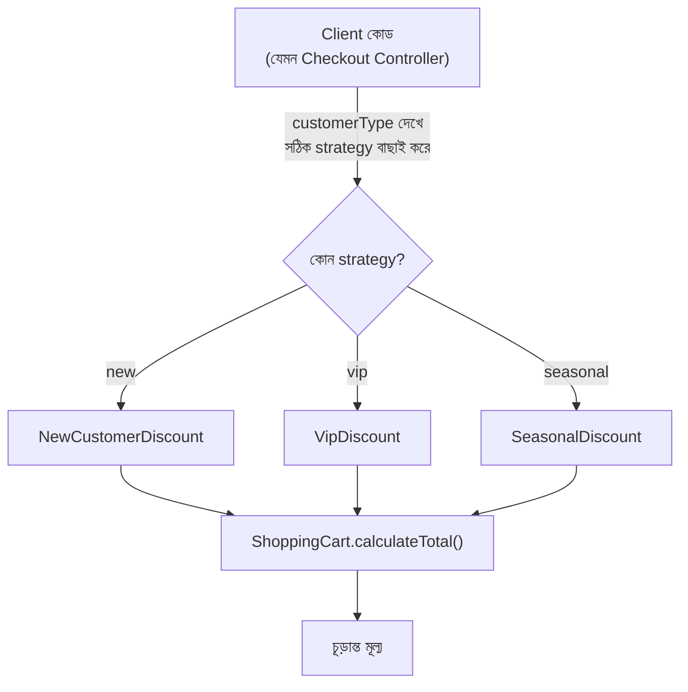

# ২২.০৪. Strategy Design Pattern

আগের লেসনে Factory Pattern আমাদের শিখিয়েছে "কোন ক্লাসের instance তৈরি হবে" সেই সিদ্ধান্তটাকে কীভাবে কেন্দ্রীভূত করা যায়। এবার আমরা একটা সম্পর্কিত কিন্তু ভিন্ন প্রশ্নের মুখোমুখি হবো — অবজেক্ট তো তৈরি হয়ে গেলো, কিন্তু সেই অবজেক্ট যদি রানটাইমে তার **আচরণ** (behavior) বা **অ্যালগরিদম** বদলাতে চায়, তখন কী হবে?

একটা বাস্তব সমস্যা দিয়ে শুরু করি। ধরো তুমি একটা শপিং কার্ট সিস্টেম বানাচ্ছো, যেখানে অর্ডারের মোট মূল্যের উপর ডিসকাউন্ট প্রয়োগ করতে হবে। কিন্তু ডিসকাউন্টের নিয়ম একরকম না — নতুন কাস্টমারদের জন্য ফ্ল্যাট ১০% ছাড়, পুরনো VIP কাস্টমারদের জন্য পয়েন্ট-ভিত্তিক ছাড়, আবার উৎসবের সময় সিজনাল ছাড়। প্রথম যে সমাধানটা মাথায় আসে, সেটা হলো একটা বিশাল `if-else` বা `switch`:

```typescript
class ShoppingCart {
  calculateTotal(amount: number, customerType: string): number {
    if (customerType === "new") {
      return amount * 0.9; // ১০% ছাড়
    } else if (customerType === "vip") {
      return amount * 0.7; // ৩০% ছাড়
    } else if (customerType === "seasonal") {
      return amount - 100; // ফ্ল্যাট ১০০ টাকা ছাড়
    }
    return amount;
  }
}
```

এই কোডে ঠিক Factory Pattern লেসনে যে সমস্যাটা দেখেছিলাম, সেই একই ধরনের সমস্যা — `ShoppingCart` ক্লাসটা নিজে একগাদা ডিসকাউন্ট-লজিক সম্পর্কে জেনে বসে আছে, যেটা আসলে তার মূল দায়িত্ব (কার্ট ম্যানেজ করা) না। প্রতিবার নতুন একটা ডিসকাউন্ট নিয়ম আসলে এই ক্লাসের ভেতরেই ঢুকে কোড বদলাতে হবে, আর পুরনো নিয়মগুলো ভেঙে যাওয়ার ঝুঁকি থাকে।

Strategy Pattern বলে — "একটা কাজ করার একাধিক উপায় (algorithm) থাকতে পারে, প্রতিটা উপায়কে একটা আলাদা ক্লাসে আলাদা করে ফেলো, তারপর যাকে সেই কাজটা করতে হবে তাকে শুধু বলো 'তুমি যেকোনো একটা উপায় (strategy) ব্যবহার করতে পারবে, ঠিক কোনটা সেটা রানটাইমে ঠিক হবে'।" এটা আসলে Module 14-এর Polymorphism-এরই একটা সরাসরি প্রয়োগ, শুধু এবার আমরা এটাকে ডেটার বদলে "আচরণ" অদলবদল করার জন্য ব্যবহার করছি।

```typescript
interface DiscountStrategy {
  apply(amount: number): number;
}

class NewCustomerDiscount implements DiscountStrategy {
  apply(amount: number): number {
    return amount * 0.9;
  }
}

class VipDiscount implements DiscountStrategy {
  apply(amount: number): number {
    return amount * 0.7;
  }
}

class SeasonalDiscount implements DiscountStrategy {
  apply(amount: number): number {
    return amount - 100;
  }
}

class NoDiscount implements DiscountStrategy {
  apply(amount: number): number {
    return amount;
  }
}

class ShoppingCart {
  // ShoppingCart এখন dependency injection-এর মাধ্যমে strategy গ্রহণ করছে
  constructor(private discountStrategy: DiscountStrategy) {}

  calculateTotal(amount: number): number {
    return this.discountStrategy.apply(amount);
  }
}

// ব্যবহার — রানটাইমে ভিন্ন ভিন্ন strategy বসিয়ে দেয়া যাচ্ছে
const vipCart = new ShoppingCart(new VipDiscount());
console.log(vipCart.calculateTotal(1000)); // 700

const newCart = new ShoppingCart(new NewCustomerDiscount());
console.log(newCart.calculateTotal(1000)); // 900
```

লক্ষ্য করো, এখানে আগের লেসনের Dependency Injection আর Factory Pattern দুটোই একসাথে কাজে লেগেছে — `ShoppingCart` তার strategy নিজে তৈরি করছে না (DI নীতি মেনে), আর কোন strategy তৈরি হবে সেই সিদ্ধান্ত একটা আলাদা Factory-তেও রাখা যেতে পারে। এভাবেই বাস্তব সফটওয়্যারে প্যাটার্নগুলো একা একা কাজ করে না, একে অপরের সাথে মিলেমিশে একটা পূর্ণাঙ্গ সমাধান তৈরি করে।

পুরো প্রবাহটা ফ্লোচার্টে দেখা যাক:



একটা প্রশ্ন স্বাভাবিকভাবেই মাথায় আসতে পারে — Factory Pattern আর Strategy Pattern তো প্রায় একই রকম দেখতে, দুটোতেই একটা interface আছে, একাধিক implementation আছে। পার্থক্যটা তাদের **উদ্দেশ্যে**। Factory Pattern-এর কাজ হলো "কোন অবজেক্ট তৈরি হবে" সেই সিদ্ধান্ত নেয়া — এটা creation নিয়ে চিন্তা করে। Strategy Pattern-এর কাজ হলো "একটা কাজ কোন পদ্ধতিতে সম্পন্ন হবে" সেটা বদলানো — এটা behavior নিয়ে চিন্তা করে, ধরে নেয় অবজেক্ট ইতিমধ্যেই তৈরি আছে। প্রায়ই এই দুটো একসাথে ব্যবহৃত হয়: একটা Factory ঠিক করে দেয় কোন Strategy ব্যবহার হবে, তারপর সেই Strategy রানটাইমে আচরণ নির্ধারণ করে।

এই প্যাটার্নটা বাস্তব জীবনে কোথায় দেখতে পাবে তার আরেকটা চমৎকার উদাহরণ হলো **sorting**। ধরো তোমার একটা লিস্ট সর্ট করার দরকার — কখনো নামের বর্ণানুক্রমে, কখনো তারিখ অনুযায়ী, কখনো মূল্য অনুযায়ী। প্রতিটা "সর্ট করার উপায়" একটা আলাদা Strategy, আর মূল ফাংশনটা শুধু জানে "আমাকে একটা sorting strategy দাও, আমি সেটা প্রয়োগ করবো" — ঠিক কীভাবে সর্ট হচ্ছে তা নিয়ে মাথা ঘামায় না।

Strategy Pattern-এর একটা বড় সুবিধা হলো এটা **Open/Closed Principle**-কে সমুন্নত রাখে — একটা নীতি যেটা বলে "কোড নতুন ফিচারের জন্য open (সম্প্রসারণযোগ্য) থাকা উচিত, কিন্তু পুরনো কোড পরিবর্তনের জন্য closed (সুরক্ষিত) থাকা উচিত"। নতুন একটা ডিসকাউন্ট নিয়ম আনতে হলে আমরা শুধু একটা নতুন ক্লাস যোগ করছি (`implements DiscountStrategy`), পুরনো `ShoppingCart` ক্লাসের একটা লাইনও বদলাচ্ছি না।

এখন পর্যন্ত আমরা তিনটা গুরুত্বপূর্ণ প্যাটার্ন শিখেছি — DI, Factory, আর Strategy। পরের লেসনে আমরা একটু থেমে এই ধারণাগুলো নিয়ে সাধারণ ইন্টারভিউ প্রশ্নগুলো ঝালিয়ে নেবো, যাতে তাত্ত্বিক জ্ঞান বাস্তব প্রস্তুতিতে রূপান্তরিত হয়।
