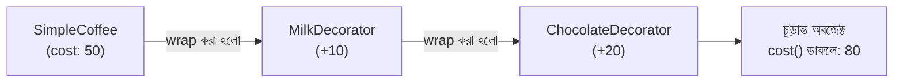

# ২২.০৬. Decorator Pattern

এই মডিউলের শেষ প্যাটার্নটা সবচেয়ে গুরুত্বপূর্ণ, কারণ এটা সরাসরি আমাদের পরের মডিউলের (Module 23, NestJS) দরজা খুলে দেবে। Decorator Pattern হলো Structural Pattern পরিবারের সদস্য — মনে আছে প্রথম লেসনে আমরা বলেছিলাম Structural Pattern সমাধান করে "একাধিক ক্লাস বা অবজেক্টকে কীভাবে একসাথে গঠন করবো" প্রশ্নটা।

চলো একটা সমস্যা দিয়ে শুরু করি। ধরো তোমার একটা `Coffee` ক্লাস আছে, যেটার একটা `cost()` মেথড আছে যা দাম হিসাব করে।

```typescript
class Coffee {
  cost(): number {
    return 50;
  }

  description(): string {
    return "Coffee";
  }
}
```

এখন কাস্টমার চাইলে কফির সাথে দুধ, চিনি, চকলেট যোগ করতে পারবে, প্রতিটার আলাদা দাম আছে। প্রথম যে ধারণাটা মাথায় আসতে পারে সেটা হলো Inheritance ব্যবহার করা (Module 13):

```typescript
class CoffeeWithMilk extends Coffee {
  cost(): number {
    return super.cost() + 10;
  }
}

class CoffeeWithMilkAndSugar extends CoffeeWithMilk {
  cost(): number {
    return super.cost() + 5;
  }
}

class CoffeeWithMilkAndSugarAndChocolate extends CoffeeWithMilkAndSugar {
  cost(): number {
    return super.cost() + 20;
  }
}
```

এখানেই সমস্যাটা স্পষ্ট হয়ে ওঠে — প্রতিটা সম্ভাব্য কম্বিনেশনের জন্য (শুধু দুধ, শুধু চিনি, দুধ+চকলেট, চিনি+চকলেট...) আলাদা আলাদা ক্লাস লাগবে। কম্বিনেশনের সংখ্যা দ্রুত বিস্ফোরিত হয়ে যায় — একে বলে **class explosion**। Inheritance এখানে ভুল টুল, কারণ Inheritance ভালো কাজ করে যখন সম্পর্কটা "is-a" (একটা VIP কাস্টমার "is a" কাস্টমার), কিন্তু "কফির সাথে দুধ যোগ করা" আসলে "is-a" সম্পর্ক না, এটা "has additional feature" সম্পর্ক।

Decorator Pattern এই সমস্যার সমাধান দেয় একটা ভিন্ন কৌশলে — নতুন ক্লাসের স্তূপ বানানোর বদলে, প্রতিটা "যোগ-সংযোজন"-কে (add-on) একটা অবজেক্টের চারপাশে "মুড়িয়ে" (wrap) দেয়া হয়, প্রতিটা wrapper মূল অবজেক্টের কাজের উপর নিজের কিছু যোগ করে।

```typescript
interface CoffeeItem {
  cost(): number;
  description(): string;
}

class SimpleCoffee implements CoffeeItem {
  cost(): number {
    return 50;
  }
  description(): string {
    return "Coffee";
  }
}

// Base Decorator — একই interface মেনে চলে, কিন্তু ভেতরে আরেকটা CoffeeItem রাখে (wrap করে)
abstract class CoffeeDecorator implements CoffeeItem {
  constructor(protected wrapped: CoffeeItem) {}

  cost(): number {
    return this.wrapped.cost();
  }
  description(): string {
    return this.wrapped.description();
  }
}

class MilkDecorator extends CoffeeDecorator {
  cost(): number {
    return this.wrapped.cost() + 10;
  }
  description(): string {
    return this.wrapped.description() + " + Milk";
  }
}

class SugarDecorator extends CoffeeDecorator {
  cost(): number {
    return this.wrapped.cost() + 5;
  }
  description(): string {
    return this.wrapped.description() + " + Sugar";
  }
}

class ChocolateDecorator extends CoffeeDecorator {
  cost(): number {
    return this.wrapped.cost() + 20;
  }
  description(): string {
    return this.wrapped.description() + " + Chocolate";
  }
}

// এখন যেকোনো কম্বিনেশন, রানটাইমে, নতুন ক্লাস ছাড়াই বানানো যাচ্ছে
let order: CoffeeItem = new SimpleCoffee();
order = new MilkDecorator(order);
order = new ChocolateDecorator(order);

console.log(order.description()); // Coffee + Milk + Chocolate
console.log(order.cost()); // 80
```

লক্ষ্য করো, প্রতিটা Decorator নিজেও `CoffeeItem` interface মেনে চলে, আর ভেতরে একটা `CoffeeItem`-কে ধরে রাখে (wrap করে)। এভাবে একটা Decorator-কে আরেকটা Decorator-এর ভেতরে বসানো যায়, স্তরে স্তরে (layer by layer), ঠিক যেমন পেঁয়াজের খোসা একটার পর একটা স্তর তৈরি করে। কোনো নতুন ক্লাস তৈরি না করেই আমরা যেকোনো কম্বিনেশন বানাতে পারছি — শুধু কোন কোন Decorator দিয়ে মুড়াবো (wrap) সেই সিদ্ধান্ত নিলেই হয়।



এখন এখানেই সবচেয়ে গুরুত্বপূর্ণ সংযোগটা করি। TypeScript-এ Decorator ধারণাটা এতটাই গুরুত্বপূর্ণ যে ভাষাটা নিজেই এর জন্য একটা বিশেষ সিনট্যাক্স দেয় — `@` চিহ্ন দিয়ে শুরু হওয়া decorator। এটা একই মূল নীতির উপর দাঁড়িয়ে — কোনো ক্লাস বা মেথডের মূল কোড না বদলে, তার চারপাশে অতিরিক্ত আচরণ "মুড়িয়ে" দেয়া। একটা সহজ উদাহরণ দেখা যাক, যেখানে আমরা একটা মেথড কল হওয়ার আগে-পরে লগ করার আচরণ যোগ করছি, মূল মেথডের কোড স্পর্শ না করেই:

```typescript
function LogExecution(target: any, propertyKey: string, descriptor: PropertyDescriptor) {
  const originalMethod = descriptor.value;

  descriptor.value = function (...args: any[]) {
    console.log(`Calling ${propertyKey} with`, args);
    const result = originalMethod.apply(this, args);
    console.log(`${propertyKey} returned`, result);
    return result;
  };

  return descriptor;
}

class OrderService {
  @LogExecution
  placeOrder(item: string) {
    return `Order placed for ${item}`;
  }
}

const service = new OrderService();
service.placeOrder("Laptop");
// Calling placeOrder with [ 'Laptop' ]
// placeOrder returned Order placed for Laptop
```

এখানে `@LogExecution` হলো একটা function-based decorator, যেটা `placeOrder` মেথডের আসল কোড না বদলে, তাকে একটা "wrapper" ফাংশন দিয়ে মুড়িয়ে দিচ্ছে (ঠিক যেমন আমরা কফিকে মুড়িয়েছিলাম)। এটাই Decorator Pattern-এর সবচেয়ে আধুনিক, ভাষা-সমর্থিত রূপ।

এখন Module 23-এর জন্য একটা গুরুত্বপূর্ণ প্রস্তুতি নিয়ে নিই। NestJS ফ্রেমওয়ার্ক, যেটা আমরা পরের মডিউলে শিখবো, পুরোপুরি এই decorator ধারণার উপর দাঁড়িয়ে তৈরি। যখন তুমি লিখবে:

```typescript
@Controller("orders")
export class OrderController {
  @Get()
  findAll() {
    return "all orders";
  }
}
```

তখন `@Controller("orders")` আসলে `OrderController` ক্লাসের চারপাশে অতিরিক্ত মেটাডেটা আর আচরণ "মুড়িয়ে" দিচ্ছে — এটা ফ্রেমওয়ার্ককে বলে দিচ্ছে "এই ক্লাসটা একটা HTTP কন্ট্রোলার, আর এর রুটগুলো `/orders` দিয়ে শুরু হবে"। `@Get()` একইভাবে `findAll` মেথডটাকে চিহ্নিত করে দিচ্ছে "এটা একটা GET রিকোয়েস্ট হ্যান্ডেল করবে"। মূল ক্লাস বা মেথডের যুক্তি (logic) স্পর্শ না করেই, decorator দিয়ে আমরা তার উপর অতিরিক্ত ক্ষমতা আর অর্থ চাপিয়ে দিচ্ছি — ঠিক যেমন Module 6-7-এ Express.js-এ আমরা `router.get("/orders", handler)` লিখতাম, শুধু এবার সেই routing তথ্যটা ফাংশনের বাইরে, ক্লাসের ঘোষণার সাথে সংযুক্ত `@` সিনট্যাক্সে প্রকাশ করা হচ্ছে।

Decorator Pattern দিয়ে আমরা এই মডিউলের সব প্যাটার্ন এক সুতোয় গেঁথে ফেললাম — Dependency Injection বলে দেয় dependency বাইরে থেকে আসবে, Factory Pattern বলে দেয় সেই dependency কীভাবে তৈরি হবে, Strategy Pattern বলে দেয় আচরণ কীভাবে অদলবদল হবে, আর Decorator Pattern বলে দেয় কীভাবে মূল কোড স্পর্শ না করে তার উপর অতিরিক্ত ক্ষমতা যোগ করা যায়। এই চারটা ধারণা একসাথে মিলেই তৈরি হয়েছে আধুনিক এন্টারপ্রাইজ ব্যাকএন্ড ফ্রেমওয়ার্কের ভিত্তি। পরের মডিউলে আমরা দেখবো কীভাবে NestJS এই সব তত্ত্বকে একটা সুসংগঠিত, বাস্তব, প্রোডাকশন-রেডি ফ্রেমওয়ার্কে রূপান্তরিত করেছে।
