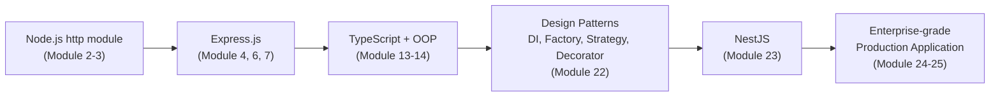

# ২৩.০১. NestJS Intro

আমাদের যাত্রাটা একবার পেছন ফিরে দেখা যাক। Module 4-এ আমরা Express.js দিয়ে প্রথম API বানিয়েছিলাম — কয়েক লাইন কোডে একটা রুট, একটা হ্যান্ডলার। Module 6-7-এ আমরা সেই ছোট শুরুটাকে বড় করেছি — Router, Controller, Middleware আলাদা করেছি, যাতে কোড গোছানো থাকে। Module 22-এ আমরা শিখেছি Dependency Injection, Factory, Strategy, আর Decorator Pattern — এমন সব কৌশল যা বড় সিস্টেমকে সুশৃঙ্খল রাখে। এখন প্রশ্ন হলো — এই সবগুলো ধারণা যদি কেউ একসাথে জড়ো করে, প্রি-প্যাকেজড একটা ফ্রেমওয়ার্ক বানিয়ে ফেলে, তাহলে সেটা দেখতে কেমন হবে? উত্তরটাই হলো **NestJS**।

চলো প্রথমে বুঝি কেন Express.js যথেষ্ট ভালো হওয়া সত্ত্বেও NestJS-এর প্রয়োজন হলো। Express.js ইচ্ছাকৃতভাবে **unopinionated** — মানে এটা তোমাকে জোর করে কোনো নির্দিষ্ট কাঠামো মানতে বাধ্য করে না। ফোল্ডার কীভাবে সাজাবে, ফাইল কোথায় রাখবে, dependency কীভাবে ম্যানেজ করবে — সবকিছুর সিদ্ধান্ত তোমার। এটা ছোট প্রজেক্টে দারুণ স্বাধীনতা দেয়, কিন্তু যখন প্রজেক্ট বড় হয়, একটা দলে দশজন ডেভেলপার কাজ করে, তখন এই স্বাধীনতাই সমস্যা হয়ে দাঁড়ায়। একজন ডেভেলপার হয়তো `controllers/` ফোল্ডারে সব লজিক রাখে, আরেকজন `handlers/` নামে ফোল্ডার বানায়, তৃতীয়জন সরাসরি রুট ফাইলেই সব লিখে ফেলে। প্রজেক্ট বড় হতে হতে একটা সময় প্রতিটা ফাইল দেখতে ভিন্ন ভিন্ন প্রজেক্টের মতো লাগে, যদিও সবই একই কোডবেসের অংশ।

NestJS এই সমস্যার সমাধান দেয় সম্পূর্ণ উল্টো দর্শন দিয়ে — এটা **opinionated**। মানে NestJS তোমাকে একটা নির্দিষ্ট কাঠামো, নির্দিষ্ট নিয়ম মেনে চলতে বলে। প্রথম দেখায় এটা কিছুটা কঠোর মনে হতে পারে, কিন্তু বাস্তবে এটা একটা বিশাল সুবিধা — যেকোনো NestJS প্রজেক্টে ঢুকলেই তুমি জানো ঠিক কোথায় কী খুঁজতে হবে, কারণ কাঠামোটা সবার জন্য একইরকম। এটা অনেকটা এরকম — Express.js যদি হয় একটা খালি জমি, যেখানে তুমি নিজের ইচ্ছামতো বাড়ি বানাতে পারো, তাহলে NestJS হলো একটা প্রি-ডিজাইনড অ্যাপার্টমেন্ট কমপ্লেক্স — প্রতিটা ফ্ল্যাটের গঠন একইরকম, বেডরুম কোথায়, রান্নাঘর কোথায় — সবকিছু আগে থেকেই নির্ধারিত, তুমি শুধু ভেতরের সাজসজ্জা (তোমার বিজনেস লজিক) ঠিক করো।

আরেকটা গুরুত্বপূর্ণ পার্থক্য — Express.js নিজে থেকে TypeScript সমর্থন করে না (যদিও Module 13-এ আমরা দেখেছি কীভাবে Express-এর সাথে TypeScript যোগ করা যায়), কিন্তু NestJS তৈরিই হয়েছে TypeScript-কে কেন্দ্র করে। এর মানে হলো, Module 13-14-তে যা শিখেছো — Class, Interface, Type, Decorator — এই সবকিছু NestJS-এ প্রথম শ্রেণীর নাগরিক (first-class citizen), কোনো "extra add-on" না।

NestJS-এর নামের পেছনেও একটা আকর্ষণীয় গল্প আছে — এটার নকশা অনেকাংশে অনুপ্রাণিত **Angular** ফ্রেমওয়ার্ক থেকে (যেটা মূলত একটা ফ্রন্টএন্ড ফ্রেমওয়ার্ক), বিশেষত Angular-এর Module, Dependency Injection সিস্টেম, আর Decorator-ভিত্তিক সিনট্যাক্স থেকে। এই কারণেই যদি তুমি ভবিষ্যতে Angular শেখো, NestJS-এর কাঠামো তোমার কাছে পরিচিত লাগবে, আর উল্টোটাও সত্যি।

এখন একটা বড় ছবি দেখা যাক, যেখানে আমরা এই পুরো কোর্সের যাত্রাটা এক নজরে দেখতে পাচ্ছি:

প্রতিটা ধাপ পরের ধাপের ভিত্তি তৈরি করেছে। Node.js-এর `http` মডিউল আমাদের শিখিয়েছে সার্ভার আসলে কী। Express.js শিখিয়েছে routing আর middleware দিয়ে কীভাবে একটা সংগঠিত API বানাতে হয়। TypeScript আর OOP শিখিয়েছে কীভাবে টাইপ-নিরাপদ, কাঠামোবদ্ধ কোড লিখতে হয়। Design Pattern শিখিয়েছে সেই কাঠামোকে আরও পরিশীলিত করার কৌশল। আর এখন, NestJS আমাদের দেখাবে কীভাবে এই সবকিছু একসাথে মিলিয়ে একটা প্রোডাকশন-রেডি, এন্টারপ্রাইজ-গ্রেড ফ্রেমওয়ার্ক তৈরি হয়।

একটা কথা স্পষ্ট করে বলা দরকার — NestJS আসলে Express.js-কে প্রতিস্থাপন করে না, বরং এর **উপরে** তৈরি। ডিফল্টভাবে NestJS ভেতরে ভেতরে Express.js ব্যবহার করে HTTP রিকোয়েস্ট হ্যান্ডেল করার জন্য (যদিও চাইলে Fastify নামের আরেকটা দ্রুতগতির ইঞ্জিনও ব্যবহার করা যায়)। তার মানে তুমি যা Express সম্পর্কে শিখেছো, তার কিছুই বৃথা যায়নি — NestJS সেই একই ভিত্তির উপর দাঁড়িয়ে একটা অনেক বেশি সংগঠিত, স্কেলেবল কাঠামো প্রদান করে।

NestJS ঠিক কোন কোন সমস্যার সমাধান করে, তার একটা তালিকা করা যাক। প্রথমত, এটা একটা built-in Dependency Injection সিস্টেম দেয়, যেটা আমরা Module 22-এ হাতে-কলমে করে দেখিয়েছিলাম — NestJS-এ এটা স্বয়ংক্রিয়ভাবে হয়ে যায়। দ্বিতীয়ত, এটা একটা স্পষ্ট মডিউলার কাঠামো দেয় — প্রতিটা ফিচার তার নিজস্ব "Module"-এ থাকে, যেটা একটা স্বয়ংসম্পূর্ণ প্যাকেজের মতো কাজ করে। তৃতীয়ত, এটা decorator-ভিত্তিক সিনট্যাক্স ব্যবহার করে (Module 22-এর শেষ লেসনে যা আমরা দেখেছি) যা কোডকে স্বতঃব্যাখ্যাত (self-documenting) করে তোলে — `@Controller()`, `@Get()`, `@Injectable()` দেখেই বোঝা যায় কোন ক্লাস কী কাজ করে।

আজকের বিশ্বে বহু বড় কোম্পানি (Adidas, Roche, Autodesk-এর মতো প্রতিষ্ঠান) NestJS ব্যবহার করে তাদের ব্যাকএন্ড সিস্টেম বানিয়েছে, কারণ যখন দল বড় হয়, প্রজেক্ট জটিল হয়, তখন opinionated কাঠামো একটা আশীর্বাদ হয়ে দাঁড়ায় — নতুন কেউ দলে যোগ দিলে দ্রুত মানিয়ে নিতে পারে, কারণ কাঠামো পরিচিত।

পরের লেসনে আমরা NestJS-এর চারপাশের পুরো ইকোসিস্টেমটা ঘুরে দেখবো — কী কী টুল, লাইব্রেরি, আর কনভেনশন একসাথে মিলে NestJS-কে এত শক্তিশালী করে তুলেছে।
