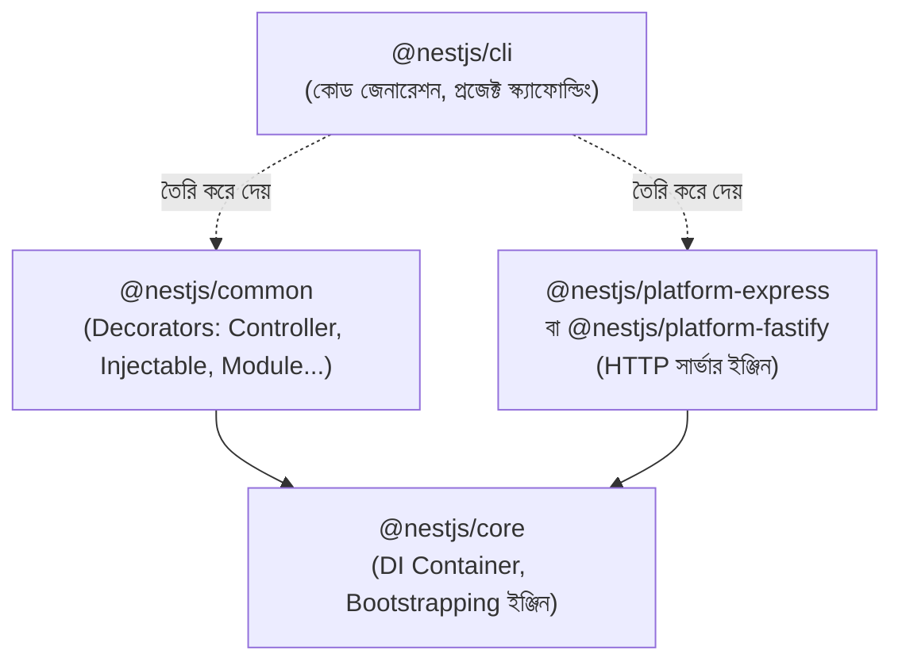

# ২৩.০২. Introduction to NestJS ecosystem

আগের লেসনে আমরা বুঝেছি NestJS কেন দরকার। এখন একটু বড় করে দেখি — NestJS আসলে একলা কোনো লাইব্রেরি না, এটা একটা সম্পূর্ণ **ইকোসিস্টেম**, যার প্রতিটা অংশ একটা নির্দিষ্ট উদ্দেশ্য সাধন করে। ঠিক যেমন Module 3-এ আমরা দেখেছিলাম কীভাবে বিভিন্ন টুল (Node.js, Express, TypeScript, Database) মিলে একটা পূর্ণাঙ্গ ব্যাকএন্ড সিস্টেম তৈরি করে, NestJS-এর ভেতরেও একইরকম একটা ছোট ইকোসিস্টেম আছে।

সবচেয়ে প্রথমে বলা দরকার **`@nestjs/core`** আর **`@nestjs/common`** প্যাকেজের কথা — এই দুটোই NestJS-এর মূল ভিত্তি। `@nestjs/common` প্যাকেজে থাকে সেই সব decorator যা আমরা সবচেয়ে বেশি ব্যবহার করবো — `@Controller()`, `@Injectable()`, `@Module()`, `@Get()`, `@Post()` ইত্যাদি। `@nestjs/core` প্যাকেজে থাকে সেই ইঞ্জিন, যেটা এই decorator-গুলো পড়ে বুঝে নেয় কীভাবে অ্যাপ্লিকেশনটা চালাতে হবে — এটাই সেই DI Container, যার তত্ত্বীয় ধারণা আমরা Module 22-এ শিখেছিলাম।

লক্ষ্য করো **`@nestjs/platform-express`** নামের প্যাকেজটা — এটাই সেই সংযোগ যা আগের লেসনে বলেছিলাম, NestJS ভেতরে ভেতরে Express.js ব্যবহার করে। যখন তুমি `@Get()` decorator লেখো, শেষ পর্যন্ত সেটা Express.js-এর `app.get()`-এই রূপান্তরিত হয় — কিন্তু তোমাকে সেটা হাতে লিখতে হয় না, NestJS এই "অনুবাদ"-এর কাজটা নিজে করে দেয়। এই কারণেই Module 6-7-এ শেখা Express-এর routing, middleware ধারণাগুলো NestJS বোঝার সময় প্রচণ্ড কাজে লাগবে — তুমি শুধু শিখছো একই জিনিসের একটা অনেক বেশি সংগঠিত রূপ।

**`@nestjs/cli`** হলো একটা কমান্ড-লাইন টুল, যেটা তুমি ব্যবহার করবে প্রায় প্রতিদিন। এটা নতুন প্রজেক্ট তৈরি করা, নতুন Controller/Service/Module স্বয়ংক্রিয়ভাবে জেনারেট করা — এসব কাজের জন্য দায়ী। পরের লেসনে আমরা এটা হাতেকলমে ব্যবহার করে দেখবো।

এই মূল প্যাকেজগুলোর বাইরে, NestJS-এর একটা বিশাল "official" মডিউল-ইকোসিস্টেম আছে, যেগুলো প্রায় সবই `@nestjs/` প্রিফিক্স দিয়ে শুরু হয়, আর প্রতিটা একটা নির্দিষ্ট বাস্তব সমস্যার সমাধান করে:

- **`@nestjs/typeorm`** বা **`@nestjs/mongoose`** — ডেটাবেজের সাথে সংযোগ (Module 15-21-এ আমরা যে ডেটাবেজ ধারণা শিখেছি, সেগুলো এখানে ব্যবহারিকভাবে প্রয়োগ হয়)।
- **`@nestjs/config`** — এনভায়রনমেন্ট ভেরিয়েবল আর কনফিগারেশন সুশৃঙ্খলভাবে ম্যানেজ করার জন্য।
- **`@nestjs/jwt`** এবং **`@nestjs/passport`** — অথেন্টিকেশনের জন্য, যেটা Module 12-এ শেখা JWT ধারণার সরাসরি প্রয়োগ।
- **`@nestjs/swagger`** — API ডকুমেন্টেশন স্বয়ংক্রিয়ভাবে তৈরি করার জন্য।
- **`@nestjs/websockets`** এবং **`@nestjs/microservices`** — রিয়েল-টাইম যোগাযোগ আর মাইক্রোসার্ভিস আর্কিটেকচারের জন্য (Module 25-এ আমরা এগুলো গভীরে দেখবো)।

এই তালিকা দেখে ভয় পাওয়ার কিছু নেই — লক্ষ্য করো একটা প্যাটার্ন। প্রতিটা মডিউল একটা নির্দিষ্ট, সীমিত দায়িত্ব পালন করে, আর প্রয়োজন অনুযায়ী তুমি শুধু সেই মডিউলগুলোই যোগ করবে যেগুলো তোমার প্রজেক্টে দরকার। এটাই NestJS-এর দর্শনের একটা গুরুত্বপূর্ণ অংশ — **modularity** (মডিউলারিটি), যেটা নিয়ে আমরা এই মডিউলের সপ্তম লেসনে আরও বিস্তারিত আলোচনা করবো।

একটা গুরুত্বপূর্ণ পার্থক্য বুঝে নেয়া দরকার — NestJS নিজে একটা **framework**, আর উপরে উল্লেখিত `@nestjs/typeorm`, `@nestjs/jwt`-এর মতো জিনিসগুলো হলো **integration module** — এগুলো তৃতীয়-পক্ষের লাইব্রেরি (যেমন TypeORM, Passport)-কে NestJS-এর decorator-ভিত্তিক, DI-ভিত্তিক দুনিয়ার সাথে সুন্দরভাবে সংযুক্ত করে দেয়। তার মানে তুমি TypeORM বা Passport সম্পর্কে যা জানো, সেটা এখানেও কাজে লাগবে — শুধু সেগুলোকে ব্যবহার করার "প্রবেশপথ" (interface) NestJS-এর নিয়ম মেনে তৈরি।

NestJS ইকোসিস্টেমের আরেকটা গুরুত্বপূর্ণ অংশ হলো এর ডকুমেন্টেশন আর কমিউনিটি। NestJS-এর অফিসিয়াল ডকুমেন্টেশন (docs.nestjs.com) অত্যন্ত সুসংগঠিত এবং প্রতিটা কনসেপ্টের জন্য বাস্তব উদাহরণ দেয়া থাকে — এই কোর্স শেষ করার পর তুমি সরাসরি সেই ডকুমেন্টেশন পড়ে নিজে নিজে নতুন মডিউল শিখে নিতে পারবে, কারণ এই লেসনগুলোতে যে মূল ধারণাগুলো (Controller, Provider, Module) শিখবে, সেগুলোর উপরেই বাকি সবকিছু দাঁড়িয়ে আছে।

এই ইকোসিস্টেমের বড় ছবিটা মাথায় রেখে, এখন আমরা প্রস্তুত সরাসরি হাতে-কলমে কাজ শুরু করার জন্য। পরের লেসনে আমরা `@nestjs/cli` ব্যবহার করে প্রথম NestJS প্রজেক্ট তৈরি করবো, এবং সেটা রান করে দেখবো।
