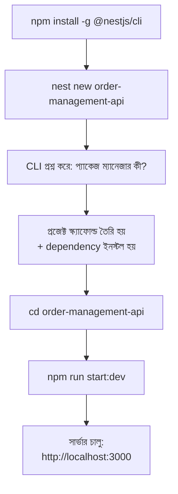

# ২৩.০৩. Running a NestJS Project

তত্ত্ব অনেক হলো, এবার হাতে-কলমে কাজ শুরু করার সময়। Module 2-এ আমরা যেমন প্রথমে হাতে লিখে একটা Node.js সার্ভার বানিয়েছিলাম, তারপর ধীরে ধীরে জটিলতা বাড়িয়েছিলাম, এখানেও একই দর্শন অনুসরণ করবো — প্রথমে NestJS CLI দিয়ে একটা প্রজেক্ট তৈরি করবো, রান করবো, তারপর ভেতরে কী আছে সেটা বুঝে নেবো।

প্রথম ধাপ হলো NestJS CLI ইনস্টল করা। এটা একটা গ্লোবাল npm প্যাকেজ, যেটা টার্মিনালের যেকোনো জায়গা থেকে চালানো যায়:

```bash
npm install -g @nestjs/cli
```

ইনস্টল হয়ে গেলে যাচাই করে নাও ভার্সন দেখে:

```bash
nest --version
```

এখন নতুন একটা প্রজেক্ট তৈরি করি। মনে করো আমরা একটা অর্ডার ম্যানেজমেন্ট সিস্টেম বানাচ্ছি (Module 22-এ যেই উদাহরণ নিয়ে কাজ করেছিলাম, সেটার সাথে মিল রেখে):

```bash
nest new order-management-api
```

এই কমান্ডটা রান করলে CLI তোমাকে প্রশ্ন করবে কোন প্যাকেজ ম্যানেজার ব্যবহার করতে চাও — npm, yarn, নাকি pnpm। যেকোনো একটা বেছে নিলে, CLI স্বয়ংক্রিয়ভাবে একটা সম্পূর্ণ, চলমান প্রজেক্ট কাঠামো তৈরি করে দেবে, এবং প্রয়োজনীয় সব dependency ইনস্টল করে দেবে। এই একটা কমান্ডেই তুমি এমন কিছু পাচ্ছো যা হাতে বানাতে গেলে ঘন্টার পর ঘন্টা লাগতো — TypeScript কনফিগারেশন, ESLint/Prettier সেটআপ, টেস্টিং ফ্রেমওয়ার্ক (Jest), আর একটা বেসিক কাজ-করা অ্যাপ্লিকেশন।

প্রজেক্ট তৈরি হয়ে গেলে, ফোল্ডারে ঢুকে সার্ভার চালু করি:

```bash
cd order-management-api
npm run start:dev
```

`start:dev` কমান্ডটা বিশেষভাবে গুরুত্বপূর্ণ — এটা **watch mode**-এ সার্ভার চালায়, মানে তুমি যখনই কোনো ফাইল পরিবর্তন করে সেভ করবে, সার্ভার স্বয়ংক্রিয়ভাবে রিস্টার্ট হয়ে যাবে। এটা অনেকটা Module 2-তে আমরা যেভাবে VS Code-এর Live Server প্লাগইন ব্যবহার করে HTML ফাইল সেভ করার সাথে সাথে ব্রাউজার রিফ্রেশ হতে দেখেছিলাম, তারই ব্যাকএন্ড সংস্করণ।

সার্ভার চালু হলে টার্মিনালে একটা লগ দেখতে পাবে যা বলবে অ্যাপ্লিকেশনটা `http://localhost:3000` পোর্টে চলছে (Module 2-এর ৮ নম্বর লেসনে শেখা Port-এর ধারণা মনে করো)। ব্রাউজারে গিয়ে সেই ঠিকানায় গেলে দেখবে একটা সাধারণ টেক্সট — "Hello World!" — এটাই NestJS-এর ডিফল্ট রুট, যা প্রজেক্ট তৈরির সময় স্বয়ংক্রিয়ভাবে তৈরি হয়ে যায়।

পুরো প্রক্রিয়াটা একটা ফ্লোতে দেখা যাক:



একটা প্রশ্ন হতে পারে — `nest new` যা করলো, সেটা কি আমরা নিজেরা `npm init` দিয়ে থেকে শুরু করে করতে পারতাম না? উত্তর হলো, টেকনিক্যালি হ্যাঁ, কিন্তু ব্যবহারিকভাবে এটাই CLI-ভিত্তিক ফ্রেমওয়ার্কের আসল সুবিধা — একটা নির্দিষ্ট, প্রমাণিত কনভেনশন অনুযায়ী প্রজেক্ট শুরু হয়, যাতে টিমের প্রতিটা সদস্য একই কাঠামো থেকে শুরু করে। এটা অনেকটা Module 1-এ আমরা যেমন Git দিয়ে প্রজেক্ট শুরু করা শিখেছিলাম — Git init করার সাথে সাথেই একটা প্রমাণিত ওয়ার্কফ্লো শুরু হয়ে যায়, সবাইকে নিজে নিজে ভার্সন কন্ট্রোল সিস্টেম বানাতে হয় না।

এখন `package.json` ফাইলটা একটু দেখা যাক, কারণ এখানে কিছু গুরুত্বপূর্ণ স্ক্রিপ্ট আছে যেগুলো আমরা বারবার ব্যবহার করবো:

```json
{
  "scripts": {
    "build": "nest build",
    "start": "nest start",
    "start:dev": "nest start --watch",
    "start:prod": "node dist/main",
    "test": "jest",
    "test:e2e": "jest --config ./test/jest-e2e.json"
  }
}
```

`start` সাধারণ মোডে সার্ভার চালায় (উৎপাদনের কাছাকাছি অবস্থায়), `start:dev` ডেভেলপমেন্টের সময় ব্যবহার করা হয় (auto-reload সহ), আর `start:prod` ব্যবহার হয় যখন প্রজেক্ট বিল্ড হয়ে গিয়ে (`npm run build`) আসল প্রোডাকশন সার্ভারে ডেপ্লয় করা হয় — এই বিল্ড প্রক্রিয়ায় TypeScript কোড সাধারণ JavaScript-এ রূপান্তরিত হয় (`dist/` ফোল্ডারে), ঠিক যেমন Module 13-এ আমরা দেখেছিলাম TypeScript কোড কীভাবে কম্পাইল হয়ে জাভাস্ক্রিপ্টে পরিণত হয়।

এই মুহূর্তে তোমার হাতে একটা চলমান, যদিও একেবারে খালি, NestJS অ্যাপ্লিকেশন আছে। পরের লেসনে আমরা এই প্রজেক্টের ভেতরের ফোল্ডার আর ফাইলগুলো একটা একটা করে খুলে দেখবো — কোন ফাইল কী কাজ করে, আর কেন ঠিক এভাবে সাজানো হয়েছে।
