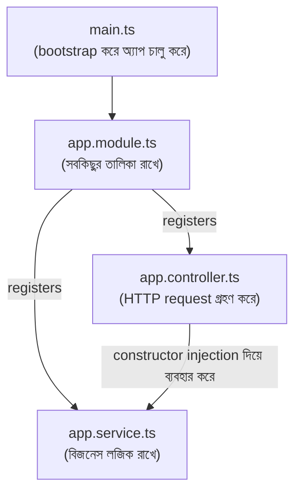

# ২৩.০৪. Files and Folder Structures

আগের লেসনে আমরা `nest new order-management-api` কমান্ড দিয়ে একটা প্রজেক্ট তৈরি করেছিলাম। এখন সেই প্রজেক্টের ভেতরে ঢুকে দেখা যাক ঠিক কী কী তৈরি হয়েছে, আর কেন। এই ফোল্ডার কাঠামো বোঝাটা গুরুত্বপূর্ণ, কারণ NestJS-এর জগতে প্রায় প্রতিটা প্রজেক্ট একই মূল কাঠামো অনুসরণ করে — একবার এটা বুঝে গেলে, তুমি যেকোনো NestJS কোডবেসে দ্রুত নিজের পথ খুঁজে নিতে পারবে।

প্রজেক্টের মূল কাঠামোটা সাধারণত এরকম দেখায়:

```
order-management-api/
├── src/
│   ├── app.controller.ts
│   ├── app.controller.spec.ts
│   ├── app.service.ts
│   ├── app.module.ts
│   └── main.ts
├── test/
│   └── app.e2e-spec.ts
├── node_modules/
├── package.json
├── tsconfig.json
├── nest-cli.json
└── .eslintrc.js
```

সবচেয়ে গুরুত্বপূর্ণ ফোল্ডারটা হলো **`src/`** — এখানেই তোমার সব অ্যাপ্লিকেশন কোড থাকবে। এই ফোল্ডারের ভেতরের চারটা ফাইল নিয়ে বিস্তারিত আলোচনা করা যাক, কারণ এই চারটা ফাইলের প্যাটার্নই পুরো NestJS-এর গঠনরীতি বুঝিয়ে দেয়।

**`main.ts`** হলো অ্যাপ্লিকেশনের প্রবেশদ্বার (entry point) — ঠিক যেমন Module 2-তে আমাদের `server.js` ফাইলে `http.createServer()` কল দিয়ে সার্ভার শুরু হতো, এখানে `main.ts`-এই সেই একই কাজ হয়, শুধু NestJS-এর নিজস্ব পদ্ধতিতে:

```typescript
import { NestFactory } from '@nestjs/core';
import { AppModule } from './app.module';

async function bootstrap() {
  const app = await NestFactory.create(AppModule);
  await app.listen(3000);
}
bootstrap();
```

লক্ষ্য করো `NestFactory.create(AppModule)` লাইনটা — এটাই সেই মুহূর্ত যেখানে NestJS-এর DI Container (Module 22-এ যা তত্ত্বীয়ভাবে শিখেছিলাম) কাজ শুরু করে। এটা `AppModule`-কে "রুট" ধরে নিয়ে পুরো অ্যাপ্লিকেশনের dependency গ্রাফ তৈরি করে ফেলে, তারপর `app.listen(3000)` দিয়ে Module 2-এর ৮ নম্বর লেসনে শেখা পোর্টে সার্ভার চালু হয়ে যায়।

**`app.module.ts`** হলো রুট মডিউল — গোটা অ্যাপ্লিকেশনের সবচেয়ে উপরের সাংগঠনিক ইউনিট। এটার গঠন এরকম:

```typescript
import { Module } from '@nestjs/common';
import { AppController } from './app.controller';
import { AppService } from './app.service';

@Module({
  imports: [],
  controllers: [AppController],
  providers: [AppService],
})
export class AppModule {}
```

এই ফাইলটা আসলে NestJS-কে বলে দেয় — "এই অ্যাপ্লিকেশনে এই এই Controller আছে, এই এই Provider (Service) আছে, আর অন্য কোনো Module থেকে কিছু import করতে হলে সেটাও এখানে লিস্ট করা হবে"। Module সম্পর্কে আমরা এই মডিউলের সপ্তম লেসনে বিস্তারিত জানবো, কিন্তু এখনই এটা মনে রাখা ভালো যে এই ফাইলটাই পুরো অ্যাপ্লিকেশনের "সূচিপত্র" (table of contents)।

**`app.controller.ts`** হলো Controller — এটা HTTP রিকোয়েস্ট গ্রহণ করে, আর রেসপন্স ফেরত পাঠায়। এটা Module 7-এ আমরা যে Controller ধারণা শিখেছিলাম, তারই একটা কাঠামোবদ্ধ রূপ:

```typescript
import { Controller, Get } from '@nestjs/common';
import { AppService } from './app.service';

@Controller()
export class AppController {
  constructor(private readonly appService: AppService) {}

  @Get()
  getHello(): string {
    return this.appService.getHello();
  }
}
```

লক্ষ্য করো constructor-এ `AppService`-টা কীভাবে গ্রহণ করা হচ্ছে — এটা হুবহু Module 22-এ শেখা Constructor Injection। `AppController` নিজে `AppService`-এর instance তৈরি করছে না (`new AppService()` কোথাও নেই), বরং NestJS-এর DI Container সেটা স্বয়ংক্রিয়ভাবে তৈরি করে সরবরাহ করে দিচ্ছে। এটাই সেই তাত্ত্বিক ধারণার প্রথম বাস্তব প্রয়োগ যা আমরা দেখতে পাচ্ছি।

**`app.service.ts`** হলো Provider (বা Service) — এখানে থাকে আসল বিজনেস লজিক:

```typescript
import { Injectable } from '@nestjs/common';

@Injectable()
export class AppService {
  getHello(): string {
    return 'Hello World!';
  }
}
```

`@Injectable()` decorator-টা এই ক্লাসকে চিহ্নিত করে দিচ্ছে "এটা একটা এমন ক্লাস, যা অন্য কোনো ক্লাসের ভেতরে inject করা যাবে"। এই decorator না থাকলে NestJS-এর DI Container এই ক্লাসটাকে dependency হিসেবে সরবরাহ করতে পারবে না।

এই তিনটা ফাইলের সম্পর্ক একটা ডায়াগ্রামে দেখা যাক:



**`app.controller.spec.ts`** ফাইলটা লক্ষ্য করার মতো — `.spec.ts` এক্সটেনশন মানে এটা একটা টেস্ট ফাইল, Jest ফ্রেমওয়ার্ক ব্যবহার করে লেখা। NestJS প্রজেক্ট শুরু থেকেই টেস্টিং-বান্ধব — প্রতিটা নতুন Controller বা Service তৈরির সাথে সাথে CLI স্বয়ংক্রিয়ভাবে তার জন্য একটা টেস্ট ফাইলের কঙ্কাল বানিয়ে দেয়, যাতে টেস্টিং শুরু থেকেই কোডিং ওয়ার্কফ্লোর একটা স্বাভাবিক অংশ হয়ে যায়।

শেষে **`nest-cli.json`** ফাইলটার কথা বলি — এটা CLI-কে বলে দেয় প্রজেক্টের সোর্স ফোল্ডার কোথায়, কম্পাইল করার নিয়ম কী। সাধারণত এই ফাইলে হাত দেয়ার দরকার হয় না, কিন্তু এটা জানা থাকলে বুঝতে সুবিধা হয় কীভাবে `nest generate` কমান্ড ঠিক জায়গায় ফাইল তৈরি করে।

এখন আমরা জানি প্রজেক্টের প্রতিটা ফাইল কোথায় থাকে আর কেন। পরের তিনটা লেসনে আমরা Controller, Provider, আর Module — এই তিনটা মূল বিল্ডিং ব্লক একটা একটা করে অনেক গভীরে গিয়ে দেখবো, নিজে হাতে নতুন কোড লিখে।
