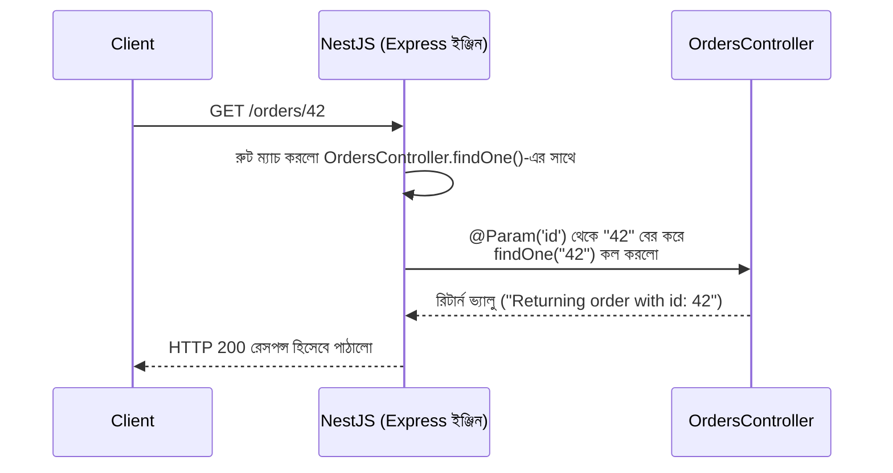

# ২৩.০৫. Controllers in NestJS

Module 7-এ আমরা প্রথম Controller ধারণাটা শিখেছিলাম — কেন রুট হ্যান্ডলারের ভেতরে সব লজিক গুঁজে না দিয়ে, HTTP রিকোয়েস্ট গ্রহণ করার দায়িত্বটাকে আলাদা করে ফেলা উচিত। NestJS এই একই ধারণাকে নিয়েছে, আর একে একটা আনুষ্ঠানিক, decorator-চালিত কাঠামোতে রূপান্তরিত করেছে। এই লেসনে আমরা Controller নিয়ে গভীরে যাবো — কীভাবে রুট বানাবে, প্যারামিটার নেবে, বডি পড়বে।

প্রথমে CLI দিয়ে একটা নতুন Controller জেনারেট করা যাক। মনে রাখো, আগের লেসনগুলোতে আমরা `order-management-api` নামের একটা প্রজেক্ট বানিয়েছিলাম — এখন সেখানে একটা `orders` রিসোর্স যোগ করি:

```bash
nest generate controller orders
# সংক্ষেপে: nest g co orders
```

এই কমান্ড চালালে CLI স্বয়ংক্রিয়ভাবে `src/orders/orders.controller.ts` তৈরি করবে, এবং সবচেয়ে গুরুত্বপূর্ণ ব্যাপার — এটা `app.module.ts`-এর `controllers` অ্যারেতে নিজেই এই নতুন Controller-কে যোগ করে দেবে। এটাই NestJS CLI-এর আসল সুবিধা — তুমি শুধু ব্যবসায়িক লজিক লিখবে, বয়লারপ্লেট সংযোগের কাজ CLI নিজেই করে দেয়।

তৈরি হওয়া ফাইলটা শুরুতে খালি থাকে, এখন আমরা এতে বাস্তব রুট যোগ করবো:

```typescript
import { Controller, Get, Post, Body, Param, Query } from '@nestjs/common';

@Controller('orders')
export class OrdersController {
  @Get()
  findAll(@Query('status') status?: string) {
    // GET /orders  অথবা  GET /orders?status=pending
    return `Returning all orders, filtered by status: ${status ?? 'none'}`;
  }

  @Get(':id')
  findOne(@Param('id') id: string) {
    // GET /orders/42
    return `Returning order with id: ${id}`;
  }

  @Post()
  create(@Body() orderData: { item: string; quantity: number }) {
    // POST /orders
    return `Order created for ${orderData.item}, quantity: ${orderData.quantity}`;
  }
}
```

এই কোড দেখে মনে করো Module 6-এর সেই লেসনের কথা, যেখানে আমরা শিখেছিলাম **Query Parameter** (`?status=pending`) বনাম **Path/Route Parameter** (`/orders/42`)-এর পার্থক্য। NestJS-এ এই একই ধারণাগুলো `@Query()` আর `@Param()` decorator দিয়ে প্রকাশ করা হয় — কিন্তু Express.js-এ যেখানে তোমাকে `req.query.status` বা `req.params.id` লিখে ম্যানুয়ালি খুঁজে বের করতে হতো, এখানে NestJS decorator ব্যবহার করে সরাসরি সেই মানটা ফাংশনের প্যারামিটার হিসেবে "inject" করে দেয়।

`@Body()` decorator একইভাবে POST রিকোয়েস্টের বডি থেকে ডেটা বের করে আনে — Module 6-এর "Anatomy of a POST Request Endpoint" লেসনে আমরা যা শিখেছিলাম, এটা তারই একটা পরিষ্কার, টাইপ-নিরাপদ সংস্করণ, কারণ TypeScript-এর টাইপ অ্যানোটেশন (`{ item: string; quantity: number }`) ব্যবহার করে আমরা বডির আকৃতি স্পষ্টভাবে ঘোষণা করছি।

`@Controller('orders')`-এ যে স্ট্রিং `'orders'` দেয়া হয়েছে, সেটাকে বলে **route prefix**। এর মানে এই Controller-এর ভেতরের সব রুট স্বয়ংক্রিয়ভাবে `/orders` দিয়ে শুরু হবে। তাই `@Get()` মানে `GET /orders`, আর `@Get(':id')` মানে `GET /orders/:id`। এই পদ্ধতিতে সম্পর্কিত সব রুট একটা নির্দিষ্ট Controller-এর ভেতরে সুন্দরভাবে গোছানো থাকে, ঠিক যেমন Module 7-এ আমরা `express.Router()` ব্যবহার করে রুটগুলো ভাগ করেছিলাম।

পুরো রিকোয়েস্ট-রেসপন্স প্রবাহটা দেখা যাক একটা সিকোয়েন্স ডায়াগ্রামে:



এই ডায়াগ্রামে একটা গুরুত্বপূর্ণ বিষয় লক্ষ্য করো — NestJS-এ তোমাকে ম্যানুয়ালি `res.send()` বা `res.json()` কল করতে হয় না (যেমনটা Express.js-এ করতে হতো)। তুমি শুধু ফাংশন থেকে একটা মান রিটার্ন করো, আর NestJS নিজে সেটাকে JSON-এ রূপান্তরিত করে সঠিক HTTP রেসপন্স হিসেবে পাঠিয়ে দেয়। এটা কোড অনেক পরিষ্কার করে দেয়, যদিও প্রয়োজনে তুমি `@Res()` decorator ব্যবহার করে Express-এর আসল `response` অবজেক্টেও সরাসরি অ্যাক্সেস পেতে পারো, ঠিক Module 6-7-এর মতো।

Status code নিয়েও (Module 6-এর প্রথম লেসন মনে করো) NestJS-এর নিজস্ব সুন্দর পদ্ধতি আছে:

```typescript
import { Controller, Post, Body, HttpCode, HttpStatus } from '@nestjs/common';

@Controller('orders')
export class OrdersController {
  @Post()
  @HttpCode(HttpStatus.CREATED) // 201 status code
  create(@Body() orderData: { item: string }) {
    return { message: `Order created for ${orderData.item}` };
  }
}
```

`@HttpCode(HttpStatus.CREATED)` decorator ব্যবহার করে আমরা স্পষ্টভাবে বলে দিচ্ছি এই রুট সফল হলে `201 Created` স্ট্যাটাস কোড ফেরত যাবে — যেটা Module 6-এ শেখা status code-এর গুরুত্বের সাথে হুবহু সংগতিপূর্ণ, শুধু এখানে এটা একটা decorator দিয়ে ঘোষণামূলকভাবে (declaratively) প্রকাশ করা হচ্ছে, ইম্পারেটিভভাবে (`res.status(201)`) না।

Controller-এর কাজ এখন স্পষ্ট — এটা শুধু HTTP-র "দরজা" হিসেবে কাজ করে, রিকোয়েস্ট গ্রহণ করে, প্রয়োজনীয় ডেটা বের করে আনে, তারপর সেই ডেটা নিয়ে আসল কাজ করার দায়িত্ব দিয়ে দেয় Provider-কে। এই বিভাজনটাই পরের লেসনের বিষয় — আমরা দেখবো Provider (বা Service) ঠিক কীভাবে বিজনেস লজিক ধরে রাখে, আর কীভাবে Dependency Injection-এর মাধ্যমে Controller-এর সাথে যুক্ত হয়।
