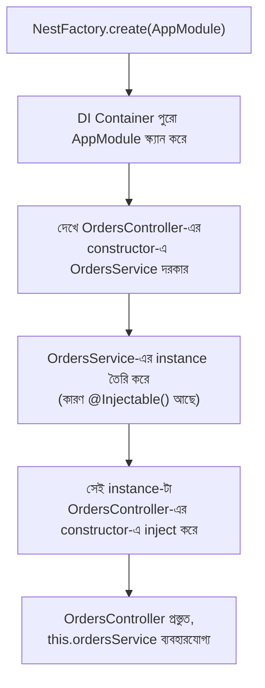

# ২৩.০৬. Providers in NestJS

আগের লেসনে আমরা Controller বানিয়েছিলাম, কিন্তু ইচ্ছাকৃতভাবে তার ভেতরে সরাসরি স্ট্রিং রিটার্ন করেছিলাম, কোনো আসল বিজনেস লজিক লিখিনি। এখন সময় এসেছে সেই ফাঁকটা পূরণ করার — Provider দিয়ে। এই লেসনটা আসলে Module 22-এ শেখা Dependency Injection তত্ত্বের সবচেয়ে গুরুত্বপূর্ণ বাস্তব প্রয়োগ, কারণ Provider-ই হলো NestJS-এর DI সিস্টেমের প্রাণকেন্দ্র।

**Provider** হলো একটা বিস্তৃত ধারণা — যেকোনো ক্লাস যেটা `@Injectable()` decorator দিয়ে চিহ্নিত করা আছে, এবং যেটা NestJS-এর DI Container-এর মাধ্যমে অন্য কোনো ক্লাসে "inject" করা যায়, সেটাই একটা Provider। সবচেয়ে সাধারণ ধরনের Provider হলো **Service** — যেখানে সাধারণত বিজনেস লজিক, ডেটাবেজ কল, বা অন্য কোনো গণনা-ভিত্তিক কাজ থাকে।

CLI দিয়ে একটা Service জেনারেট করা যাক:

```bash
nest generate service orders
# সংক্ষেপে: nest g s orders
```

এটা `src/orders/orders.service.ts` তৈরি করবে। চলো এখানে Module 22-এ শেখা Factory Pattern-এর মতো একটা সাধারণ in-memory অর্ডার ম্যানেজমেন্ট লজিক লিখি:

```typescript
import { Injectable, NotFoundException } from '@nestjs/common';

export interface Order {
  id: number;
  item: string;
  quantity: number;
}

@Injectable()
export class OrdersService {
  private orders: Order[] = [];
  private nextId = 1;

  findAll(status?: string): Order[] {
    // বাস্তব অ্যাপে এখানে status অনুযায়ী ফিল্টার করা হতো,
    // ডেটাবেজ কুয়েরির মাধ্যমে (Module 15-21 মনে করো)
    return this.orders;
  }

  findOne(id: number): Order {
    const order = this.orders.find((o) => o.id === id);
    if (!order) {
      throw new NotFoundException(`Order with id ${id} not found`);
    }
    return order;
  }

  create(item: string, quantity: number): Order {
    const newOrder: Order = { id: this.nextId++, item, quantity };
    this.orders.push(newOrder);
    return newOrder;
  }
}
```

লক্ষ্য করো `@Injectable()` decorator-টা — এটাই সেই সংকেত যা NestJS-কে বলে দেয়, "এই ক্লাসটা DI Container ম্যানেজ করবে, প্রয়োজনে যেকোনো জায়গায় এটা সরবরাহ করা যাবে।" এখন এই Service-কে Controller-এর সাথে যুক্ত করি:

```typescript
import { Controller, Get, Post, Body, Param, Query, ParseIntPipe } from '@nestjs/common';
import { OrdersService } from './orders.service';

@Controller('orders')
export class OrdersController {
  // Constructor Injection — Module 22-এ শেখা ঠিক এই প্যাটার্ন
  constructor(private readonly ordersService: OrdersService) {}

  @Get()
  findAll(@Query('status') status?: string) {
    return this.ordersService.findAll(status);
  }

  @Get(':id')
  findOne(@Param('id', ParseIntPipe) id: number) {
    return this.ordersService.findOne(id);
  }

  @Post()
  create(@Body() body: { item: string; quantity: number }) {
    return this.ordersService.create(body.item, body.quantity);
  }
}
```

এখানে যে জিনিসটা সবচেয়ে গুরুত্বপূর্ণ, সেটা হলো `constructor(private readonly ordersService: OrdersService)` লাইনটা। আমরা কোথাও `new OrdersService()` লিখিনি। এটা হুবহু Module 22-এর দ্বিতীয় লেসনে দেখা Dependency Injection-এর সেই তাত্ত্বিক কোড:

```typescript
// Module 22-এ আমরা যা শিখেছিলাম:
class OrderService {
  constructor(private notifier: Notifier) {}
}
// আর হাতে করে dependency সরবরাহ করতাম:
const orderService = new OrderService(new EmailNotifier());
```

কিন্তু NestJS-এ, সেই "হাতে করে সরবরাহ করা" কাজটা DI Container স্বয়ংক্রিয়ভাবে করে দেয়। যখন NestJS `OrdersController`-এর instance বানানোর দরকার হয়, সে দেখে constructor-এ `OrdersService` টাইপের একটা প্যারামিটার চাওয়া হয়েছে। সে তখন নিজে থেকেই `OrdersService`-এর একটা instance তৈরি করে (অথবা যদি আগে থেকেই একটা তৈরি করা থাকে, সেটাই পুনরায় ব্যবহার করে), এবং সেটা `OrdersController`-এর constructor-এ পাস করে দেয়। প্রোগ্রামারকে এই "তার" জোড়া লাগানোর কাজে হাত দিতে হয় না।

এই পুরো প্রক্রিয়াটা একটা ফ্লোচার্টে দেখা যাক:



এখানে `ParseIntPipe` নামের একটা নতুন জিনিস দেখা গেলো — এটা একটা **Pipe**, যেটা রিকোয়েস্ট থেকে আসা ডেটাকে ব্যবহারের আগে রূপান্তর বা যাচাই (validate) করে। যেহেতু URL-এর সব প্যারামিটার আসলে string হিসেবে আসে, `ParseIntPipe` সেই string-কে number-এ রূপান্তরিত করে দেয়, আর যদি রূপান্তর সম্ভব না হয় (কেউ যদি `/orders/abc` পাঠায়), স্বয়ংক্রিয়ভাবে একটা এরর ফেরত পাঠায়। এটা Module 6-এর "Data validation in a Backend Application" লেসনে শেখা ধারণারই একটা built-in, ঘোষণামূলক রূপ।

`NotFoundException` নামের ক্লাসটাও লক্ষ্য করার মতো — এটা NestJS-এর built-in exception ক্লাসগুলোর একটা, যেটা throw করলে NestJS স্বয়ংক্রিয়ভাবে সঠিক HTTP status code (404) এবং একটা সুগঠিত error response তৈরি করে ফেরত পাঠায়। এভাবে error handling-ও (Module 7-এ যা middleware দিয়ে হাতে করতে হতো) NestJS-এ অনেকটা ঘোষণামূলক আর স্বয়ংক্রিয় হয়ে যায়।

এখন আমাদের কাছে একটা Controller আছে যেটা HTTP-র সাথে কথা বলে, আর একটা Service আছে যেটা আসল লজিক ধরে রাখে, আর দুটোর মধ্যে সংযোগ ঘটছে Dependency Injection দিয়ে। কিন্তু একটা প্রশ্ন এখনও বাকি — NestJS কীভাবে জানে কোন Controller আর কোন Service একসাথে থাকবে, একটা নির্দিষ্ট ফিচারের অংশ হিসেবে? এই প্রশ্নের উত্তর দেবে পরের লেসন — Module।
