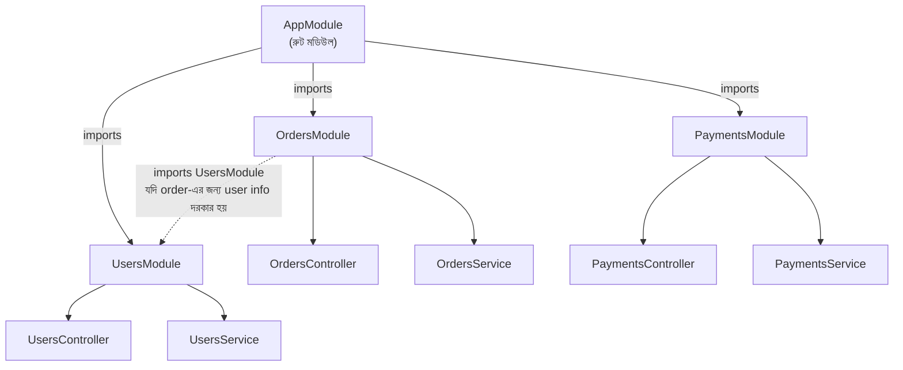

# ২৩.০৭. Modules In NestJS Applications

আমরা এখন পর্যন্ত Controller আর Service (Provider) দিয়ে একটা কাজ-করা `orders` ফিচার বানিয়েছি। কিন্তু বাস্তব অ্যাপ্লিকেশনে শুধু অর্ডার না, থাকবে ইউজার, পেমেন্ট, নোটিফিকেশন — এরকম আরও অনেক ফিচার। এই ফিচারগুলোকে আলাদা আলাদা, স্বয়ংসম্পূর্ণ এককে ভাগ করে রাখার কাজটাই করে **Module**।

Module ধারণাটা বুঝতে Module 8-এর OOP নিয়ে আলোচনার একটা উপমা মনে করা যাক — একটা ক্লাস যেমন সম্পর্কিত ডেটা আর মেথডকে একসাথে "গুটিয়ে" (encapsulate) রাখে, একটা NestJS Module তেমনি সম্পর্কিত Controller, Service, আর অন্যান্য উপাদানকে একসাথে "গুটিয়ে" রাখে একটা নির্দিষ্ট ফিচারের চারপাশে। একে বলা যায় "feature-based organization" — প্রতিটা ব্যবসায়িক ফিচারের নিজস্ব একটা ফোল্ডার, নিজস্ব একটা Module।

চলো CLI দিয়ে `OrdersModule` তৈরি করি (আসলে যখন আমরা আগের লেসনগুলোতে `nest g co orders` আর `nest g s orders` চালিয়েছিলাম, CLI ইতিমধ্যেই এই Module-টা স্বয়ংক্রিয়ভাবে তৈরি করে দিয়েছিলো, কারণ NestJS CLI ডিফল্টভাবে প্রতিটা রিসোর্সের জন্য একটা Module আশা করে):

```bash
nest generate module orders
# সংক্ষেপে: nest g mo orders
```

তৈরি হওয়া `orders.module.ts` ফাইলটা দেখা যাক:

```typescript
import { Module } from '@nestjs/common';
import { OrdersController } from './orders.controller';
import { OrdersService } from './orders.service';

@Module({
  controllers: [OrdersController],
  providers: [OrdersService],
  exports: [OrdersService], // অন্য Module চাইলে OrdersService ব্যবহার করতে পারবে
})
export class OrdersModule {}
```

`@Module()` decorator-এর ভেতরে চারটা মূল প্রপার্টি আছে, প্রতিটার একটা নির্দিষ্ট দায়িত্ব:

- **`controllers`** — এই Module-এর অংশ যে Controller-গুলো, তাদের তালিকা।
- **`providers`** — এই Module-এ যে Service (বা অন্য Provider) তৈরি হবে এবং DI Container-এ নিবন্ধিত হবে, তাদের তালিকা।
- **`imports`** — অন্য কোনো Module-এর কার্যকারিতা যদি এই Module-এর দরকার হয় (যেমন `DatabaseModule`, `AuthModule`), সেগুলো এখানে আমদানি করা হয়।
- **`exports`** — এই Module-এর কোন Provider বাইরের অন্য Module ব্যবহার করতে পারবে, তার তালিকা। ডিফল্টভাবে একটা Module-এর ভেতরের Provider শুধু সেই Module-এর ভেতরেই দৃশ্যমান — `exports` না করলে অন্য কেউ সেটা ব্যবহার করতে পারবে না।

এখন এই `OrdersModule`-কে রুট `AppModule`-এর সাথে যুক্ত করতে হবে, যাতে NestJS জানে এই Module-টা অ্যাপ্লিকেশনের অংশ:

```typescript
import { Module } from '@nestjs/common';
import { OrdersModule } from './orders/orders.module';

@Module({
  imports: [OrdersModule],
  controllers: [],
  providers: [],
})
export class AppModule {}
```

লক্ষ্য করো, এখন `AppModule` নিজে সরাসরি `OrdersController` বা `OrdersService` জানে না — সে শুধু জানে `OrdersModule`-কে import করতে হবে, আর `OrdersModule` নিজে তার ভেতরের সব কিছুর দায়িত্ব নেয়। এটাই মডিউলার আর্কিটেকচারের আসল শক্তি — প্রতিটা ফিচার একটা "ব্ল্যাক বক্স"-এর মতো কাজ করে, যার ভেতরের বিস্তারিত জানার দরকার হয় না বাইরে থেকে, শুধু জানতে হয় সেটা কী প্রদান করে (exports করে)।

পুরো সম্পর্কটা একটা ডায়াগ্রামে দেখা যাক, একটা কল্পিত বড় অ্যাপ্লিকেশনের প্রেক্ষাপটে যেখানে একাধিক Module আছে:



লক্ষ্য করো নিচের তীরটা — `OrdersModule` চাইলে `UsersModule`-কেও import করতে পারে, যদি অর্ডার প্রসেস করার সময় ইউজারের তথ্য দরকার হয় (যেমন ইউজার ভ্যালিড কিনা যাচাই করা)। কিন্তু এই সংযোগটা কাজ করবে শুধু যদি `UsersModule` তার `UsersService`-কে `exports` করে দেয়, আর `OrdersModule` তার `imports`-এ `UsersModule`-কে যোগ করে। এভাবে পুরো অ্যাপ্লিকেশনটা ছোট ছোট, স্বয়ংসম্পূর্ণ, একে অপরের সাথে সুস্পষ্টভাবে সংযুক্ত ইউনিটের সমষ্টি হয়ে দাঁড়ায় — ঠিক যেমন Module 18-19-এ আমরা ডেটাবেজে একটা বড় সিস্টেমকে ছোট ছোট, সম্পর্কযুক্ত টেবিলে ভাগ করা শিখেছিলাম।

এখানে Module 22-এর Dependency Injection তত্ত্বের সাথে একটা গুরুত্বপূর্ণ সংযোগ করা দরকার। DI Container-এর ধারণাটা মূলত পুরো অ্যাপ্লিকেশনের জন্য একটাই — যখন NestJS বুট হয়, সে `AppModule` থেকে শুরু করে, প্রতিটা `imports`-এ থাকা Module-এ ঢুকে, প্রতিটা Provider-কে চিহ্নিত করে, আর একটা বিশাল "dependency গ্রাফ" তৈরি করে ফেলে। Module মূলত এই গ্রাফটাকে সংগঠিত করার একটা উপায় — কোন Provider কার কাছে দৃশ্যমান হবে, সেই "visibility boundary" তৈরি করা।

মডিউলার আর্কিটেকচারের এই কৌশলটাই আমাদের পরবর্তী মডিউলে (Module 24, একটা সম্পূর্ণ ই-কমার্স প্রজেক্ট) কাজে লাগবে সবচেয়ে বেশি — যেখানে আমরা `ProductModule`, `SubscriptionModule`, `StoreModule`-এর মতো একাধিক Module একসাথে নিয়ে একটা পূর্ণাঙ্গ, বাস্তব অ্যাপ্লিকেশন বানাবো। এখন যেহেতু আমরা NestJS-এর তিনটা মূল বিল্ডিং ব্লক (Controller, Provider, Module) বুঝে গেছি, পরের এবং শেষ লেসনে আমরা পুরো মডিউলটা সংক্ষেপে রিক্যাপ করবো, আর দেখবো এই সবকিছু একসাথে কীভাবে কাজ করে একটা সম্পূর্ণ রিকোয়েস্ট-রেসপন্স চক্রে।
