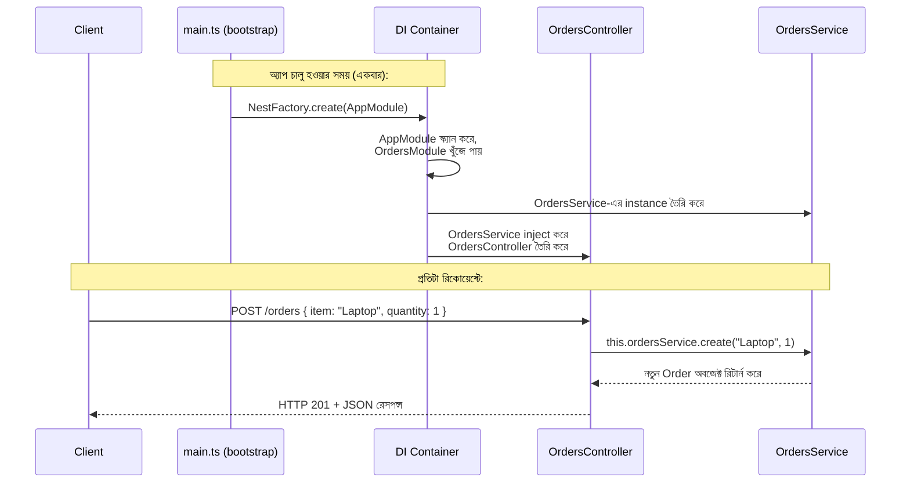

# ২৩.০৮. Module Summery

এই মডিউলের শুরুতে আমরা একটা প্রশ্ন নিয়ে বসেছিলাম — Express.js যথেষ্ট ভালো হওয়া সত্ত্বেও কেন NestJS-এর মতো একটা ফ্রেমওয়ার্ক দরকার। এখন, আটটা লেসনের শেষে, আমরা সেই প্রশ্নের সম্পূর্ণ উত্তর দিতে পারি, আর সবচেয়ে গুরুত্বপূর্ণ ব্যাপার — একটা সম্পূর্ণ, যদিও ছোট, NestJS অ্যাপ্লিকেশন কীভাবে তৈরি হয়, কীভাবে চলে, সেটাও আমরা এখন হাতে-কলমে জানি।

চলো পুরো যাত্রাটা এক নজরে দেখা যাক। আমরা শুরু করেছিলাম `nest new` কমান্ড দিয়ে একটা প্রজেক্ট তৈরি করে, তারপর দেখেছিলাম `main.ts` কীভাবে অ্যাপ্লিকেশন বুট করে, `app.module.ts` কীভাবে পুরো অ্যাপ্লিকেশনের কাঠামো ঘোষণা করে। তারপর আমরা Controller বানিয়েছি যা HTTP রিকোয়েস্ট গ্রহণ করে, Provider (Service) বানিয়েছি যেখানে আসল বিজনেস লজিক থাকে, আর দেখেছি কীভাবে Dependency Injection এই দুইয়ের মধ্যে সংযোগ তৈরি করে, প্রোগ্রামারকে হাতে `new` কল করতে না দিয়ে। সবশেষে আমরা Module দিয়ে এই সব কিছুকে একটা সংগঠিত, স্বয়ংসম্পূর্ণ ফিচার-ইউনিটে বেঁধেছি।

এখন একটা সম্পূর্ণ রিকোয়েস্টের যাত্রাটা প্রান্ত থেকে প্রান্ত দেখা যাক, যেখানে আমাদের এই মডিউলের সব ধারণা একসাথে কাজ করছে:

এই ডায়াগ্রামে দুইটা আলাদা সময়-পর্যায় লক্ষ্য করা জরুরি — একটা হলো **bootstrap time** (অ্যাপ চালু হওয়ার সময়, যেটা একবারই ঘটে), আরেকটা হলো **request time** (প্রতিটা HTTP রিকোয়েস্টে যা ঘটে)। DI Container-এর ভারী কাজ — dependency গ্রাফ তৈরি করা, instance বানানো — সবই bootstrap time-এ ঘটে যায়, আর request time-এ শুধু আগে থেকে তৈরি করা instance-গুলো ব্যবহৃত হয়। এই ডিজাইনটা পারফরম্যান্সের দিক থেকেও গুরুত্বপূর্ণ, কারণ প্রতিটা রিকোয়েস্টে dependency আবার নতুন করে তৈরি করার দরকার হয় না।

এখন Module 22-এর সাথে পুরো যোগসূত্রটা আরেকবার স্পষ্ট করে বলি, কারণ এটাই এই দুই মডিউলের সবচেয়ে গুরুত্বপূর্ণ শিক্ষা:

- **Dependency Injection** (Module 22.02) → NestJS-এর সম্পূর্ণ DI Container সিস্টেমের ভিত্তি, `constructor(private service: SomeService)` প্যাটার্নে প্রতিদিন ব্যবহৃত হয়।
- **Factory Pattern** (Module 22.03) → NestJS-এর ভেতরে ভেতরে, `@Injectable()` ক্লাসগুলোর instance তৈরির প্রক্রিয়ায় factory-সদৃশ লজিক কাজ করে; আমরা নিজেরাও কাস্টম প্রোভাইডার ফ্যাক্টরি (`useFactory`) সংজ্ঞায়িত করতে পারি ভবিষ্যতে।
- **Strategy Pattern** (Module 22.04) → যখন একাধিক Service একই Interface মেনে ভিন্ন ভিন্ন লজিক প্রয়োগ করে (যেমন একাধিক পেমেন্ট গেটওয়ে), NestJS-এর DI ব্যবহার করেই রানটাইমে সঠিক Strategy বেছে নেয়া যায়।
- **Decorator Pattern** (Module 22.06) → পুরো NestJS-এর সিনট্যাক্সই decorator-ভিত্তিক — `@Controller()`, `@Injectable()`, `@Module()`, `@Get()`, `@Body()` — প্রতিটাই মূল ক্লাস/ফাংশনের কোড না বদলে তার উপর অতিরিক্ত অর্থ আর ক্ষমতা যোগ করে।

আর Module 4, 6, 7-এর সাথে সংযোগটাও স্মরণ করা যাক:

- Express.js-এর **routing** (Module 6.02) → NestJS-এর `@Controller()` আর `@Get()/@Post()` decorator-এ রূপান্তরিত হয়েছে, ভেতরে ভেতরে এখনও Express.js-ই চলছে।
- Express.js-এর **Controller ও Middleware** (Module 7) → NestJS-এ যথাক্রমে Controller ক্লাস আর Guard/Interceptor/Pipe-এর (যা আমরা Module 25-এ শিখবো) মতো আরও সংগঠিত রূপ পেয়েছে।
- **Data validation** (Module 6.05) → NestJS-এর Pipe সিস্টেমে (`ParseIntPipe`-এর মতো) built-in, ঘোষণামূলক হয়ে গেছে।

একটা গুরুত্বপূর্ণ পার্থক্যও আবার মনে করিয়ে দেয়া দরকার — NestJS Express.js-কে প্রতিস্থাপন করেনি, বরং তাকে একটা কাঠামোবদ্ধ, প্রোডাকশন-রেডি স্তরে উন্নীত করেছে। তুমি যা Module 2-7-এ শিখেছো, তার প্রতিটা ধারণাই এখানে কাজে লেগেছে, শুধু নতুন সিনট্যাক্স আর সংগঠনের মধ্য দিয়ে প্রকাশ পেয়েছে।

এখন তুমি জানো:
- কীভাবে `nest new` দিয়ে একটা প্রজেক্ট শুরু করতে হয়, আর `nest generate` দিয়ে Controller/Service/Module তৈরি করতে হয়।
- একটা প্রজেক্টের ফোল্ডার কাঠামো — `main.ts`, `app.module.ts`, প্রতিটা ফিচারের নিজস্ব ফোল্ডার।
- Controller কীভাবে HTTP রিকোয়েস্ট গ্রহণ করে, `@Get()`, `@Post()`, `@Param()`, `@Query()`, `@Body()` ব্যবহার করে।
- Provider (Service) কীভাবে বিজনেস লজিক ধরে রাখে, আর `@Injectable()` দিয়ে DI Container-এ নিবন্ধিত হয়।
- Module কীভাবে Controller আর Provider-কে একটা সংগঠিত, স্বয়ংসম্পূর্ণ ফিচার-ইউনিটে বেঁধে রাখে, `imports`/`exports` দিয়ে একে অপরের সাথে সংযুক্ত হয়।

কিন্তু এটা শুধু শুরু। আমরা এখনও ডেটাবেজের সাথে NestJS সংযুক্ত করিনি, অথেন্টিকেশন বানাইনি, একাধিক Module মিলিয়ে একটা বাস্তব, জটিল প্রজেক্ট বানাইনি। এই সবকিছু আমরা করবো পরের মডিউলে, যেখানে তত্ত্ব থেকে বেরিয়ে আমরা সরাসরি একটা সম্পূর্ণ ই-কমার্স প্রজেক্ট বানানো শুরু করবো — Requirement Analysis থেকে শুরু করে, ডেটাবেজ সংযোগ, Subscription Module, Store Module, Product Module পর্যন্ত। যা কিছু এই দুই মডিউলে (Design Pattern আর NestJS Basics) তুমি শিখেছো, তার প্রতিটা টুকরো এখন একসাথে জোড়া লেগে একটা বাস্তব, প্রোডাকশন-মানের অ্যাপ্লিকেশনে রূপান্তরিত হবে।
