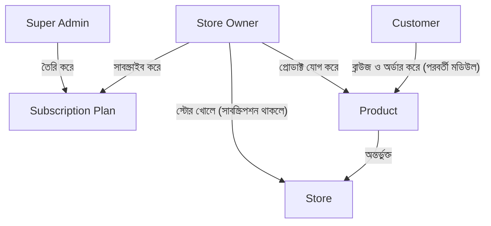

# ২৪.০১. Project Requirements

এতদিন আমরা আলাদা আলাদা টুকরো শিখেছি — Module 22-এ ডিজাইন প্যাটার্ন আর Dependency Injection-এর দর্শন, Module 23-এ NestJS-এর কাঠামো (Module, Controller, Provider, Decorator)। এখন সময় এসেছে এই সব টুকরোকে এক জায়গায় এনে একটা বাস্তব প্রজেক্ট বানানোর। এই মডিউলের পুরোটা জুড়ে আমরা একটাই প্রজেক্ট বানাবো, লেসন-বাই-লেসন, ঠিক যেভাবে একটা সত্যিকারের প্রোডাক্ট টিম কাজ করে — প্রথমে কী বানাচ্ছি বুঝে নেয়া, তারপর ধাপে ধাপে হাত দিয়ে বানানো।

প্রজেক্টের নাম ধরা যাক **"ShopKori"** — একটা মাল্টি-ভেন্ডর ই-কমার্স ব্যাকএন্ড, যেখানে একাধিক ব্যবসায়ী (store owner) নিজের নিজের দোকান খুলতে পারবে, প্রোডাক্ট বিক্রি করতে পারবে, আর প্ল্যাটফর্মটা সেন্ট্রালি একজন সুপার অ্যাডমিন দিয়ে নিয়ন্ত্রিত হবে। এটা অনেকটা Daraz বা Shopify-এর ছোট সংস্করণ ভাবতে পারো — অনেক দোকান, একই প্ল্যাটফর্ম, একজন মালিক পুরো সিস্টেমের।

যেকোনো বাস্তব প্রজেক্ট শুরু হয় কোড লিখে নয়, প্রশ্ন করে। প্রথম প্রশ্নটাই হলো — এই সিস্টেমে আসলে কারা কারা থাকবে, আর প্রত্যেকে কী করতে পারবে? এটাকে আমরা বলি **stakeholder ও role identification**। ShopKori-তে তিন ধরনের ব্যবহারকারী থাকবে:

- **Super Admin** — প্ল্যাটফর্মের মালিক পক্ষ। এরা সাবস্ক্রিপশন প্ল্যান তৈরি করে, কোন স্টোর অ্যাপ্রুভ হবে সেটা ঠিক করে, পুরো সিস্টেমের উপর নজর রাখে।
- **Store Owner** — যে ব্যবসায়ী নিজের দোকান খুলতে চায়। তাকে প্রথমে একটা সাবস্ক্রিপশন প্ল্যান কিনতে হবে (ফ্রি, বেসিক বা প্রো), তারপর স্টোর তৈরি করতে পারবে, প্রোডাক্ট যোগ করতে পারবে।
- **Customer** — যে প্রোডাক্ট কিনবে। এই মডিউলে আমরা মূলত সুপার অ্যাডমিন, সাবস্ক্রিপশন, স্টোর আর প্রোডাক্ট — এই চারটা অংশ নিয়ে কাজ করবো; কাস্টমার-সাইড অর্ডার-ফ্লো নিয়ে আসবে পরবর্তী মডিউলে।

লক্ষ্য করো এই তিন ধরনের ইউজারের মধ্যে একটা স্পষ্ট **নির্ভরতার শৃঙ্খল** আছে — একজন স্টোর ওউনার সাবস্ক্রিপশন ছাড়া স্টোর খুলতে পারবে না, স্টোর ছাড়া প্রোডাক্ট যোগ করতে পারবে না। এই শৃঙ্খলটাই আমাদের পুরো ডেটা মডেলের মেরুদণ্ড হয়ে থাকবে, আর Module 18-20-এ যে ERD আর রিলেশনশিপ ডিজাইন শিখেছিলে (one-to-many, many-to-one), সেটাই এখানে বাস্তবে প্রয়োগ হবে।

এরপর আসে ফাংশনাল রিকোয়ারমেন্ট লেখার পালা। প্রতিটা রিকোয়ারমেন্ট আমরা ছোট ছোট ইউজার স্টোরি আকারে লিখবো — "As a [role], I want to [action], so that [reason]" — কারণ এই ফরম্যাটটা শুধু কী বানাতে হবে তা বলে না, কেন বানাতে হবে সেটাও মনে করিয়ে দেয়। প্রথম ধাপের কিছু স্টোরি:

- সুপার অ্যাডমিন হিসেবে, আমি চাই একটা সাবস্ক্রিপশন প্ল্যান তৈরি করতে, যাতে স্টোর ওউনাররা সেটা কিনতে পারে।
- স্টোর ওউনার হিসেবে, আমি চাই রেজিস্টার করতে এবং একটা সাবস্ক্রিপশন প্ল্যান বেছে নিতে, যাতে আমি প্ল্যাটফর্মে ঢুকতে পারি।
- স্টোর ওউনার হিসেবে, আমি চাই আমার নিজের স্টোর তৈরি করতে, যাতে আমি প্রোডাক্ট বিক্রি শুরু করতে পারি।
- স্টোর ওউনার হিসেবে, আমি চাই আমার স্টোরের অধীনে প্রোডাক্ট যোগ, এডিট, ডিলিট করতে পারি।

এই মুহূর্তে আমরা এখনো টেকনিক্যাল কোনো সিদ্ধান্ত নিচ্ছি না — কোন ডেটাবেজ, কোন অথেন্টিকেশন মেকানিজম, কীভাবে ফোল্ডার সাজাবো, এসব প্রশ্নের উত্তর পরের লেসনগুলোতে আসবে। এখন শুধু "কী বানাচ্ছি" এই প্রশ্নের একটা পরিষ্কার, লিখিত উত্তর তৈরি করা হলো — যাকে বলা হয় **Product Requirement Document (PRD)**-এর প্রথম খসড়া। বাস্তব প্রোডাক্ট টিমে এই ডকুমেন্টটা প্রোডাক্ট ম্যানেজার লেখেন, ডেভেলপার হিসেবে তোমার দায়িত্ব থাকে এটা পড়ে বুঝা এবং প্রশ্ন তোলা — অস্পষ্ট জায়গাগুলো খুঁজে বের করা। ঠিক এই "প্রশ্ন তোলা"র অংশটাই আমরা পরের লেসনে করবো, যেখানে এই প্রাথমিক রিকোয়ারমেন্টগুলোকে আরেকটু গভীরে নিয়ে গিয়ে edge case আর অস্পষ্টতাগুলো বের করবো।
