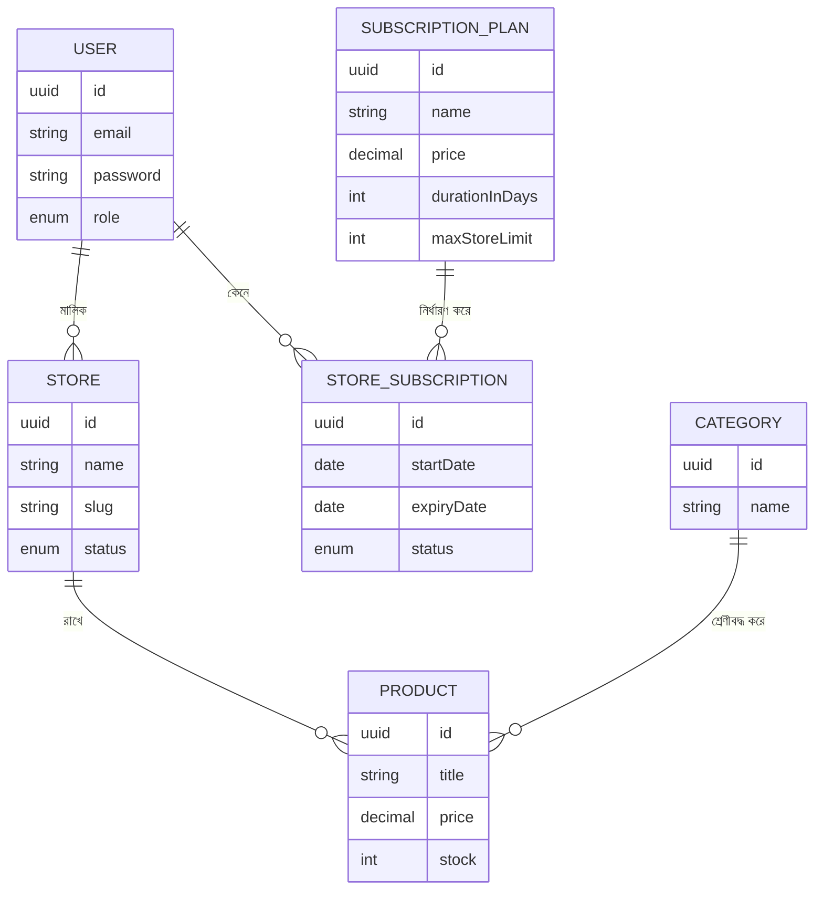

# ২৪.০২. Requirement Analysis — Part 2

গত লেসনে আমরা ShopKori-এর জন্য একটা প্রাথমিক রিকোয়ারমেন্ট লিস্ট বানিয়েছিলাম — তিন ধরনের ইউজার, আর কিছু ইউজার স্টোরি। কিন্তু বাস্তবে, প্রথম খসড়া রিকোয়ারমেন্ট কখনোই সম্পূর্ণ হয় না। একজন অভিজ্ঞ ব্যাকএন্ড ডেভেলপারের কাজ শুধু কোড লেখা না — বরং রিকোয়ারমেন্টের ফাঁকফোকর খুঁজে বের করে সেগুলো নিয়ে প্রশ্ন তোলা, যাতে ডেভেলপমেন্ট শুরু হওয়ার আগেই ভুল বোঝাবুঝি ধরা পড়ে। এই কাজটাকে বলে **requirement grooming** বা **refinement**।

চলো গত লেসনের স্টোরিগুলো নিয়ে কিছু কঠিন প্রশ্ন করি:

**প্রশ্ন ১: সাবস্ক্রিপশন প্ল্যান কি একবার কিনলেই আজীবন, নাকি মেয়াদ আছে?**
বাস্তব SaaS মডেলে সাধারণত মাসিক বা বাৎসরিক মেয়াদ থাকে। আমরা সিদ্ধান্ত নিচ্ছি — প্রতিটা প্ল্যানের একটা `durationInDays` থাকবে, আর একজন স্টোর ওউনারের সাবস্ক্রিপশনের একটা `startDate` আর `expiryDate` থাকবে। মেয়াদ শেষ হলে স্টোর "inactive" হয়ে যাবে, কিন্তু ডিলিট হবে না — ডেটা রিটেনশন গুরুত্বপূর্ণ।

**প্রশ্ন ২: একজন স্টোর ওউনার কি একইসাথে একাধিক স্টোর খুলতে পারবে?**
এটা একটা বিজনেস সিদ্ধান্ত, টেকনিক্যাল না। ধরে নিচ্ছি — প্রতিটা সাবস্ক্রিপশন প্ল্যানে `maxStoreLimit` নামের একটা ফিল্ড থাকবে (ফ্রি প্ল্যানে ১টা, প্রো প্ল্যানে ৫টা)। এই একটা সিদ্ধান্তই দেখিয়ে দেয় কেন রিকোয়ারমেন্ট গ্রুমিং জরুরি — প্রথম দেখায় "স্টোর খুলতে পারবে" স্টোরিটা সহজ মনে হলেও, এখানে একটা সীমা (limit) এবং সেই সীমা কোথা থেকে আসছে (প্ল্যান থেকে) — এটা আগে থেকে না ভাবলে পরে পুরো এন্টিটি রিডিজাইন করতে হতো।

**প্রশ্ন ৩: সুপার অ্যাডমিন কীভাবে তৈরি হয়? সে কি রেজিস্টার করে, নাকি সিস্টেমে আগে থেকেই থাকে?**
সিকিউরিটির দিক থেকে, সুপার অ্যাডমিন কখনো পাবলিক রেজিস্ট্রেশন ফর্ম দিয়ে তৈরি হয় না। আমরা সিদ্ধান্ত নিচ্ছি — একটা **seed script** দিয়ে ডেটাবেজে প্রথম সুপার অ্যাডমিন ঢুকিয়ে দেয়া হবে (আমরা এটা migration/seeding লেসনে দেখবো), আর `User` এন্টিটির একটা `role` ফিল্ড থাকবে যেটা `SUPER_ADMIN`, `STORE_OWNER`, `CUSTOMER` — এই তিনটার একটা হতে পারবে।

**প্রশ্ন ৪: প্রোডাক্ট কি সরাসরি স্টোরের অধীনে, নাকি ক্যাটাগরির মধ্যেও ভাগ হবে?**
আমরা রাখবো দুটোই — প্রতিটা প্রোডাক্ট একটা নির্দিষ্ট স্টোরের অধীনে থাকবে (মালিকানার সম্পর্ক), আবার একটা ঐচ্ছিক ক্যাটাগরির সাথেও যুক্ত থাকতে পারবে (শ্রেণীবিন্যাসের সম্পর্ক)। এই দুটো সম্পর্ক সম্পূর্ণ ভিন্ন কারণে দরকার — একটা মালিকানা (কে দায়ী), আরেকটা শ্রেণীবিন্যাস (কীভাবে খুঁজে পাওয়া যাবে)।

এই প্রশ্ন-উত্তর পর্বের পর আমরা এখন এন্টিটিগুলোর একটা রাফ চিত্র আঁকতে পারি — Module 18-20-এ শেখা ERD-এর ধারণা কাজে লাগিয়ে:

এই ডায়াগ্রামটা এখনো "চূড়ান্ত" না — এটা একটা **workable draft**, যা ডেভেলপমেন্টের সময় পরিবর্তিত হবে। কিন্তু এটা থাকার সুবিধা হলো, এখন আমরা টেকনিক্যাল আলোচনায় যেতে পারি একটা কমন ভাষা নিয়ে — যখন আমরা বলবো "STORE_SUBSCRIPTION টেবিল", সবাই বুঝবে ঠিক কী বোঝানো হচ্ছে।

একটা জিনিস খেয়াল করার মতো — আমরা `STORE_SUBSCRIPTION`-কে আলাদা এন্টিটি করেছি, `USER` আর `SUBSCRIPTION_PLAN`-এর মাঝে সরাসরি সম্পর্ক না রেখে। এটা একটা **junction/join entity** প্যাটার্ন, যেটা Module 19-এ many-to-many সম্পর্ক নিয়ে আলোচনার সময় দেখেছিলে — কারণ একজন ইউজার সময়ের সাথে একাধিক সাবস্ক্রিপশন কিনতে পারে (পুরনোটার মেয়াদ শেষ হলে নতুন একটা), তাই এই সম্পর্কটা শুধু একটা ফরেন কী দিয়ে প্রকাশ করা যায় না — নিজের মধ্যে অতিরিক্ত তথ্য (তারিখ, স্ট্যাটাস) থাকা দরকার।

রিকোয়ারমেন্ট আর ডেটা মডেলের এই প্রাথমিক ছবিটা হাতে নিয়ে এখন আমরা টেকনিক্যাল সিদ্ধান্তের দিকে এগোতে পারি — কোন টুলস দিয়ে বানাবো, প্রজেক্ট কীভাবে বুটস্ট্র্যাপ করবো। পরের লেসনেই আমরা টার্মিনাল খুলে প্রথম কমান্ড চালাবো।
