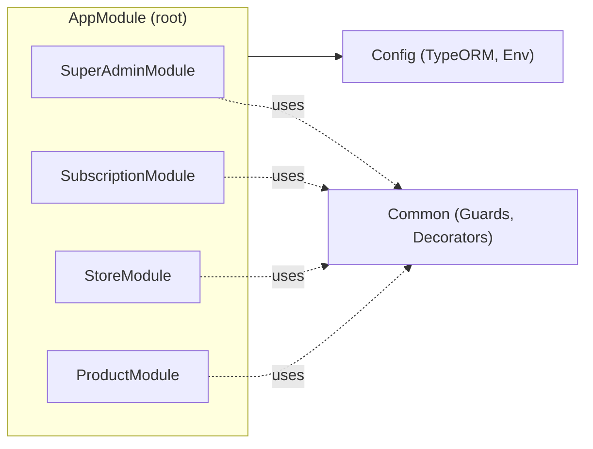

# ২৪.০৩. Technical Grooming And Project Bootstrap

গত লেসনে আমরা রিকোয়ারমেন্ট আর একটা রাফ ERD পর্যন্ত পৌঁছেছিলাম। এখন প্রশ্ন — এই ডিজাইনটা বাস্তবে কোন টুলস দিয়ে বানাবো? এই সিদ্ধান্তগুলো নেয়ার প্রক্রিয়াকে বলে **technical grooming** — বিজনেস রিকোয়ারমেন্টকে টেকনিক্যাল সিদ্ধান্তে রূপান্তর করা।

**ফ্রেমওয়ার্ক:** Module 23-এ আমরা NestJS-এর মূল ধারণা শিখেছি — Module, Controller, Provider, Dependency Injection। ShopKori-এর মতো একটা প্রজেক্টে একাধিক ডোমেইন (super-admin, subscription, store, product) থাকবে, প্রতিটার নিজস্ব সার্ভিস, নিজস্ব এন্টিটি — আর এই ধরনের "অনেকগুলো স্বয়ংসম্পূর্ণ মডিউল একসাথে কাজ করা" পরিস্থিতিতে NestJS-এর মডিউলার আর্কিটেকচার একদম উপযুক্ত। Module 22-তে শেখা Dependency Injection প্যাটার্নটাই এখানে আসল কাজ করবে — প্রতিটা সার্ভিস তার নির্ভরতা (repository, অন্য সার্ভিস) নিজে তৈরি করবে না, NestJS-এর IoC container ইনজেক্ট করে দেবে।

**ডেটাবেজ ও ORM:** আমরা ব্যবহার করবো **PostgreSQL** (রিলেশনাল ডেটা, ফরেন কী কনস্ট্রেইন্ট — Module 18-19-এ যা শিখেছো তার জন্য উপযুক্ত) আর **TypeORM** — কারণ এটা NestJS-এর সাথে অফিসিয়ালি ইন্টিগ্রেটেড (`@nestjs/typeorm` প্যাকেজ আছে), Decorator-বেজড এন্টিটি ডিফাইন করতে দেয় (Module 13-14-এ শেখা ক্লাস আর ডেকোরেটরের ধারণার সাথে মিলে যায়), আর মাইগ্রেশন সাপোর্ট করে যা প্রোডাকশন-গ্রেড স্কিমা ম্যানেজমেন্টের জন্য দরকার।

**প্যাকেজ ম্যানেজার:** `npm` ব্যবহার করবো, কারণ এটা সবচেয়ে সহজলভ্য এবং কোর্সের আগের মডিউলগুলোর সাথে সামঞ্জস্যপূর্ণ।

**ভাষা:** TypeScript — কারণ NestJS নিজেই TypeScript-ফার্স্ট ফ্রেমওয়ার্ক, আর Module 13-এ শেখা টাইপ-সেফটি এখানে বাস্তব সুবিধা দেবে — একটা এন্টিটির ফিল্ড ভুল টাইপে ব্যবহার করলে কম্পাইল টাইমেই ধরা পড়বে, রানটাইমে নয়।

এই সিদ্ধান্তগুলো নেয়ার পর এখন আসল কাজ — প্রজেক্ট বুটস্ট্র্যাপ করা। প্রথমে NestJS CLI ইনস্টল করে নিতে হবে (যদি আগে না থাকে):

```bash
npm install -g @nestjs/cli
```

এরপর নতুন প্রজেক্ট তৈরি:

```bash
nest new shopkori-backend
```

CLI তোমাকে প্যাকেজ ম্যানেজার বেছে নিতে বলবে — `npm` সিলেক্ট করো। এটা চালালে CLI স্বয়ংক্রিয়ভাবে একটা বেসিক প্রজেক্ট স্ট্রাকচার তৈরি করে দেবে:

```
shopkori-backend/
├── src/
│   ├── app.controller.ts
│   ├── app.module.ts
│   ├── app.service.ts
│   └── main.ts
├── test/
├── package.json
├── tsconfig.json
└── nest-cli.json
```

কিন্তু ShopKori-এর মতো একটা মাল্টি-মডিউল প্রজেক্টের জন্য এই ফ্ল্যাট স্ট্রাকচার যথেষ্ট না। আমরা `src/` এর ভেতরে একটা ডোমেইন-বেজড ফোল্ডার কাঠামো তৈরি করবো, যেখানে প্রতিটা বিজনেস ডোমেইন নিজের ফোল্ডারে থাকবে:

```
src/
├── modules/
│   ├── super-admin/
│   ├── subscription/
│   ├── store/
│   └── product/
├── common/
│   ├── guards/
│   ├── decorators/
│   └── filters/
├── config/
│   └── typeorm.config.ts
├── app.module.ts
└── main.ts
```

এই কাঠামোর পেছনের চিন্তাটা হলো **Separation of Concerns** — Module 22-তে শেখা ডিজাইন প্যাটার্নের একটা মূল নীতি। `modules/` ফোল্ডারের প্রতিটা সাব-ফোল্ডার একটা স্বয়ংসম্পূর্ণ NestJS মডিউল হবে — নিজস্ব entity, dto, repository, service, controller সহ। `common/` ফোল্ডারে থাকবে এমন জিনিস যা একাধিক মডিউল শেয়ার করবে — যেমন authentication guard, role decorator। আর `config/` ফোল্ডারে থাকবে অ্যাপ্লিকেশন-লেভেল কনফিগারেশন, যেমন ডেটাবেজ কানেকশন সেটিংস।



আপাতত এই ফোল্ডারগুলো ফাঁকা তৈরি করে রাখবো — শুধু কাঠামোটা দাঁড় করানো, যাতে সামনের প্রতিটা লেসনে আমরা জানি ঠিক কোথায় নতুন ফাইল বসবে। `package.json`-এ কিছু প্রয়োজনীয় ডিপেন্ডেন্সিও এখনই ইনস্টল করে নেয়া ভালো, যদিও এগুলো ব্যবহার করবো পরের কয়েক লেসনে:

```bash
npm install @nestjs/typeorm typeorm pg
npm install class-validator class-transformer
npm install @nestjs/config
```

`@nestjs/typeorm` আর `typeorm` আমাদের ORM লেয়ারের জন্য, `pg` হলো PostgreSQL-এর Node.js ড্রাইভার, `class-validator`/`class-transformer` আমরা DTO ভ্যালিডেশনের জন্য ব্যবহার করবো (Module 12-এর JWT/অথ লেসনগুলোতেও এই লাইব্রেরিগুলোর সাথে পরিচয় হয়েছিল ইনপুট ভ্যালিডেশনের প্রসঙ্গে), আর `@nestjs/config` দিয়ে `.env` ফাইল থেকে এনভায়রনমেন্ট ভেরিয়েবল পড়বো — যাতে ডেটাবেজ পাসওয়ার্ডের মতো সংবেদনশীল তথ্য কোডে হার্ডকোড না থাকে।

কাঠামো দাঁড় হয়ে গেছে, ডিপেন্ডেন্সি ইনস্টল হয়ে গেছে। কিন্তু এখনো একটা লাইন কোডও লেখা হয়নি বাস্তব ফিচারের জন্য। পরের লেসনে আমরা এই বড় প্রজেক্টটাকে ছোট ছোট কাজে ভাঙবো, আর ঠিক করবো প্রথমে কোনটা বানানো সবচেয়ে জরুরি — এই প্রায়োরিটাইজেশনকে বলে P0 টাস্ক খুঁজে বের করা।
