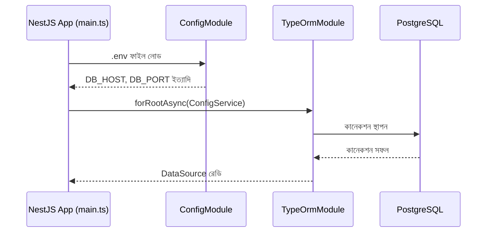

# ২৪.০৫. Connecting Database

গত লেসনে আমরা ঠিক করেছিলাম, রোডম্যাপের প্রথম P0 টাস্ক হলো ডেটাবেজ কানেকশন — কারণ এটা ছাড়া বাকি সব কাজ থমকে থাকবে। কোনো এন্টিটি, কোনো মাইগ্রেশন, কোনো সার্ভিস লজিক — কিছুই ডেটাবেজ ছাড়া অর্থবহ না। তাই এই লেসনে আমরা প্রথমবারের মতো NestJS অ্যাপ্লিকেশনকে একটা আসল PostgreSQL ডেটাবেজের সাথে যুক্ত করবো।

প্রথমে দরকার একটা চলমান PostgreSQL ইনস্ট্যান্স। ডেভেলপমেন্টের সুবিধার জন্য আমরা Docker ব্যবহার করবো, যাতে লোকাল মেশিনে সরাসরি PostgreSQL ইনস্টল করতে না হয়। প্রজেক্টের রুটে একটা `docker-compose.yml` ফাইল তৈরি করি:

```yaml
version: '3.8'
services:
  postgres:
    image: postgres:15
    restart: always
    environment:
      POSTGRES_USER: shopkori
      POSTGRES_PASSWORD: shopkori_pass
      POSTGRES_DB: shopkori_db
    ports:
      - '5432:5432'
    volumes:
      - shopkori_pg_data:/var/lib/postgresql/data
volumes:
  shopkori_pg_data:
```

```bash
docker compose up -d
```

এই কমান্ডটা ব্যাকগ্রাউন্ডে একটা PostgreSQL সার্ভার চালু করে দেবে, পোর্ট ৫৪৩২-এ। এখন আমাদের NestJS অ্যাপ্লিকেশনকে বলতে হবে এই ডেটাবেজের ঠিকানা কোথায়। গত লেসনে ইনস্টল করা `@nestjs/config` প্যাকেজ ব্যবহার করে আমরা `.env` ফাইলে সংবেদনশীল তথ্য রাখবো, কোডে হার্ডকোড করবো না — এটা নিরাপত্তার একটা মৌলিক নিয়ম, যেন ডেটাবেজ পাসওয়ার্ড কখনো Git-এ কমিট না হয়।

`.env`:

```
DB_HOST=localhost
DB_PORT=5432
DB_USERNAME=shopkori
DB_PASSWORD=shopkori_pass
DB_NAME=shopkori_db
```

`.gitignore`-এ `.env` যোগ করে দিতে ভুলো না। এরপর `src/config/typeorm.config.ts` ফাইলে TypeORM-এর কনফিগারেশন লিখি:

```typescript
import { registerAs } from '@nestjs/config';
import { TypeOrmModuleOptions } from '@nestjs/typeorm';

export default registerAs(
  'database',
  (): TypeOrmModuleOptions => ({
    type: 'postgres',
    host: process.env.DB_HOST,
    port: parseInt(process.env.DB_PORT ?? '5432', 10),
    username: process.env.DB_USERNAME,
    password: process.env.DB_PASSWORD,
    database: process.env.DB_NAME,
    entities: [__dirname + '/../**/*.entity{.ts,.js}'],
    synchronize: false, // প্রোডাকশনে কখনো true রাখা যাবে না
    autoLoadEntities: true,
  }),
);
```

`synchronize: false` একটা গুরুত্বপূর্ণ সিদ্ধান্ত, যেটা নিয়ে পরের লেসনে বিস্তারিত কথা বলবো — সংক্ষেপে বলা যায়, `synchronize: true` দিলে TypeORM প্রতিবার এন্টিটি অনুযায়ী নিজে থেকে ডেটাবেজ স্কিমা বদলে ফেলে, যা ডেভেলপমেন্টে সুবিধাজনক মনে হলেও প্রোডাকশনে বিপজ্জনক — ভুলবশত একটা কলাম বা পুরো টেবিল হারিয়ে যেতে পারে। আমরা শুরু থেকেই **migration-based** ওয়ার্কফ্লো অনুসরণ করবো, যা বাস্তব টিমে standard practice।

এখন `app.module.ts`-এ এই কনফিগারেশন যুক্ত করি:

```typescript
import { Module } from '@nestjs/common';
import { ConfigModule, ConfigService } from '@nestjs/config';
import { TypeOrmModule } from '@nestjs/typeorm';
import databaseConfig from './config/typeorm.config';

@Module({
  imports: [
    ConfigModule.forRoot({
      isGlobal: true,
      load: [databaseConfig],
    }),
    TypeOrmModule.forRootAsync({
      inject: [ConfigService],
      useFactory: (configService: ConfigService) =>
        configService.get('database'),
    }),
  ],
})
export class AppModule {}
```

এখানে `TypeOrmModule.forRootAsync` ব্যবহার করার কারণটা লক্ষণীয় — Module 22-তে শেখা Dependency Injection-এর সরাসরি প্রয়োগ। আমরা `ConfigService`-কে ইনজেক্ট করাচ্ছি, তারপর সেটা দিয়ে ডেটাবেজ কনফিগারেশন তৈরি করছি — বরং সরাসরি `process.env` থেকে পড়ার বদলে। এতে করে টেস্টিং সহজ হয় (পরে `ConfigService` মক করে দেয়া যায়), আর কনফিগারেশন লজিক এক জায়গায় কেন্দ্রীভূত থাকে।



অ্যাপ্লিকেশন চালিয়ে দেখা যাক সব ঠিক আছে কিনা:

```bash
npm run start:dev
```

যদি টার্মিনালে কোনো কানেকশন এরর না আসে, বুঝবে ডেটাবেজ কানেকশন সফল হয়েছে। এই মুহূর্তে ডেটাবেজে এখনো কোনো টেবিল নেই — কারণ আমরা এখনো কোনো এন্টিটি ডিফাইন করিনি। এটাই স্বাভাবিক; কানেকশন স্থাপন আর স্কিমা তৈরি করা দুটো আলাদা ধাপ। পরের লেসনে আমরা প্রথম এন্টিটি — `User` — ডিফাইন করবো, আর তারপর TypeORM-এর মাইগ্রেশন সিস্টেম ব্যবহার করে সেটাকে বাস্তব একটা ডেটাবেজ টেবিলে রূপান্তর করবো।
