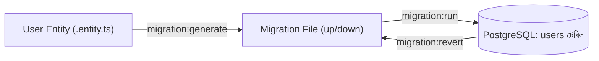

# ২৪.০৬. Connecting Entity With TypeORM And Running Migration

গত লেসনে আমরা ডেটাবেজের সাথে কানেকশন তৈরি করেছি, কিন্তু ডেটাবেজটা এখনো খালি — কোনো টেবিল নেই। এই লেসনে আমরা প্রথম এন্টিটি ডিফাইন করবো — `User` — আর তারপর সেটাকে একটা বাস্তব টেবিলে রূপান্তর করবো মাইগ্রেশনের মাধ্যমে।

প্রথমে মনে করিয়ে দেই, Module 13-14-এ শেখা ক্লাস আর ডেকোরেটরের ধারণা এখানে সরাসরি কাজে লাগবে — TypeORM-এর একটা এন্টিটি আসলে একটা সাধারণ TypeScript ক্লাস, যার প্রপার্টিগুলোকে ডেকোরেটর দিয়ে বলে দেয়া হয় এগুলো ডেটাবেজ কলামের সাথে কীভাবে ম্যাপ হবে। `src/modules/user/entities/user.entity.ts`:

```typescript
import {
  Entity,
  PrimaryGeneratedColumn,
  Column,
  CreateDateColumn,
  UpdateDateColumn,
} from 'typeorm';

export enum UserRole {
  SUPER_ADMIN = 'SUPER_ADMIN',
  STORE_OWNER = 'STORE_OWNER',
  CUSTOMER = 'CUSTOMER',
}

@Entity('users')
export class User {
  @PrimaryGeneratedColumn('uuid')
  id: string;

  @Column({ unique: true })
  email: string;

  @Column()
  password: string;

  @Column({ type: 'enum', enum: UserRole, default: UserRole.CUSTOMER })
  role: UserRole;

  @Column({ nullable: true })
  fullName: string;

  @CreateDateColumn()
  createdAt: Date;

  @UpdateDateColumn()
  updatedAt: Date;
}
```

`@Entity('users')` ডেকোরেটর NestJS/TypeORM-কে বলে দিচ্ছে এই ক্লাসটা `users` নামের একটা টেবিলের সাথে যুক্ত। `@PrimaryGeneratedColumn('uuid')` ব্যবহার করছি অটো-ইনক্রিমেন্ট ইন্টিজারের বদলে, কারণ একটা মাল্টি-টেন্যান্ট সিস্টেমে UUID ব্যবহার করা ভালো অভ্যাস — এতে আইডি অনুমানযোগ্য (guessable) হয় না, যা একটা নিরাপত্তাগত সুবিধা। `UserRole` enum-টা গত দুই লেসনের রিকোয়ারমেন্ট অ্যানালাইসিসের সরাসরি ফসল — মনে আছে, আমরা সিদ্ধান্ত নিয়েছিলাম রোল তিন ধরনের হবে।

এন্টিটি ডিফাইন হলো, কিন্তু গত লেসনে আমরা `synchronize: false` রেখেছিলাম — তাই TypeORM নিজে থেকে টেবিল বানাবে না। এখন দরকার একটা **migration**। মাইগ্রেশন হলো একটা ভার্সন-কন্ট্রোলড, ধাপে ধাপে স্কিমা পরিবর্তনের ইতিহাস — ঠিক যেভাবে Git কোডের ইতিহাস রাখে, মাইগ্রেশন ডেটাবেজ স্কিমার ইতিহাস রাখে। এতে দলের প্রতিটা সদস্য, আর প্রতিটা এনভায়রনমেন্ট (dev, staging, production) একই স্কিমা ধাপে ধাপে প্রয়োগ করতে পারে।

প্রথমে `package.json`-এ একটা TypeORM CLI কনফিগারেশন আর স্ক্রিপ্ট যোগ করি। এজন্য একটা আলাদা DataSource ফাইল দরকার, `src/config/data-source.ts`:

```typescript
import { DataSource } from 'typeorm';
import * as dotenv from 'dotenv';
dotenv.config();

export const AppDataSource = new DataSource({
  type: 'postgres',
  host: process.env.DB_HOST,
  port: parseInt(process.env.DB_PORT ?? '5432', 10),
  username: process.env.DB_USERNAME,
  password: process.env.DB_PASSWORD,
  database: process.env.DB_NAME,
  entities: ['src/**/*.entity{.ts,.js}'],
  migrations: ['src/migrations/*{.ts,.js}'],
  synchronize: false,
});
```

`package.json`-এ স্ক্রিপ্ট:

```json
{
  "scripts": {
    "typeorm": "typeorm-ts-node-commonjs -d src/config/data-source.ts",
    "migration:generate": "npm run typeorm -- migration:generate",
    "migration:run": "npm run typeorm -- migration:run",
    "migration:revert": "npm run typeorm -- migration:revert"
  }
}
```

এখন এন্টিটির উপর ভিত্তি করে মাইগ্রেশন **generate** করা যাক — এটা TypeORM-কে বলে "বর্তমান এন্টিটি ফাইল আর ডেটাবেজের বর্তমান অবস্থা তুলনা করে পার্থক্যটা একটা ফাইলে লিখে দাও":

```bash
npm run migration:generate -- src/migrations/CreateUserTable
```

এটা `src/migrations/` ফোল্ডারে একটা ফাইল তৈরি করবে, মোটামুটি এরকম দেখতে:

```typescript
import { MigrationInterface, QueryRunner } from 'typeorm';

export class CreateUserTable1700000000000 implements MigrationInterface {
  public async up(queryRunner: QueryRunner): Promise<void> {
    await queryRunner.query(`
      CREATE TYPE "users_role_enum" AS ENUM('SUPER_ADMIN', 'STORE_OWNER', 'CUSTOMER');
      CREATE TABLE "users" (
        "id" uuid NOT NULL DEFAULT uuid_generate_v4(),
        "email" character varying NOT NULL,
        "password" character varying NOT NULL,
        "role" "users_role_enum" NOT NULL DEFAULT 'CUSTOMER',
        "fullName" character varying,
        "createdAt" TIMESTAMP NOT NULL DEFAULT now(),
        "updatedAt" TIMESTAMP NOT NULL DEFAULT now(),
        CONSTRAINT "UQ_email" UNIQUE ("email"),
        CONSTRAINT "PK_users" PRIMARY KEY ("id")
      );
    `);
  }

  public async down(queryRunner: QueryRunner): Promise<void> {
    await queryRunner.query(`DROP TABLE "users";`);
    await queryRunner.query(`DROP TYPE "users_role_enum";`);
  }
}
```

লক্ষ্য করো — `up()` মেথড বলে দেয় পরিবর্তনটা কীভাবে প্রয়োগ হবে, আর `down()` মেথড বলে দেয় সেটা কীভাবে ফিরিয়ে নেয়া (rollback) যাবে। এই সিমেট্রি খুব গুরুত্বপূর্ণ — যদি কোনো মাইগ্রেশন প্রোডাকশনে সমস্যা তৈরি করে, `down()` থাকলে দ্রুত আগের অবস্থায় ফিরে যাওয়া যায়।

এখন মাইগ্রেশন বাস্তবে চালানো যাক:

```bash
npm run migration:run
```

এটা ডেটাবেজে `users` টেবিল তৈরি করবে, আর সাথে একটা `migrations` নামের মেটাডেটা টেবিলও তৈরি করবে, যেখানে TypeORM ট্র্যাক রাখে কোন কোন মাইগ্রেশন ইতিমধ্যে চালানো হয়েছে — যাতে একই মাইগ্রেশন দুইবার না চলে।



এই ওয়ার্কফ্লোটাই এখন থেকে আমাদের স্ট্যান্ডার্ড অভ্যাস হবে — যখনই নতুন এন্টিটি যোগ হবে বা পুরনো এন্টিটি বদলাবে, আমরা `migration:generate` চালাবো, ফাইলটা রিভিউ করবো, তারপর `migration:run` করবো। এই প্যাটার্নটা আমরা `SubscriptionPlan`, `Store`, `Product` এন্টিটির জন্যও পুনরাবৃত্তি করবো সামনের লেসনগুলোতে।

`User` এন্টিটি আর মাইগ্রেশন রেডি হয়ে গেছে — এখন আমাদের ভিত্তি প্রস্তুত। পরের লেসনে আমরা সুপার অ্যাডমিন মডিউলের রিকোয়ারমেন্ট নিয়ে বসবো — কারণ গত লেসনের রোডম্যাপ অনুযায়ী এরপর দরকার সুপার অ্যাডমিনের API, যিনি সাবস্ক্রিপশন প্ল্যান নিয়ন্ত্রণ করবেন।
