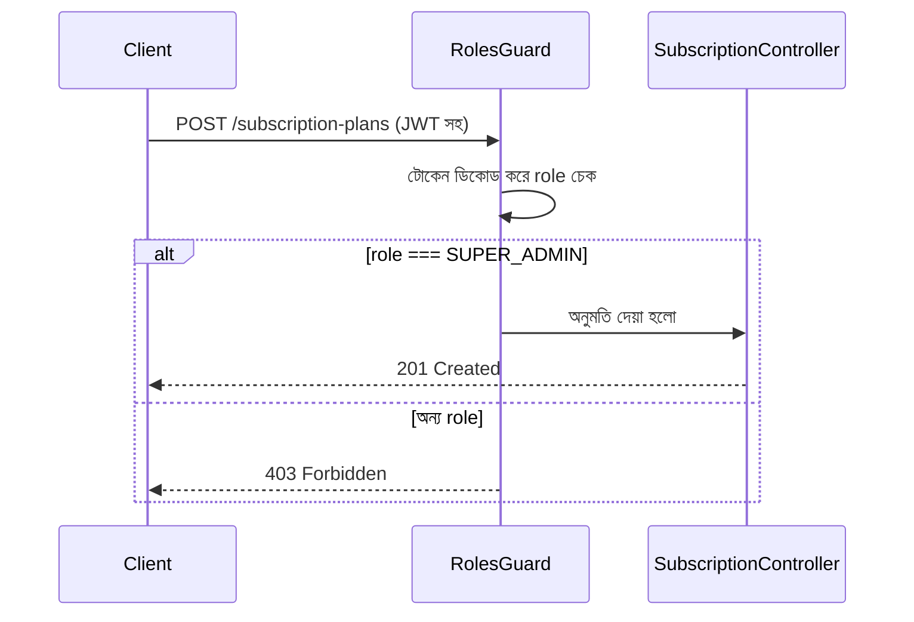

# ২৪.০৭. API For Super Admins — Project Requirement

গত লেসনে আমরা `User` এন্টিটি বানিয়ে ফেলেছি, আর সেটাকে ডেটাবেজে মাইগ্রেট করেছি। এখন `users` টেবিলে তিন ধরনের রোল রাখার ব্যবস্থা আছে — কিন্তু বাস্তবে এখনো কোনো ইউজার নেই, আর কোনো API-ও নেই যা দিয়ে ইউজার তৈরি করা যায়। রোডম্যাপ অনুযায়ী পরবর্তী ধাপ হলো সুপার অ্যাডমিনের জন্য API — কারণ Module 24.02-এর নির্ভরতার চেইন অনুযায়ী, সাবস্ক্রিপশন প্ল্যান তৈরি করার ক্ষমতা একমাত্র সুপার অ্যাডমিনের থাকা উচিত।

কোড লেখার আগে, চলো আরেকবার Module 24.01-এর মতো একটা ছোট PRD লিখি — এবার সুপার অ্যাডমিন মডিউলের জন্য। এটা অভ্যাসের অংশ করে ফেলা ভালো: **প্রতিটা নতুন মডিউলের আগে একটা সংক্ষিপ্ত রিকোয়ারমেন্ট ডকুমেন্ট**, তারপর কোড।

**সুপার অ্যাডমিন মডিউলের স্কোপ:**

1. সুপার অ্যাডমিন সিস্টেমে লগইন করতে পারবে (JWT-বেজড অথেন্টিকেশন — যা Module 12-এ বিস্তারিত শেখা হয়েছিল)।
2. সুপার অ্যাডমিন সাবস্ক্রিপশন প্ল্যান তৈরি, আপডেট, তালিকাভুক্ত করতে পারবে।
3. সুপার অ্যাডমিন সব স্টোরের তালিকা দেখতে পারবে, এবং প্রয়োজনে একটা স্টোর সাসপেন্ড করতে পারবে।
4. সুপার অ্যাডমিন নিজে **রেজিস্টার** করতে পারবে না — এই অ্যাকাউন্ট শুধু seed script দিয়ে তৈরি হবে (Module 24.02-এ যে সিদ্ধান্ত নিয়েছিলাম)।

চতুর্থ পয়েন্টটা বাস্তবায়ন করা যাক এই লেসনেই, কারণ এটা ছোট কিন্তু গুরুত্বপূর্ণ। একটা seed script তৈরি করবো, `src/database/seeds/super-admin.seed.ts`:

```typescript
import { AppDataSource } from '../../config/data-source';
import { User, UserRole } from '../../modules/user/entities/user.entity';
import * as bcrypt from 'bcrypt';

async function seedSuperAdmin() {
  await AppDataSource.initialize();
  const userRepo = AppDataSource.getRepository(User);

  const existing = await userRepo.findOne({
    where: { email: 'admin@shopkori.com' },
  });
  if (existing) {
    console.log('Super admin already exists, skipping.');
    return;
  }

  const hashedPassword = await bcrypt.hash('ChangeMe123!', 10);
  const admin = userRepo.create({
    email: 'admin@shopkori.com',
    password: hashedPassword,
    role: UserRole.SUPER_ADMIN,
    fullName: 'ShopKori Super Admin',
  });

  await userRepo.save(admin);
  console.log('Super admin created successfully.');
}

seedSuperAdmin().then(() => process.exit(0));
```

`package.json`-এ একটা স্ক্রিপ্ট যোগ করি:

```json
{
  "scripts": {
    "seed:super-admin": "ts-node src/database/seeds/super-admin.seed.ts"
  }
}
```

খেয়াল করো, আমরা `bcrypt.hash()` দিয়ে পাসওয়ার্ড হ্যাশ করছি — কখনোই প্লেইন টেক্সট পাসওয়ার্ড ডেটাবেজে রাখা যাবে না। এটা Module 12-এর অথেন্টিকেশন লেসনের একটা মৌলিক নীতির পুনরাবৃত্তি।

এখন authentication এর দিকে তাকাই। সুপার অ্যাডমিন এন্ডপয়েন্ট রক্ষা করতে আমাদের একটা **Role Guard** দরকার — একটা মেকানিজম যা প্রতিটা রিকোয়েস্টে চেক করবে, লগইন করা ইউজারের রোল কি `SUPER_ADMIN`। আমরা এই গার্ডটা `common/guards/roles.guard.ts`-এ রাখবো, যাতে পরে `SubscriptionModule` আর `StoreModule`-ও এটা পুনঃব্যবহার করতে পারে — এটাই আগের লেসনে বলা `common/` ফোল্ডারের উদ্দেশ্য।

```typescript
import {
  Injectable,
  CanActivate,
  ExecutionContext,
  ForbiddenException,
} from '@nestjs/common';
import { Reflector } from '@nestjs/core';
import { UserRole } from '../../modules/user/entities/user.entity';
import { ROLES_KEY } from '../decorators/roles.decorator';

@Injectable()
export class RolesGuard implements CanActivate {
  constructor(private reflector: Reflector) {}

  canActivate(context: ExecutionContext): boolean {
    const requiredRoles = this.reflector.getAllAndOverride<UserRole[]>(
      ROLES_KEY,
      [context.getHandler(), context.getClass()],
    );
    if (!requiredRoles) return true;

    const { user } = context.switchToHttp().getRequest();
    if (!user || !requiredRoles.includes(user.role)) {
      throw new ForbiddenException('এই কাজটি করার অনুমতি তোমার নেই।');
    }
    return true;
  }
}
```

আর একটা কাস্টম ডেকোরেটর, `common/decorators/roles.decorator.ts`:

```typescript
import { SetMetadata } from '@nestjs/common';
import { UserRole } from '../../modules/user/entities/user.entity';

export const ROLES_KEY = 'roles';
export const Roles = (...roles: UserRole[]) => SetMetadata(ROLES_KEY, roles);
```

এই প্যাটার্নটা — `Reflector` ব্যবহার করে মেটাডেটা পড়া, আর `CanActivate` ইন্টারফেস ইমপ্লিমেন্ট করা — Module 22-তে শেখা **Strategy Pattern**-এর একটা বাস্তব উদাহরণ। NestJS-এর গার্ড সিস্টেম মূলত একটা প্লাগেবল স্ট্র্যাটেজি — তুমি নতুন নতুন গার্ড বসাতে পারো, প্রতিটা আলাদা একটা "অনুমতি দেয়ার কৌশল" প্রতিনিধিত্ব করে, আর কন্ট্রোলার নিজে জানে না ভেতরে কী যাচাই হচ্ছে — শুধু ডেকোরেটর দিয়ে ঘোষণা করে দেয় কোন রোল লাগবে।



এই লেসনে আমরা মূলত ভিত্তি তৈরি করলাম — seed script দিয়ে সুপার অ্যাডমিন, আর `RolesGuard`/`Roles` ডেকোরেটর দিয়ে অনুমতি নিয়ন্ত্রণের কাঠামো। JWT টোকেন যাচাইয়ের সম্পূর্ণ `AuthModule` (লগইন এন্ডপয়েন্ট, `JwtStrategy`) আমরা বিস্তারিতভাবে দেখবো Module 25-এ, কিন্তু এখানে যে `RolesGuard` বানালাম, সেটা ঠিক তেমনই থেকে যাবে — শুধু `request.user` কোথা থেকে আসছে সেটা তখন যোগ হবে।

এখন যেহেতু সুপার অ্যাডমিনের অনুমতি-কাঠামো প্রস্তুত, পরের লেসনে আমরা আসল কাজে যাবো — সাবস্ক্রিপশন মডিউলের PRD লেখা এবং সেটার বুটস্ট্র্যাপ শুরু করা।
