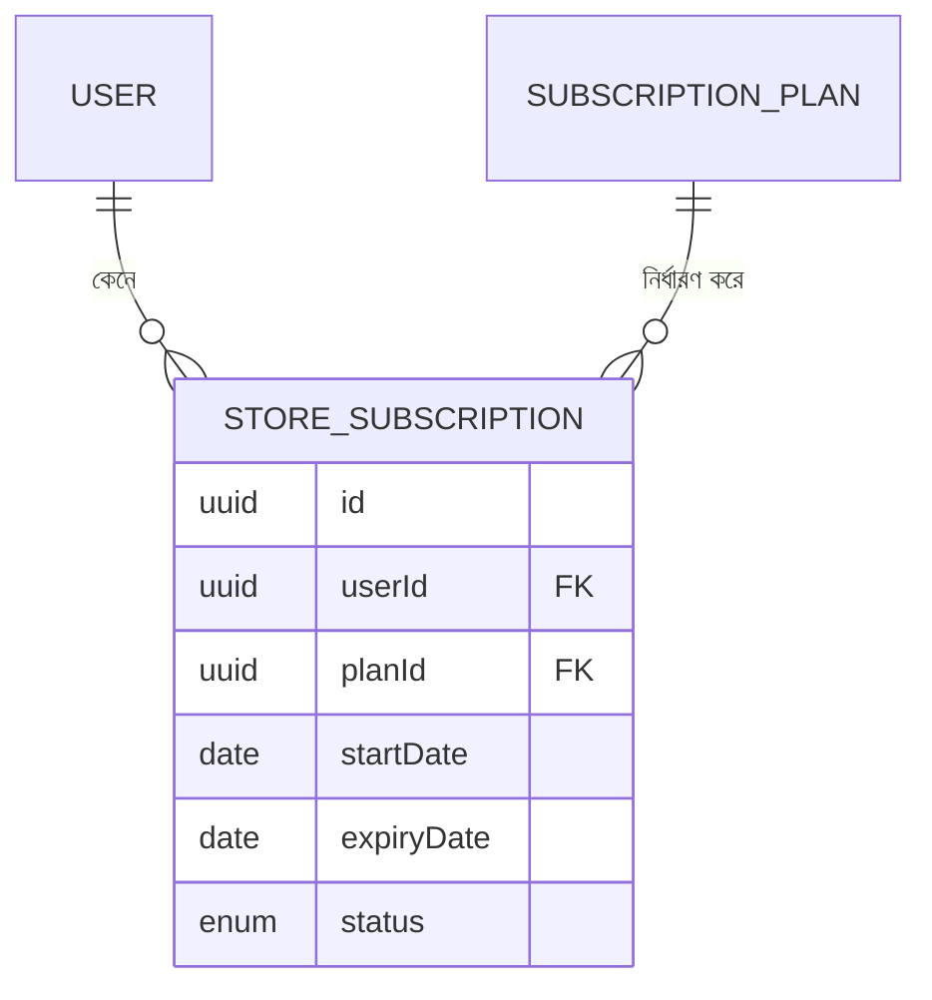

# ২৪.০৮. Bootstrapping Subscription Module With PRD

গত লেসনে সুপার অ্যাডমিনের অনুমতি-কাঠামো তৈরি হয়ে গেছে — `RolesGuard`, `Roles` ডেকোরেটর, আর একজন seed করা সুপার অ্যাডমিন ইউজার। রোডম্যাপ অনুযায়ী এখন সময় সাবস্ক্রিপশন মডিউলে হাত দেয়ার — কারণ Module 24.02-এর ERD অনুযায়ী, একজন স্টোর ওউনার স্টোর খোলার আগে তাকে একটা সাবস্ক্রিপশন প্ল্যান কিনতে হবে।

আগের প্যাটার্ন অনুসরণ করে, প্রথমে একটা মিনি-PRD লিখি। এবার আরেকটু বিস্তারিতভাবে, কারণ সাবস্ক্রিপশন লজিক আসলে বেশ কিছু বিজনেস রুল বহন করে:

**Subscription মডিউলের স্কোপ:**

1. সুপার অ্যাডমিন একাধিক `SubscriptionPlan` তৈরি করতে পারবে — যেমন Free, Basic, Pro। প্রতিটা প্ল্যানের থাকবে নাম, দাম, মেয়াদ (দিনে), আর কতগুলো স্টোর খোলা যাবে তার সীমা (`maxStoreLimit`)।
2. স্টোর ওউনার একটা প্ল্যান বেছে নিয়ে সাবস্ক্রাইব করবে — এই কাজটা তৈরি করবে একটা `StoreSubscription` রেকর্ড, যার একটা শুরুর তারিখ, শেষের তারিখ, আর স্ট্যাটাস (ACTIVE, EXPIRED, CANCELLED) থাকবে।
3. একজন স্টোর ওউনারের একসাথে সর্বোচ্চ একটা ACTIVE সাবস্ক্রিপশন থাকতে পারবে।
4. সাবস্ক্রিপশনের মেয়াদ শেষ হয়ে গেলে (`expiryDate` অতীত), সেটা স্বয়ংক্রিয়ভাবে EXPIRED হিসেবে গণ্য হবে — এই লজিকটা আমরা সার্ভিস লেয়ারে চেক করবো।

**বিজনেস রুল যা মনে রাখা জরুরি (গত লেসনগুলোর নির্ভরতা মাথায় রেখে):**
- সাবস্ক্রিপশন প্ল্যান তৈরি/এডিট শুধু `SUPER_ADMIN` করতে পারবে — গত লেসনের `RolesGuard` এখানে সরাসরি ব্যবহার হবে।
- সাবস্ক্রিপশন প্ল্যান দেখা (list) সবাই পারবে, কারণ কাস্টমার-facing প্রাইসিং পেজেও এটা লাগবে।
- একটা প্ল্যানে স্টোর ওউনার সাবস্ক্রাইব করলে, প্ল্যানের `maxStoreLimit` পরবর্তীতে Store মডিউলে গিয়ে চেক হবে (Module 24.16-এ আমরা এই কানেকশনটা বাস্তবায়ন করবো)।

এখন NestJS CLI দিয়ে মডিউলের কাঠামো তৈরি করি। CLI-এর জেনারেটর কমান্ডগুলো Module 23-এ পরিচিত হয়েছিলে; এখন সেটা বাস্তব কাজে লাগাচ্ছি:

```bash
nest g module modules/subscription
nest g controller modules/subscription --flat
nest g service modules/subscription --flat
```

এটা `src/modules/subscription/` এর ভেতরে `subscription.module.ts`, `subscription.controller.ts`, আর `subscription.service.ts` তৈরি করে দেবে, এবং `subscription.module.ts`-কে স্বয়ংক্রিয়ভাবে `AppModule`-এ ইমপোর্টও করে দেবে। এখন এই ফোল্ডারের ভেতরে আমরা নিজেরাই বাকি সাব-ফোল্ডারগুলো তৈরি করবো, যেন কাঠামোটা গোছানো থাকে:

```
src/modules/subscription/
├── entities/
│   ├── subscription-plan.entity.ts
│   └── store-subscription.entity.ts
├── dto/
├── repositories/
├── subscription.module.ts
├── subscription.controller.ts
└── subscription.service.ts
```

প্রথমে দুইটা এন্টিটি ডিফাইন করি, যা Module 24.02-এর ERD-এর সরাসরি বাস্তবায়ন। `entities/subscription-plan.entity.ts`:

```typescript
import { Entity, PrimaryGeneratedColumn, Column, OneToMany } from 'typeorm';
import { StoreSubscription } from './store-subscription.entity';

@Entity('subscription_plans')
export class SubscriptionPlan {
  @PrimaryGeneratedColumn('uuid')
  id: string;

  @Column({ unique: true })
  name: string;

  @Column('decimal', { precision: 10, scale: 2 })
  price: number;

  @Column({ type: 'int' })
  durationInDays: number;

  @Column({ type: 'int' })
  maxStoreLimit: number;

  @OneToMany(() => StoreSubscription, (sub) => sub.plan)
  subscriptions: StoreSubscription[];
}
```

`entities/store-subscription.entity.ts`:

```typescript
import {
  Entity,
  PrimaryGeneratedColumn,
  Column,
  ManyToOne,
  JoinColumn,
  CreateDateColumn,
} from 'typeorm';
import { User } from '../../user/entities/user.entity';
import { SubscriptionPlan } from './subscription-plan.entity';

export enum SubscriptionStatus {
  ACTIVE = 'ACTIVE',
  EXPIRED = 'EXPIRED',
  CANCELLED = 'CANCELLED',
}

@Entity('store_subscriptions')
export class StoreSubscription {
  @PrimaryGeneratedColumn('uuid')
  id: string;

  @ManyToOne(() => User, { onDelete: 'CASCADE' })
  @JoinColumn({ name: 'userId' })
  user: User;

  @Column()
  userId: string;

  @ManyToOne(() => SubscriptionPlan, (plan) => plan.subscriptions)
  @JoinColumn({ name: 'planId' })
  plan: SubscriptionPlan;

  @Column()
  planId: string;

  @Column({ type: 'date' })
  startDate: Date;

  @Column({ type: 'date' })
  expiryDate: Date;

  @Column({
    type: 'enum',
    enum: SubscriptionStatus,
    default: SubscriptionStatus.ACTIVE,
  })
  status: SubscriptionStatus;

  @CreateDateColumn()
  createdAt: Date;
}
```

লক্ষ্য করো `StoreSubscription`-এ আমরা `@ManyToOne` সম্পর্ক ব্যবহার করেছি দুইবার — একবার `User`-এর সাথে, একবার `SubscriptionPlan`-এর সাথে। এটাই Module 24.02-এ বলা **join entity** প্যাটার্নের বাস্তবায়ন — `StoreSubscription` নিজেই একটা সম্পূর্ণ এন্টিটি, যার নিজস্ব প্রাইমারি কী আছে, শুধু দুইটা ফরেন কী রাখা কলাম না। এভাবে আমরা প্রতিটা সাবস্ক্রিপশন ইতিহাস আলাদা রেকর্ড হিসেবে রাখতে পারি — একজন ইউজার সময়ের সাথে একাধিকবার সাবস্ক্রাইব করলে প্রতিটা তার নিজের সারিতে থাকবে।



এন্টিটিগুলো এখন প্রস্তুত। এগুলোকে `subscription.module.ts`-এ `TypeOrmModule.forFeature([...])` দিয়ে রেজিস্টার করে দিতে হবে, তারপর মাইগ্রেশন জেনারেট করে ডেটাবেজে প্রয়োগ করতে হবে — ঠিক গত লেসনগুলোতে `User` এন্টিটির জন্য যেভাবে করেছিলাম। কিন্তু তার আগে, পরের লেসনে আমরা এই মডিউলের API এন্ডপয়েন্টগুলো পরিকল্পনা করবো — কোন এন্ডপয়েন্ট কী নেবে, কী রিটার্ন করবে — যাতে ইমপ্লিমেন্টেশনের সময় কোনো দ্বিধা না থাকে।
