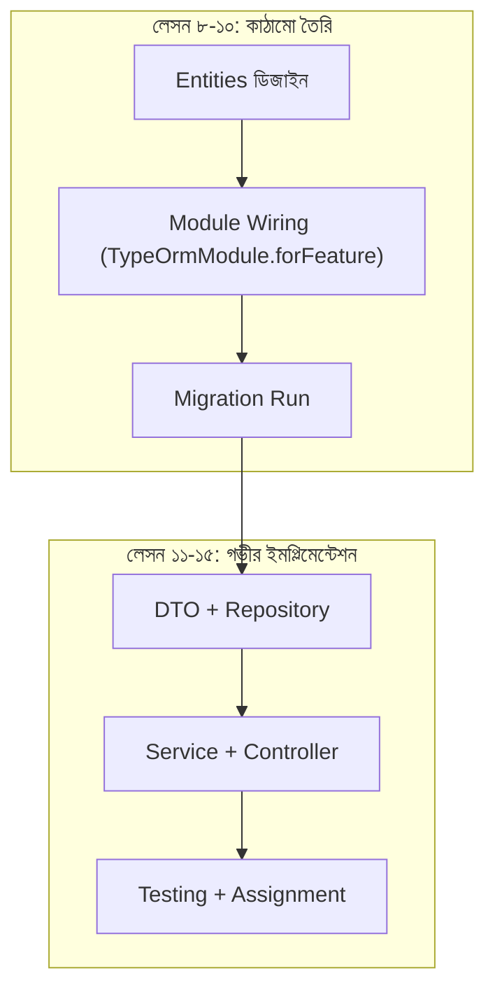

# ২৪.১০. Subscription Module Implementation — NestJS Module

গত লেসনে আমরা সাবস্ক্রিপশন মডিউলের API কন্ট্র্যাক্ট আর ডেটা ফ্লো পরিকল্পনা করেছি একটা সিকোয়েন্স ডায়াগ্রাম দিয়ে। এখন সময় এসেছে সেই পরিকল্পনার প্রথম বাস্তব বাস্তবায়নের — `SubscriptionModule` ওয়্যারিং করা, যাতে এন্টিটিগুলো TypeORM-এর মাধ্যমে NestJS-এর ডিপেন্ডেন্সি ইনজেকশন সিস্টেমে যুক্ত হয়।

`subscription.module.ts`:

```typescript
import { Module } from '@nestjs/common';
import { TypeOrmModule } from '@nestjs/typeorm';
import { SubscriptionPlan } from './entities/subscription-plan.entity';
import { StoreSubscription } from './entities/store-subscription.entity';
import { SubscriptionController } from './subscription.controller';
import { SubscriptionService } from './subscription.service';

@Module({
  imports: [TypeOrmModule.forFeature([SubscriptionPlan, StoreSubscription])],
  controllers: [SubscriptionController],
  providers: [SubscriptionService],
  exports: [SubscriptionService],
})
export class SubscriptionModule {}
```

এই ছোট্ট ফাইলটা আসলে অনেক কিছু বলছে। `TypeOrmModule.forFeature([...])` NestJS-কে বলছে — "এই দুইটা এন্টিটির জন্য Repository তৈরি করে ডিপেন্ডেন্সি ইনজেকশন কন্টেইনারে রেখে দাও, যাতে `SubscriptionService` এগুলো `@InjectRepository()` দিয়ে চেয়ে নিতে পারে।" এটাই Module 22-তে শেখা IoC (Inversion of Control) কন্টেইনারের বাস্তব রূপ — আমরা কোথাও `new Repository()` লিখছি না, বরং ফ্রেমওয়ার্ককে বলে দিচ্ছি কী কী দরকার, ফ্রেমওয়ার্ক নিজে সেটা বানিয়ে সরবরাহ করছে।

`exports: [SubscriptionService]` লাইনটাও গুরুত্বপূর্ণ — ভবিষ্যতে যখন `StoreModule` তৈরি হবে (Module 24.16 থেকে), তখন স্টোর তৈরি করার আগে "এই ইউজারের কি একটা ACTIVE সাবস্ক্রিপশন আছে?" — এই প্রশ্নের উত্তর জানতে `StoreModule`-এর `SubscriptionService` দরকার হবে। `exports` না থাকলে অন্য মডিউল এই সার্ভিস ইনজেক্ট করতে পারতো না — এটা NestJS-এর মডিউল এনক্যাপসুলেশনের নিয়ম, প্রতিটা মডিউল ডিফল্টভাবে নিজের প্রোভাইডার লুকিয়ে রাখে, explicit export ছাড়া কেউ সেটা ব্যবহার করতে পারে না।

`AppModule`-এ (যদি CLI নিজে না করে থাকে) ইমপোর্ট নিশ্চিত করি:

```typescript
@Module({
  imports: [
    // ...আগের ইমপোর্টগুলো
    SubscriptionModule,
  ],
})
export class AppModule {}
```

এখন এন্টিটিগুলোর জন্য মাইগ্রেশন জেনারেট আর রান করি, ঠিক Module 24.06-এ শেখা প্রক্রিয়া অনুসরণ করে:

```bash
npm run migration:generate -- src/migrations/CreateSubscriptionTables
npm run migration:run
```

এটা `subscription_plans` আর `store_subscriptions` — দুইটা নতুন টেবিল তৈরি করবে ডেটাবেজে, যেখানে `store_subscriptions`-এর দুইটা ফরেন কী কনস্ট্রেইন্ট থাকবে — একটা `users` টেবিলের দিকে, একটা `subscription_plans` টেবিলের দিকে।

মডিউলটা এখন কাঠামোগতভাবে সম্পূর্ণ, কিন্তু `SubscriptionController` আর `SubscriptionService` এখনো ফাঁকা — শুধু NestJS CLI-এর দেয়া বয়লারপ্লেট আছে। এটা ইচ্ছাকৃত। এই মডিউলে (Module 24) আমরা একটা গুরুত্বপূর্ণ শিক্ষাগত সিদ্ধান্ত নিয়েছি — সাবস্ক্রিপশন ফিচারটাকে দুই ধাপে দেখবো। এই লেসন পর্যন্ত আমরা শুধু **কাঠামো** (module wiring, entity registration, migration) তৈরি করলাম। লেসন ১১ থেকে ১৫ পর্যন্ত আমরা আবার এই একই মডিউলে ফিরে আসবো, কিন্তু এবার আরও গভীরে গিয়ে — DTO, Repository প্যাটার্ন, Service লজিক, Controller এন্ডপয়েন্ট, আর টেস্টিং — প্রতিটা স্তর আলাদা আলাদা লেসনে ভেঙে।



এই দুই-ধাপের পদ্ধতিটা বাস্তব সফটওয়্যার দলগুলোতেও দেখা যায় — প্রথমে একটা "স্কেলেটন PR" (শুধু কাঠামো, কম্পাইল হয়, কিন্তু ফিচার অসম্পূর্ণ), তারপর একটা "ফিচার PR" (আসল লজিক)। এভাবে ভাঙলে কোড রিভিউ সহজ হয়, আর প্রতিটা ধাপে ভুল ধরা সহজ হয়।

কাঠামো দাঁড়িয়ে গেছে, মাইগ্রেশন চলে গেছে। এখন পরের লেসন থেকে আমরা এই একই মডিউলে "জুম ইন" করবো — প্রথমে DTO আর Repository লেয়ার দিয়ে শুরু করে, যাতে ইনপুট ভ্যালিডেশন আর ডেটাবেজ অ্যাক্সেস আলাদা, পরিষ্কার স্তরে ভাগ থাকে।
