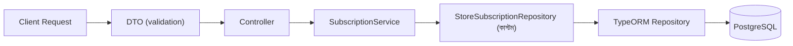

# ২৪.১২. Preparing DTO And Repository Layer

গত লেসনে আমরা ঠিক করেছিলাম, প্রথমে DTO আর Repository লেয়ার বানাবো — নির্ভরতার দিক থেকে সবচেয়ে "নিচের" আর সবচেয়ে "উপরের" প্রান্তের দুইটা স্তর। এই লেসনে আমরা ঠিক সেটাই করবো।

**DTO (Data Transfer Object)** হলো এমন একটা ক্লাস, যা বলে দেয় একটা নির্দিষ্ট অপারেশনের জন্য ক্লায়েন্ট থেকে কী শেপের ডেটা আসা উচিত, আর সেই ডেটা কী কী নিয়ম মানতে হবে। Module 24.03-এ ইনস্টল করা `class-validator` আর `class-transformer` এখানে কাজে লাগবে। `src/modules/subscription/dto/create-subscription-plan.dto.ts`:

```typescript
import {
  IsString,
  IsNumber,
  Min,
  IsPositive,
  MaxLength,
} from 'class-validator';

export class CreateSubscriptionPlanDto {
  @IsString()
  @MaxLength(50)
  name: string;

  @IsNumber()
  @IsPositive()
  price: number;

  @IsNumber()
  @Min(1)
  durationInDays: number;

  @IsNumber()
  @Min(1)
  maxStoreLimit: number;
}
```

`src/modules/subscription/dto/subscribe.dto.ts`:

```typescript
import { IsUUID } from 'class-validator';

export class SubscribeDto {
  @IsUUID()
  planId: string;
}
```

এই ডেকোরেটরগুলো (`@IsString`, `@IsPositive`, `@IsUUID`) স্বয়ংক্রিয়ভাবে যাচাই করে দেবে — যদি কেউ `price` হিসেবে নেগেটিভ সংখ্যা পাঠায়, বা `planId` হিসেবে UUID না এমন কিছু পাঠায়, তাহলে Controller-এ পৌঁছানোর আগেই NestJS-এর `ValidationPipe` রিকোয়েস্ট বাতিল করে একটা ৪০০ এরর ফেরত দেবে। এটাই DTO-এর আসল শক্তি — বিজনেস লজিক শুরু হওয়ার আগেই ইনপুটের মানসম্মততা নিশ্চিত করা, যাতে Service লেয়ারে গিয়ে "যদি ইনপুট খারাপ হয়" এই চিন্তা বারবার করতে না হয়।

`ValidationPipe`-টা `main.ts`-এ গ্লোবালি চালু করে দিতে হবে, যদি এখনো করা না থাকে:

```typescript
import { ValidationPipe } from '@nestjs/common';

async function bootstrap() {
  const app = await NestFactory.create(AppModule);
  app.useGlobalPipes(new ValidationPipe({ whitelist: true, transform: true }));
  await app.listen(3000);
}
bootstrap();
```

`whitelist: true` মানে হলো DTO-তে ডিফাইন না করা কোনো এক্সট্রা ফিল্ড কেউ পাঠালে সেটা স্বয়ংক্রিয়ভাবে বাদ পড়ে যাবে — এটা একটা নিরাপত্তা অভ্যাস, কারণ ক্লায়েন্ট চাইলেই যা খুশি পাঠাতে পারে, DTO সেটাকে ফিল্টার করে দেয়।

এখন **Repository লেয়ার**। TypeORM ইতিমধ্যে প্রতিটা এন্টিটির জন্য একটা ডিফল্ট Repository দেয় (`find`, `save`, `findOne` ইত্যাদি সহ), কিন্তু আমাদের দরকার কিছু কাস্টম, ডোমেইন-স্পেসিফিক কোয়েরি — যেমন "এই ইউজারের কি একটা ACTIVE সাবস্ক্রিপশন আছে?" এই প্রশ্নের উত্তর। এই ধরনের লজিক Service-এর ভেতরে ছড়িয়ে না রেখে একটা কাস্টম Repository ক্লাসে জড়ো করাটাই ভালো অভ্যাস — এটা Module 22-তে শেখা **Repository Pattern**-এর হুবহু প্রয়োগ, যার মূল কথা হলো ডেটা অ্যাক্সেস লজিককে বিজনেস লজিক থেকে আলাদা করে ফেলা।

`src/modules/subscription/repositories/store-subscription.repository.ts`:

```typescript
import { Injectable } from '@nestjs/common';
import { InjectRepository } from '@nestjs/typeorm';
import { Repository } from 'typeorm';
import {
  StoreSubscription,
  SubscriptionStatus,
} from '../entities/store-subscription.entity';

@Injectable()
export class StoreSubscriptionRepository {
  constructor(
    @InjectRepository(StoreSubscription)
    private readonly repo: Repository<StoreSubscription>,
  ) {}

  findActiveByUser(userId: string): Promise<StoreSubscription | null> {
    return this.repo.findOne({
      where: { userId, status: SubscriptionStatus.ACTIVE },
      relations: ['plan'],
    });
  }

  createSubscription(data: Partial<StoreSubscription>): StoreSubscription {
    return this.repo.create(data);
  }

  save(subscription: StoreSubscription): Promise<StoreSubscription> {
    return this.repo.save(subscription);
  }

  findByUser(userId: string): Promise<StoreSubscription[]> {
    return this.repo.find({ where: { userId }, relations: ['plan'] });
  }
}
```

খেয়াল করো — এই ক্লাসটা নিজে `@Injectable()`, আর এটা TypeORM-এর ডিফল্ট `Repository<StoreSubscription>`-কে `@InjectRepository()` দিয়ে ইনজেক্ট করিয়ে নিজের ভেতরে **wrap** করছে। এটাকে বলা যায় "custom repository as a service" প্যাটার্ন — TypeORM-এর জেনেরিক Repository-এর উপর একটা ডোমেইন-স্পেসিফিক স্তর বসানো। এর সুবিধা হলো, `SubscriptionService` এখন `findActiveByUser()`-এর মতো অর্থবহ নাম দিয়ে কাজ করতে পারবে, TypeORM-এর `findOne({ where: {...} })`-এর মতো জেনেরিক সিনট্যাক্স বারবার না লিখে।

এই কাস্টম Repository-কে `subscription.module.ts`-এর `providers`-এ যোগ করে দিতে হবে:

```typescript
@Module({
  imports: [TypeOrmModule.forFeature([SubscriptionPlan, StoreSubscription])],
  controllers: [SubscriptionController],
  providers: [SubscriptionService, StoreSubscriptionRepository],
  exports: [SubscriptionService],
})
export class SubscriptionModule {}
```



DTO দিয়ে ইনপুটের দরজা পাহারা দেয়া হলো, আর কাস্টম Repository দিয়ে ডেটাবেজ অ্যাক্সেসের ভাষা পরিষ্কার করা হলো। এখন এই দুইয়ের মাঝের সেতু বানানোর পালা — পরের লেসনে আমরা `SubscriptionService` আর `SubscriptionController` লিখবো, যেখানে বিজনেস রুলগুলো (যেমন "একটাই ACTIVE সাবস্ক্রিপশন") বাস্তবে কার্যকর হবে।
