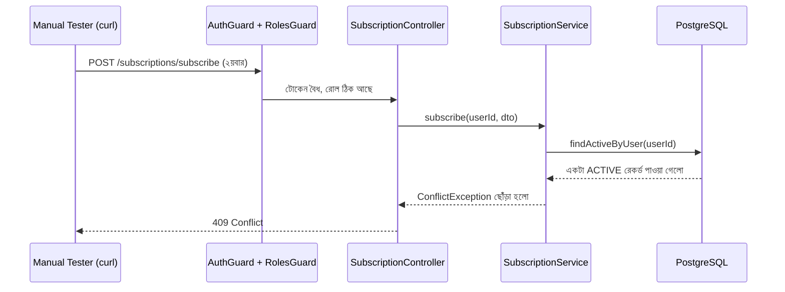

# ২৪.১৪. Testing End Points

গত লেসনে সাবস্ক্রিপশন মডিউলের Service আর Controller লেখা শেষ হয়েছে, আর সার্ভার এরর ছাড়াই উঠছে। কিন্তু কোড কম্পাইল হওয়া মানে এই না যে এটা সঠিকভাবে কাজ করছে — বিজনেস লজিকের প্রতিটা শাখা বাস্তবে চালিয়ে দেখা দরকার। এই লেসনে আমরা ম্যানুয়াল API টেস্টিং করবো, যেন সাবস্ক্রিপশন ফ্লো লঞ্চ করার আগে নিশ্চিত হওয়া যায় সব ঠিকঠাক কাজ করছে।

ম্যানুয়াল টেস্টিংয়ের জন্য আমরা `curl` অথবা Postman/Thunder Client ব্যবহার করতে পারি — এই লেসনে `curl` দিয়ে দেখাচ্ছি, যাতে কমান্ড লাইনেই পুরো ফ্লো দেখা যায় এবং সহজে রিপ্রোডিউস করা যায়।

**ধাপ ১: সুপার অ্যাডমিন হিসেবে লগইন করে টোকেন নেয়া** (ধরে নিচ্ছি Module 25-এর মতো একটা বেসিক `/auth/login` এন্ডপয়েন্ট আছে যা Module 24.07-এর seed করা অ্যাডমিন দিয়ে কাজ করে):

```bash
curl -X POST http://localhost:3000/auth/login \
  -H "Content-Type: application/json" \
  -d '{"email":"admin@shopkori.com","password":"ChangeMe123!"}'
```

রেসপন্স থেকে `accessToken` কপি করে রাখি, বাকি রিকোয়েস্টে ব্যবহার করবো।

**ধাপ ২: একটা সাবস্ক্রিপশন প্ল্যান তৈরি করা:**

```bash
curl -X POST http://localhost:3000/subscription-plans \
  -H "Content-Type: application/json" \
  -H "Authorization: Bearer <accessToken>" \
  -d '{"name":"Basic","price":499,"durationInDays":30,"maxStoreLimit":1}'
```

প্রত্যাশিত রেসপন্স ২০১ স্ট্যাটাসসহ নতুন প্ল্যান অবজেক্ট। এখানে একটা গুরুত্বপূর্ণ negative test — যদি আমরা এই একই রিকোয়েস্ট টোকেন ছাড়া পাঠাই, বা একজন সাধারণ `CUSTOMER` রোলের টোকেন দিয়ে পাঠাই, তাহলে `RolesGuard` (Module 24.07) কাজ করে ৪০৩ Forbidden ফেরত দেয়া উচিত। এই negative test-টা চালিয়ে দেখাই আসল যাচাই — শুধু "সফল কেস" টেস্ট করলে গার্ড আসলে কাজ করছে কিনা সেটা প্রমাণ হয় না।

```bash
curl -X POST http://localhost:3000/subscription-plans \
  -H "Content-Type: application/json" \
  -d '{"name":"Hacked","price":0,"durationInDays":30,"maxStoreLimit":100}'
# প্রত্যাশিত: 401 Unauthorized (কোনো টোকেন নেই)
```

**ধাপ ৩: প্ল্যানের তালিকা দেখা (পাবলিক এন্ডপয়েন্ট, টোকেন লাগবে না):**

```bash
curl http://localhost:3000/subscription-plans
```

**ধাপ ৪: একজন স্টোর ওউনার সাবস্ক্রাইব করা:**

```bash
curl -X POST http://localhost:3000/subscriptions/subscribe \
  -H "Content-Type: application/json" \
  -H "Authorization: Bearer <storeOwnerToken>" \
  -d '{"planId":"<planId-from-step-2>"}'
```

প্রত্যাশিত রেসপন্স — একটা `StoreSubscription` অবজেক্ট, `status: "ACTIVE"`, আর `expiryDate` আজকের তারিখ থেকে ৩০ দিন পরে (কারণ প্ল্যানের `durationInDays` ৩০)।

**ধাপ ৫: দ্বিতীয়বার সাবস্ক্রাইব করার চেষ্টা (এজ কেস, Module 24.08-এর বিজনেস রুল #৩ যাচাই):**

```bash
curl -X POST http://localhost:3000/subscriptions/subscribe \
  -H "Content-Type: application/json" \
  -H "Authorization: Bearer <storeOwnerToken>" \
  -d '{"planId":"<planId-from-step-2>"}'
# প্রত্যাশিত: 409 Conflict — "তোমার ইতিমধ্যে একটা সক্রিয় সাবস্ক্রিপশন আছে।"
```

যদি এই রেসপন্সটা ঠিক এভাবেই আসে, তাহলে বুঝবে `SubscriptionService.subscribe()`-এর `ConflictException` লজিক (Module 24.13) সঠিকভাবে কাজ করছে।

এই পুরো টেস্টিং প্রক্রিয়াটাকে আমরা একটা সিকোয়েন্স ডায়াগ্রামে সাজিয়ে দেখতে পারি, যাতে বোঝা যায় প্রতিটা রিকোয়েস্ট সিস্টেমের কোন কোন স্তর অতিক্রম করছে:



এই ধরনের ম্যানুয়াল, ধাপে-ধাপে টেস্টিং একটা গুরুত্বপূর্ণ অভ্যাস — প্রতিটা এন্ডপয়েন্ট শুধু "হ্যাপি পাথ" (সবকিছু ঠিক থাকলে কী হয়) না, বরং এর "স্যাড পাথ" বা এজ কেসগুলোও (ভুল ইনপুট, অননুমোদিত অ্যাক্সেস, ডুপ্লিকেট অপারেশন) যাচাই করা উচিত। বাস্তব প্রোডাকশন বাগগুলোর বড় একটা অংশই আসলে এই এজ কেস থেকেই আসে, হ্যাপি পাথ থেকে না।

ম্যানুয়াল টেস্টিং প্রতিবার করা ক্লান্তিকর আর ভুলপ্রবণ — একবার একটা বাগ ঠিক করার পর আগের সব টেস্ট আবার হাতে চালানো বাস্তবসম্মত না। পরের লেসনে আমরা দেখবো কীভাবে এই একই টেস্টগুলো **স্বয়ংক্রিয়** (automated) করা যায়, আর সেই সাথে একটা অ্যাসাইনমেন্ট থাকবে তোমার জন্য — যাতে তুমি নিজে হাতে সাবস্ক্রিপশন মডিউলের বাকি এজ কেসগুলো চিন্তা করে দেখতে পারো।
