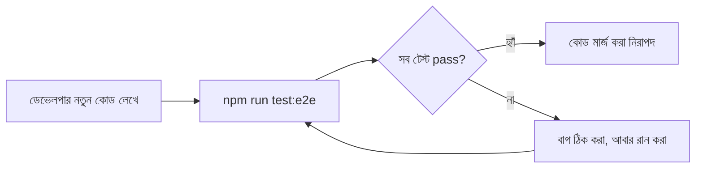

# ২৪.১৫. Testing API And Assignment

গত লেসনে আমরা `curl` দিয়ে হাতে হাতে সাবস্ক্রিপশন মডিউলের এন্ডপয়েন্ট টেস্ট করেছি। এই লেসনে আমরা সেই একই পরিস্থিতিগুলো **স্বয়ংক্রিয় (automated) e2e টেস্ট**-এ রূপান্তর করবো, আর তারপর সাবস্ক্রিপশন সাব-আর্ক (লেসন ১১-১৫) শেষ করবো একটা অ্যাসাইনমেন্ট দিয়ে, যা তুমি নিজে হাতে বাস্তবায়ন করে দেখবে।

NestJS প্রজেক্ট বুটস্ট্র্যাপ করার সময় (Module 24.03) CLI নিজে থেকেই `test/` ফোল্ডারে একটা e2e টেস্ট সেটআপ দিয়ে দিয়েছিল, যা Jest ব্যবহার করে। আমরা সেটার উপর ভিত্তি করে `test/subscription.e2e-spec.ts` লিখবো:

```typescript
import { Test, TestingModule } from '@nestjs/testing';
import { INestApplication, ValidationPipe } from '@nestjs/common';
import * as request from 'supertest';
import { AppModule } from '../src/app.module';

describe('Subscription API (e2e)', () => {
  let app: INestApplication;
  let superAdminToken: string;
  let storeOwnerToken: string;
  let planId: string;

  beforeAll(async () => {
    const moduleFixture: TestingModule = await Test.createTestingModule({
      imports: [AppModule],
    }).compile();

    app = moduleFixture.createNestApplication();
    app.useGlobalPipes(new ValidationPipe({ whitelist: true }));
    await app.init();

    const adminLogin = await request(app.getHttpServer())
      .post('/auth/login')
      .send({ email: 'admin@shopkori.com', password: 'ChangeMe123!' });
    superAdminToken = adminLogin.body.accessToken;

    const ownerLogin = await request(app.getHttpServer())
      .post('/auth/login')
      .send({ email: 'owner@shopkori.com', password: 'OwnerPass123!' });
    storeOwnerToken = ownerLogin.body.accessToken;
  });

  it('সুপার অ্যাডমিন প্ল্যান তৈরি করতে পারবে', async () => {
    const res = await request(app.getHttpServer())
      .post('/subscription-plans')
      .set('Authorization', `Bearer ${superAdminToken}`)
      .send({ name: 'Basic', price: 499, durationInDays: 30, maxStoreLimit: 1 });

    expect(res.status).toBe(201);
    expect(res.body.name).toBe('Basic');
    planId = res.body.id;
  });

  it('টোকেন ছাড়া প্ল্যান তৈরি করা যাবে না', async () => {
    const res = await request(app.getHttpServer())
      .post('/subscription-plans')
      .send({ name: 'Hacked', price: 0, durationInDays: 1, maxStoreLimit: 1 });

    expect(res.status).toBe(401);
  });

  it('স্টোর ওউনার প্ল্যানে সাবস্ক্রাইব করতে পারবে', async () => {
    const res = await request(app.getHttpServer())
      .post('/subscriptions/subscribe')
      .set('Authorization', `Bearer ${storeOwnerToken}`)
      .send({ planId });

    expect(res.status).toBe(201);
    expect(res.body.status).toBe('ACTIVE');
  });

  it('দ্বিতীয়বার সাবস্ক্রাইব করলে 409 আসবে', async () => {
    const res = await request(app.getHttpServer())
      .post('/subscriptions/subscribe')
      .set('Authorization', `Bearer ${storeOwnerToken}`)
      .send({ planId });

    expect(res.status).toBe(409);
  });

  afterAll(async () => {
    await app.close();
  });
});
```

এই টেস্ট ফাইলটা আসলে গত লেসনের প্রতিটা `curl` কমান্ডের একটা কোডবদ্ধ রূপ — পার্থক্য হলো, এখন এটা `npm run test:e2e` চালিয়ে যেকোনো সময়, যতবার খুশি, সেকেন্ডের মধ্যে পুনরায় চালানো যায়, আর ফলাফল pass/fail হিসেবে স্পষ্টভাবে দেখা যায়। এটাই automated testing-এর মূল ভ্যালু — ম্যানুয়াল টেস্টিং একবার করে বোঝায় "এই মুহূর্তে এটা কাজ করছে", কিন্তু automated টেস্ট বোঝায় "ভবিষ্যতে কেউ কোড বদলালেও এটা কাজ করা চালিয়ে যাবে, নাহলে টেস্ট ফেল করে জানিয়ে দেবে" — এটাকে বলে **regression protection**।



**অ্যাসাইনমেন্ট — এখন তোমার পালা:**

সাবস্ক্রিপশন মডিউল নিয়ে নিচের কাজগুলো নিজে হাতে বাস্তবায়ন করো:

1. একটা নতুন এন্ডপয়েন্ট `PATCH /subscription-plans/:id` বানাও, যা শুধু `SUPER_ADMIN` ব্যবহার করতে পারবে, আর একটা `UpdateSubscriptionPlanDto` (সব ফিল্ড ঐচ্ছিক — `class-validator`-এর `@IsOptional()` ব্যবহার করে) নেবে।
2. `SubscriptionService`-এ একটা মেথড লেখো `isSubscriptionExpired(subscription)`, যা চেক করবে `expiryDate` অতীতে চলে গেছে কিনা, আর যদি গেছে, `status`-কে `EXPIRED`-এ আপডেট করে সেভ করবে। এটা `getMySubscription()`-এর ভেতরে কল করো, যাতে প্রতিবার সাবস্ক্রিপশন চেক করার সময় মেয়াদ স্বয়ংক্রিয়ভাবে যাচাই হয়।
3. একটা e2e টেস্ট লেখো যা যাচাই করে — অস্তিত্বহীন `planId` দিয়ে সাবস্ক্রাইব করার চেষ্টা করলে `404 Not Found` আসে (Module 24.13-এ `findPlanById()`-এর `NotFoundException` ইতিমধ্যে আছে, শুধু টেস্ট লিখতে হবে)।
4. চিন্তা করো — যদি একজন `CUSTOMER` রোলের ইউজার `/subscriptions/subscribe` কল করে, বর্তমান কোডে কী হবে? তুমি কি মনে করো এটাতে `RolesGuard` বসানো উচিত? যদি হ্যাঁ, সেটা যোগ করো।

এই অ্যাসাইনমেন্টটা শেষ করলে সাবস্ক্রিপশন মডিউল কার্যকরীভাবে সম্পূর্ণ — এন্টিটি থেকে শুরু করে DTO, Repository, Service, Controller, আর টেস্ট পর্যন্ত পুরো স্ট্যাক তুমি নিজের হাতে বানিয়েছো। এটাই এই মডিউলের প্রথম "সম্পূর্ণ vertical slice" — একটা ফিচার একদম উপর থেকে নিচ পর্যন্ত পুরোপুরি কাজ করছে।

সাবস্ক্রিপশন মডিউল শেষ, আর রোডম্যাপ অনুযায়ী (Module 24.04) এখন পরবর্তী নির্ভরতা হলো **Store মডিউল** — কারণ একজন স্টোর ওউনার এখন সাবস্ক্রাইব করতে পারে, কিন্তু এখনো স্টোর খুলতে পারে না। পরের লেসনে আমরা ঠিক সেই কাজ শুরু করবো।
