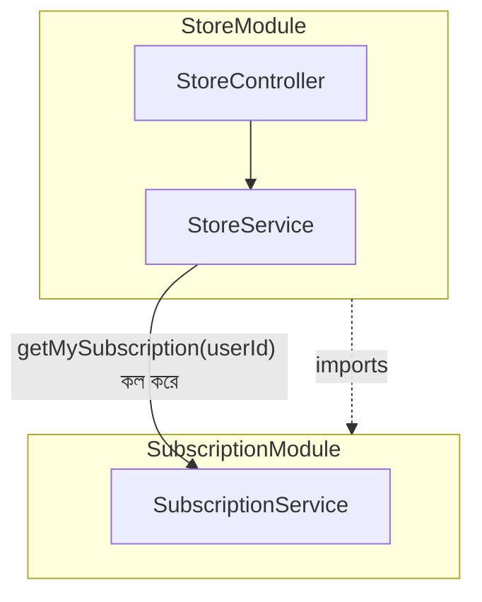
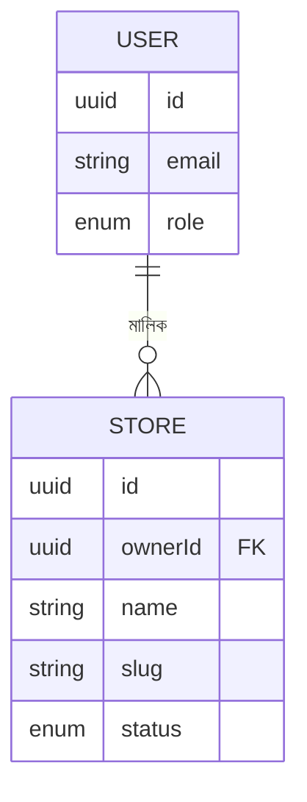

# ২৪.১৬. Store Setup Module Introduction

গত লেসনে সাবস্ক্রিপশন মডিউল সম্পূর্ণ হয়েছে — একজন স্টোর ওউনার এখন একটা প্ল্যানে সাবস্ক্রাইব করতে পারে। কিন্তু ShopKori-এর আসল উদ্দেশ্য তো দোকান খোলা আর প্রোডাক্ট বিক্রি করা — সাবস্ক্রিপশন শুধু সেই পথের একটা পূর্বশর্ত মাত্র। এখন রোডম্যাপের (Module 24.04) পরের ধাপ — **Store মডিউল**।

আগের প্যাটার্ন অনুসরণ করে, প্রথমে একটা মিনি-PRD লিখি।

**Store মডিউলের স্কোপ:**

1. একজন `STORE_OWNER` নিজের স্টোর তৈরি করতে পারবে — কিন্তু শুধুমাত্র যদি তার একটা ACTIVE সাবস্ক্রিপশন থাকে।
2. স্টোর তৈরির সময় সাবস্ক্রিপশন প্ল্যানের `maxStoreLimit` চেক হবে — একজন ওউনার তার প্ল্যানের সীমার বেশি স্টোর খুলতে পারবে না। এটা Module 24.02-এ চিহ্নিত করা সেই বিজনেস রুল, যা এখন বাস্তবায়িত হবে।
3. প্রতিটা স্টোরের একটা `slug` থাকবে (URL-friendly ইউনিক নাম, যেমন `rahims-electronics`), যা কাস্টমার-facing পেজের URL-এ ব্যবহার হবে।
4. স্টোরের একটা `status` থাকবে — `PENDING`, `ACTIVE`, `SUSPENDED`। নতুন স্টোর ডিফল্টভাবে `PENDING` অবস্থায় তৈরি হবে, আর সুপার অ্যাডমিন সেটা `ACTIVE` করবে — এটা একটা মডারেশন স্তর, যাতে যেকোনো স্টোর সরাসরি লাইভ হয়ে না যায়।
5. সুপার অ্যাডমিন যেকোনো স্টোর `SUSPENDED` করতে পারবে (Module 24.07-এর PRD-তে যা প্রতিশ্রুতি দেয়া হয়েছিল)।

এই রুলগুলো লক্ষ্য করলে দেখবে, `Store` এন্টিটি দুইটা ভিন্ন মডিউলের সাথে সম্পর্কযুক্ত — `User` (মালিকানার সম্পর্ক) আর `SubscriptionPlan`/`StoreSubscription` (সীমা যাচাইয়ের জন্য)। এই আন্তঃমডিউল নির্ভরতাই এই লেসনের কেন্দ্রীয় স্থাপত্য প্রশ্ন তৈরি করে — **StoreModule কীভাবে SubscriptionModule-এর ডেটা অ্যাক্সেস করবে, নিজের ভেতরের গঠন না ভেঙে?**

উত্তরটা হলো, ঠিক Module 24.10-এ যেভাবে `exports: [SubscriptionService]` লিখেছিলাম, সেভাবেই — `StoreModule` তার `imports` অ্যারেতে `SubscriptionModule` যোগ করবে, আর তারপর `StoreService`-এর কনস্ট্রাক্টরে `SubscriptionService` ইনজেক্ট করে নেবে। এটা NestJS-এর মডিউল সিস্টেমের একটা গুরুত্বপূর্ণ নিয়ম প্রদর্শন করে — মডিউলগুলো একে অপরের থেকে সম্পূর্ণ বিচ্ছিন্ন না, বরং **explicit ইন্টারফেসের মাধ্যমে** (exports/imports) নিয়ন্ত্রিতভাবে একে অপরের সাথে কথা বলে। এটা Module 22-তে শেখা "loose coupling" নীতির বাস্তব প্রয়োগ — StoreModule জানে না SubscriptionService-এর ভেতরে ঠিক কীভাবে ডেটাবেজ কোয়েরি হচ্ছে, শুধু জানে এটার একটা মেথড কল করলে কী পাওয়া যাবে।

চলো ERD-টাও আপডেট করে নেই, `Store` এন্টিটি কীভাবে বাকি সবকিছুর সাথে যুক্ত হচ্ছে সেটা স্পষ্ট করার জন্য:

আরেকটা গুরুত্বপূর্ণ ডিজাইন সিদ্ধান্ত — `Store` এন্টিটিতে সরাসরি `subscriptionId` ফরেন কী রাখবো না। কারণ সাবস্ক্রিপশন সময়ের সাথে বদলাতে পারে (মেয়াদ শেষ হলে নতুন সাবস্ক্রিপশন কেনা যাবে), কিন্তু স্টোর একবার তৈরি হলে সেটার পরিচয় স্থায়ী থাকা উচিত। তাই স্টোর তৈরির সময় শুধু "এই মুহূর্তে কি ইউজারের ACTIVE সাবস্ক্রিপশন আছে, আর সীমা পার হয়নি" — এই চেকটা করা হবে, স্টোর নিজে কোনো নির্দিষ্ট সাবস্ক্রিপশন রেকর্ডের সাথে স্থায়ীভাবে বাঁধা থাকবে না। এটা একটা সূক্ষ্ম কিন্তু গুরুত্বপূর্ণ ডেটা মডেলিং সিদ্ধান্ত, যা ভবিষ্যতে সমস্যা এড়াবে।

এই পরিকল্পনা হাতে নিয়ে, পরের লেসনে আমরা সরাসরি Store মডিউলের কোডিং-এ নেমে পড়বো — এন্টিটি, DTO, আর Repository লেয়ার দিয়ে শুরু করে।
