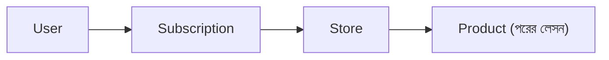

# ২৪.১৮. Developing Controller And Module

গত লেসনে Store মডিউলের এন্টিটি, DTO, আর Repository তৈরি হয়েছে, আর `SubscriptionModule` ইমপোর্ট করে আন্তঃমডিউল সংযোগও স্থাপন হয়েছে। এখন `StoreService` লিখে সেই সংযোগটা বাস্তবে কাজে লাগানোর পালা, তারপর `StoreController` দিয়ে এন্ডপয়েন্ট উন্মুক্ত করা।

`store.service.ts`:

```typescript
import {
  Injectable,
  ForbiddenException,
  ConflictException,
} from '@nestjs/common';
import { StoreRepository } from './repositories/store.repository';
import { SubscriptionService } from '../subscription/subscription.service';
import { CreateStoreDto } from './dto/create-store.dto';
import { Store, StoreStatus } from './entities/store.entity';

@Injectable()
export class StoreService {
  constructor(
    private readonly storeRepo: StoreRepository,
    private readonly subscriptionService: SubscriptionService,
  ) {}

  async createStore(ownerId: string, dto: CreateStoreDto): Promise<Store> {
    const activeSubscriptions =
      await this.subscriptionService.getMySubscription(ownerId);
    const active = activeSubscriptions.find((s) => s.status === 'ACTIVE');

    if (!active) {
      throw new ForbiddenException(
        'স্টোর খুলতে হলে আগে একটা সক্রিয় সাবস্ক্রিপশন লাগবে।',
      );
    }

    const existingSlug = await this.storeRepo.findBySlug(dto.slug);
    if (existingSlug) {
      throw new ConflictException('এই slug ইতিমধ্যে ব্যবহৃত হচ্ছে।');
    }

    const currentStoreCount = await this.storeRepo.countByOwner(ownerId);
    if (currentStoreCount >= active.plan.maxStoreLimit) {
      throw new ForbiddenException(
        `তোমার প্ল্যানে সর্বোচ্চ ${active.plan.maxStoreLimit}টা স্টোর খোলা যায়। এই সীমা পার হয়ে গেছে।`,
      );
    }

    const store = this.storeRepo.create({
      ownerId,
      name: dto.name,
      slug: dto.slug,
      status: StoreStatus.PENDING,
    });

    return this.storeRepo.save(store);
  }

  getMyStores(ownerId: string): Promise<Store[]> {
    return this.storeRepo.findByOwner(ownerId);
  }

  getAllStores(): Promise<Store[]> {
    return this.storeRepo.findAll();
  }

  async suspendStore(storeId: string): Promise<Store> {
    const stores = await this.storeRepo.findAll();
    const store = stores.find((s) => s.id === storeId);
    if (!store) {
      throw new ForbiddenException('স্টোর পাওয়া যায়নি।');
    }
    store.status = StoreStatus.SUSPENDED;
    return this.storeRepo.save(store);
  }
}
```

এই সার্ভিসটা মনোযোগ দিয়ে দেখো — `createStore()` মেথডে তিনটা আলাদা চেক ক্রমান্বয়ে হচ্ছে: প্রথমে সক্রিয় সাবস্ক্রিপশন আছে কিনা (গত লেসনের ক্রস-মডিউল কল, `subscriptionService.getMySubscription()` ব্যবহার করে), তারপর slug ইউনিক কিনা, সবশেষে `maxStoreLimit` পার হয়ে গেছে কিনা। এই তিনটা চেক ঠিক Module 24.16-এর PRD-তে লেখা ক্রম আর যুক্তি মেনে সাজানো — সবচেয়ে মৌলিক শর্ত (সাবস্ক্রিপশন থাকা) আগে যাচাই হচ্ছে, কারণ সেটা না থাকলে বাকি চেকগুলো করার কোনো মানেই নেই। এটা একটা ভালো অভ্যাস — বিজনেস লজিকে "cheapest/most fundamental check first" নীতি অনুসরণ করলে কোড পড়তে সহজ হয় আর অপ্রয়োজনীয় কাজ কম হয়।

এখন `store.controller.ts`:

```typescript
import {
  Controller,
  Get,
  Post,
  Patch,
  Body,
  Param,
  Req,
  UseGuards,
} from '@nestjs/common';
import { AuthGuard } from '@nestjs/passport';
import { StoreService } from './store.service';
import { CreateStoreDto } from './dto/create-store.dto';
import { RolesGuard } from '../../common/guards/roles.guard';
import { Roles } from '../../common/decorators/roles.decorator';
import { UserRole } from '../user/entities/user.entity';

@Controller('stores')
export class StoreController {
  constructor(private readonly storeService: StoreService) {}

  @Post()
  @UseGuards(AuthGuard('jwt'), RolesGuard)
  @Roles(UserRole.STORE_OWNER)
  create(@Req() req, @Body() dto: CreateStoreDto) {
    return this.storeService.createStore(req.user.id, dto);
  }

  @Get('my-stores')
  @UseGuards(AuthGuard('jwt'), RolesGuard)
  @Roles(UserRole.STORE_OWNER)
  myStores(@Req() req) {
    return this.storeService.getMyStores(req.user.id);
  }

  @Get()
  @UseGuards(AuthGuard('jwt'), RolesGuard)
  @Roles(UserRole.SUPER_ADMIN)
  allStores() {
    return this.storeService.getAllStores();
  }

  @Patch(':id/suspend')
  @UseGuards(AuthGuard('jwt'), RolesGuard)
  @Roles(UserRole.SUPER_ADMIN)
  suspend(@Param('id') id: string) {
    return this.storeService.suspendStore(id);
  }
}
```

এখন `store.module.ts` সম্পূর্ণ করি, `StoreService` আর `StoreController` যোগ করে:

```typescript
import { Module } from '@nestjs/common';
import { TypeOrmModule } from '@nestjs/typeorm';
import { Store } from './entities/store.entity';
import { StoreRepository } from './repositories/store.repository';
import { StoreService } from './store.service';
import { StoreController } from './store.controller';
import { SubscriptionModule } from '../subscription/subscription.module';

@Module({
  imports: [TypeOrmModule.forFeature([Store]), SubscriptionModule],
  controllers: [StoreController],
  providers: [StoreRepository, StoreService],
  exports: [StoreRepository, StoreService],
})
export class StoreModule {}
```

`exports`-এ `StoreService`-ও রেখে দিলাম — কারণ পরের লেসনে `ProductModule` তৈরি হবে, আর প্রোডাক্ট তৈরির সময় "এই স্টোর কি আসলেই এই ইউজারের?" — এই যাচাই করার জন্য `ProductService`-কে `StoreService` ইনজেক্ট করতে হবে। এভাবে নির্ভরতার চেইন এখন তিন স্তরে বিস্তৃত — `Product` নির্ভর করবে `Store`-এর উপর, `Store` নির্ভর করে `Subscription`-এর উপর, `Subscription` নির্ভর করে `User`-এর উপর — ঠিক Module 24.04-এ আঁকা রোডম্যাপ ডায়াগ্রামের মতোই।



Store মডিউলের কোর ফাংশনালিটি এখন কোড আকারে দাঁড়িয়ে গেছে। কিন্তু আগের সাব-আর্কের মতোই, লেখা কোড আর কাজ-করা কোড এক জিনিস না। পরের লেসনে আমরা এই পুরো ফ্লো — সাবস্ক্রাইব করা থেকে শুরু করে স্টোর তৈরি, লিমিট ছাড়িয়ে যাওয়া, সুপার অ্যাডমিনের সাসপেন্ড করা পর্যন্ত — পুরোটা টেস্ট করে দেখবো।
