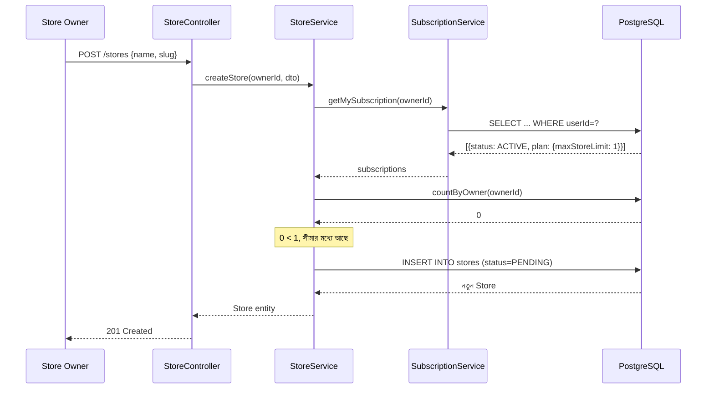

# ২৪.১৯. Testing The System

গত লেসনে Store মডিউলের Service আর Controller সম্পূর্ণ হয়েছে। এবার পুরো সিস্টেমটা — User থেকে Subscription থেকে Store — একটানা টেস্ট করে দেখার সময়, ঠিক যেভাবে Module 24.14-15-এ সাবস্ক্রিপশন মডিউল টেস্ট করেছিলাম, কিন্তু এবার এন্ড-টু-এন্ড, একাধিক মডিউল জুড়ে।

এই ধরনের টেস্টিংকে বলে **integration testing** — শুধু একটা মডিউল আলাদাভাবে ঠিকভাবে কাজ করছে কিনা তা না, বরং একাধিক মডিউল একসাথে জোড়া লাগলে পুরো ফ্লো সঠিকভাবে কাজ করছে কিনা, সেটা যাচাই করা। `test/store.e2e-spec.ts`:

```typescript
import { Test, TestingModule } from '@nestjs/testing';
import { INestApplication, ValidationPipe } from '@nestjs/common';
import * as request from 'supertest';
import { AppModule } from '../src/app.module';

describe('Store creation flow (e2e)', () => {
  let app: INestApplication;
  let ownerToken: string;
  let adminToken: string;
  let basicPlanId: string;

  beforeAll(async () => {
    const moduleFixture: TestingModule = await Test.createTestingModule({
      imports: [AppModule],
    }).compile();
    app = moduleFixture.createNestApplication();
    app.useGlobalPipes(new ValidationPipe({ whitelist: true }));
    await app.init();

    const adminLogin = await request(app.getHttpServer())
      .post('/auth/login')
      .send({ email: 'admin@shopkori.com', password: 'ChangeMe123!' });
    adminToken = adminLogin.body.accessToken;

    const planRes = await request(app.getHttpServer())
      .post('/subscription-plans')
      .set('Authorization', `Bearer ${adminToken}`)
      .send({ name: 'Basic', price: 499, durationInDays: 30, maxStoreLimit: 1 });
    basicPlanId = planRes.body.id;

    const ownerLogin = await request(app.getHttpServer())
      .post('/auth/login')
      .send({ email: 'owner@shopkori.com', password: 'OwnerPass123!' });
    ownerToken = ownerLogin.body.accessToken;
  });

  it('সাবস্ক্রিপশন ছাড়া স্টোর তৈরি করা যাবে না', async () => {
    const res = await request(app.getHttpServer())
      .post('/stores')
      .set('Authorization', `Bearer ${ownerToken}`)
      .send({ name: "Rahim's Electronics", slug: 'rahims-electronics' });

    expect(res.status).toBe(403);
  });

  it('সাবস্ক্রাইব করার পর স্টোর তৈরি করা যাবে', async () => {
    await request(app.getHttpServer())
      .post('/subscriptions/subscribe')
      .set('Authorization', `Bearer ${ownerToken}`)
      .send({ planId: basicPlanId });

    const res = await request(app.getHttpServer())
      .post('/stores')
      .set('Authorization', `Bearer ${ownerToken}`)
      .send({ name: "Rahim's Electronics", slug: 'rahims-electronics' });

    expect(res.status).toBe(201);
    expect(res.body.status).toBe('PENDING');
  });

  it('Basic প্ল্যানের সীমা (১টা স্টোর) পার হলে 403 আসবে', async () => {
    const res = await request(app.getHttpServer())
      .post('/stores')
      .set('Authorization', `Bearer ${ownerToken}`)
      .send({ name: 'Second Shop', slug: 'second-shop' });

    expect(res.status).toBe(403);
  });

  it('সুপার অ্যাডমিন স্টোর সাসপেন্ড করতে পারবে', async () => {
    const stores = await request(app.getHttpServer())
      .get('/stores')
      .set('Authorization', `Bearer ${adminToken}`);
    const storeId = stores.body[0].id;

    const res = await request(app.getHttpServer())
      .patch(`/stores/${storeId}/suspend`)
      .set('Authorization', `Bearer ${adminToken}`);

    expect(res.status).toBe(200);
    expect(res.body.status).toBe('SUSPENDED');
  });

  afterAll(async () => {
    await app.close();
  });
});
```

এই টেস্ট স্যুটটা লক্ষ্য করলে বোঝা যায় কেন Module 24.16-এর PRD-তে "maxStoreLimit ১" রাখা একটা ইচ্ছাকৃত টেস্ট-ফ্রেন্ডলি সিদ্ধান্ত ছিল — এতে করে "সীমা পার হওয়া" কেসটা মাত্র একটা স্টোর তৈরির পরেই টেস্ট করা যাচ্ছে, বড় সংখ্যা দিয়ে টেস্ট ডেটা তৈরির ঝামেলা ছাড়াই।

পুরো ফ্লোটাকে একটা সমন্বিত সিকোয়েন্স ডায়াগ্রামে দেখা যাক, যাতে User → Subscription → Store — তিনটা মডিউল কীভাবে একসাথে কাজ করছে সেটা এক নজরে বোঝা যায়:



এই ডায়াগ্রামটা দেখিয়ে দেয় কীভাবে একটা সিঙ্গেল API কল আসলে দুইটা ভিন্ন মডিউল, দুইটা ভিন্ন ডেটাবেজ টেবিলের সাথে কথা বলছে, কিন্তু Controller-এর দৃষ্টিকোণ থেকে এটা একটাই সহজ কল — `storeService.createStore()`। এই জটিলতা লুকিয়ে রাখাটাই ভালো architecture-এর লক্ষণ — প্রতিটা স্তর তার ব্যবহারকারীর কাছে একটা সরল ইন্টারফেস দেখায়, ভেতরের জটিলতা এনক্যাপসুলেট করে রাখে।

User, Subscription, আর Store — তিনটা মডিউল এখন একসাথে বাস্তবে কাজ করছে, টেস্ট দিয়ে প্রমাণিত। রোডম্যাপের শেষ ধাপ বাকি — Product মডিউল, যেখানে আসল বিজনেস ভ্যালু তৈরি হয় (যা বিক্রি হবে)। পরের ও শেষ লেসনে আমরা সেটাই বানাবো, আর এই পুরো মডিউলের যাত্রা সম্পূর্ণ করবো।
