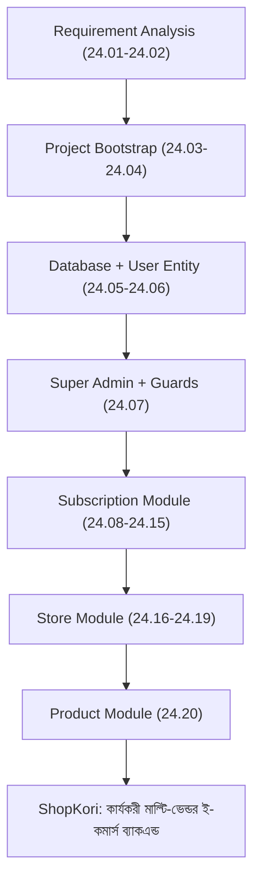

# ২৪.২০. Product Module Hands On

গত লেসনে আমরা প্রমাণ করেছি User, Subscription, আর Store — তিনটা মডিউল একসাথে সঠিকভাবে কাজ করছে। এখন এই মডিউলের শেষ ধাপ — **Product**, যেটাই আসলে ShopKori-এর আসল বিজনেস ভ্যালু। এতদিনের সব কাজ — সাবস্ক্রিপশন, স্টোর — এই মুহূর্তের প্রস্তুতি মাত্র, কারণ প্রোডাক্ট ছাড়া কোনো ই-কমার্স প্ল্যাটফর্মের কোনো অর্থই নেই।

Module 24.02-এর ERD অনুযায়ী মনে করিয়ে দেই — প্রোডাক্টের দুইটা সম্পর্ক থাকবে: `Store`-এর সাথে (মালিকানা) আর `Category`-এর সাথে (শ্রেণীবিন্যাস, ঐচ্ছিক)। প্রথমে `Category` এন্টিটি বানাই, এটা সবচেয়ে সহজ, কোনো নির্ভরতা ছাড়া:

```typescript
// src/modules/product/entities/category.entity.ts
import { Entity, PrimaryGeneratedColumn, Column, OneToMany } from 'typeorm';
import { Product } from './product.entity';

@Entity('categories')
export class Category {
  @PrimaryGeneratedColumn('uuid')
  id: string;

  @Column({ unique: true })
  name: string;

  @OneToMany(() => Product, (product) => product.category)
  products: Product[];
}
```

এখন `Product` এন্টিটি:

```typescript
import {
  Entity,
  PrimaryGeneratedColumn,
  Column,
  ManyToOne,
  JoinColumn,
  CreateDateColumn,
} from 'typeorm';
import { Store } from '../../store/entities/store.entity';
import { Category } from './category.entity';

@Entity('products')
export class Product {
  @PrimaryGeneratedColumn('uuid')
  id: string;

  @ManyToOne(() => Store, (store) => store.products, { onDelete: 'CASCADE' })
  @JoinColumn({ name: 'storeId' })
  store: Store;

  @Column()
  storeId: string;

  @ManyToOne(() => Category, (category) => category.products, {
    nullable: true,
  })
  @JoinColumn({ name: 'categoryId' })
  category: Category | null;

  @Column({ nullable: true })
  categoryId: string | null;

  @Column()
  title: string;

  @Column('decimal', { precision: 10, scale: 2 })
  price: number;

  @Column({ type: 'int', default: 0 })
  stock: number;

  @CreateDateColumn()
  createdAt: Date;
}
```

লক্ষ্য করো `category` সম্পর্কটা `nullable: true` — Module 24.02-এর সিদ্ধান্ত অনুযায়ী, `storeId` বাধ্যতামূলক (মালিকানা ছাড়া প্রোডাক্ট থাকতেই পারে না) কিন্তু `categoryId` ঐচ্ছিক (শ্রেণীবিন্যাস ছাড়াও প্রোডাক্ট থাকতে পারে)।

DTO — `dto/create-product.dto.ts`:

```typescript
import { IsString, IsNumber, IsPositive, IsOptional, Min } from 'class-validator';

export class CreateProductDto {
  @IsString()
  title: string;

  @IsNumber()
  @IsPositive()
  price: number;

  @IsNumber()
  @Min(0)
  stock: number;

  @IsOptional()
  @IsString()
  categoryId?: string;
}
```

`ProductService`-এর সবচেয়ে গুরুত্বপূর্ণ কাজ হলো এই যাচাই করা — যে ইউজার প্রোডাক্ট যোগ করছে, সে আসলেই সেই স্টোরের মালিক কিনা। এটাই এই মডিউলের নিরাপত্তার মূল বিষয়, নাহলে যেকোনো স্টোর ওউনার অন্যের স্টোরে প্রোডাক্ট ঢুকিয়ে দিতে পারতো:

```typescript
import { Injectable, ForbiddenException } from '@nestjs/common';
import { InjectRepository } from '@nestjs/typeorm';
import { Repository } from 'typeorm';
import { Product } from './entities/product.entity';
import { StoreRepository } from '../store/repositories/store.repository';
import { CreateProductDto } from './dto/create-product.dto';

@Injectable()
export class ProductService {
  constructor(
    @InjectRepository(Product)
    private readonly productRepo: Repository<Product>,
    private readonly storeRepo: StoreRepository,
  ) {}

  async createProduct(
    ownerId: string,
    storeId: string,
    dto: CreateProductDto,
  ): Promise<Product> {
    const ownerStores = await this.storeRepo.findByOwner(ownerId);
    const ownsStore = ownerStores.some((s) => s.id === storeId);

    if (!ownsStore) {
      throw new ForbiddenException('এই স্টোরে প্রোডাক্ট যোগ করার অনুমতি তোমার নেই।');
    }

    const product = this.productRepo.create({ ...dto, storeId });
    return this.productRepo.save(product);
  }

  findByStore(storeId: string): Promise<Product[]> {
    return this.productRepo.find({ where: { storeId } });
  }
}
```

`product.controller.ts`:

```typescript
import { Controller, Post, Get, Body, Param, Req, UseGuards } from '@nestjs/common';
import { AuthGuard } from '@nestjs/passport';
import { ProductService } from './product.service';
import { CreateProductDto } from './dto/create-product.dto';
import { RolesGuard } from '../../common/guards/roles.guard';
import { Roles } from '../../common/decorators/roles.decorator';
import { UserRole } from '../user/entities/user.entity';

@Controller('stores/:storeId/products')
export class ProductController {
  constructor(private readonly productService: ProductService) {}

  @Post()
  @UseGuards(AuthGuard('jwt'), RolesGuard)
  @Roles(UserRole.STORE_OWNER)
  create(
    @Req() req,
    @Param('storeId') storeId: string,
    @Body() dto: CreateProductDto,
  ) {
    return this.productService.createProduct(req.user.id, storeId, dto);
  }

  @Get()
  findByStore(@Param('storeId') storeId: string) {
    return this.productService.findByStore(storeId);
  }
}
```

আর `product.module.ts`, যা `StoreModule` ইমপোর্ট করে, ঠিক আগের লেসনগুলোর একই প্যাটার্নে:

```typescript
import { Module } from '@nestjs/common';
import { TypeOrmModule } from '@nestjs/typeorm';
import { Product } from './entities/product.entity';
import { Category } from './entities/category.entity';
import { ProductService } from './product.service';
import { ProductController } from './product.controller';
import { StoreModule } from '../store/store.module';

@Module({
  imports: [TypeOrmModule.forFeature([Product, Category]), StoreModule],
  controllers: [ProductController],
  providers: [ProductService],
})
export class ProductModule {}
```

মাইগ্রেশন জেনারেট আর রান করে দিলে ডেটাবেজে `products` আর `categories` টেবিল তৈরি হয়ে যাবে:

```bash
npm run migration:generate -- src/migrations/CreateProductAndCategoryTables
npm run migration:run
```

এখন Module 24.01-এ যে চারটা মডিউল রোডম্যাপে রাখা হয়েছিল — User, Subscription, Store, Product — সবগুলোই বাস্তবে দাঁড়িয়ে গেছে, একটার উপর আরেকটা নির্ভর করে, একটা সম্পূর্ণ, পরীক্ষিত সিস্টেম হিসেবে। পুরো যাত্রাটা একবার সংক্ষেপে দেখা যাক:



এই মডিউলে তুমি শুধু NestJS-এর সিনট্যাক্স শেখোনি — তুমি দেখেছো কীভাবে একটা বাস্তব প্রজেক্ট রিকোয়ারমেন্ট থেকে শুরু হয়ে, ধাপে ধাপে, প্রতিটা সিদ্ধান্তের পেছনে যুক্তি রেখে একটা কার্যকরী সিস্টেমে রূপান্তরিত হয়। এখনো বাকি আছে অনেক কিছু — প্রোডাক্ট সার্চ, অর্ডার ফ্লো, পেমেন্ট, রিভিউ, আরও গভীর অথেন্টিকেশন আর অথোরাইজেশন প্যাটার্ন। ঠিক এই জায়গা থেকেই Module 25 — NestJS Advanced শুরু হবে, যেখানে আমরা রাউটিং, মিডলওয়্যার, JWT-বেজড সম্পূর্ণ অথেন্টিকেশন সিস্টেম, আর RBAC আরও গভীরভাবে শিখবো, ঠিক এই ShopKori কোডবেসের উপরেই দাঁড়িয়ে।
