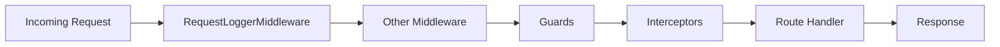

# ২৫.০১. Routing and Middleware in NestJS

Module 24-এ আমরা একটা পুরো ই-কমার্স ব্যাকএন্ড বানিয়ে ফেলেছি — সুপার অ্যাডমিন API, সাবস্ক্রিপশন মডিউল, স্টোর মডিউল, প্রোডাক্ট মডিউল, সব মিলিয়ে একটা কাজ-করা সিস্টেম। কিন্তু একটা প্রজেক্ট "কাজ করে" আর "প্রোডাকশনে চালানোর যোগ্য" — এই দুইটার মধ্যে অনেক ফারাক। এই মডিউল থেকে আমরা ঠিক সেই ফারাকটা ঘোচানো শুরু করবো, একই ই-কমার্স প্রজেক্টকে ধাপে ধাপে "লেভেল আপ" করে।

প্রথম ধাপ — routing আর middleware নিয়ে আরেকটু গভীরে যাওয়া। Module 7-এ Express.js-এ middleware কী জিনিস, কীভাবে কাজ করে সেটা শিখেছিলে — একটা রিকোয়েস্ট যখন সার্ভারে আসে, সেটা একে একে কয়েকটা ফাংশনের ভেতর দিয়ে যায়, প্রতিটা ফাংশন চাইলে রিকোয়েস্টটা পরের ধাপে পাঠাতে পারে (`next()`), বা থামিয়ে দিতে পারে। NestJS-এও ধারণাটা একই, কিন্তু এটাকে আরও গোছানো, আরও টাইপ-সেফ কাঠামোতে বসানো হয়েছে।

NestJS-এ মিডলওয়্যার লেখার সবচেয়ে পরিষ্কার পদ্ধতি হলো একটা ক্লাস বানানো, যেটা `NestMiddleware` ইন্টারফেস ইমপ্লিমেন্ট করে।

```typescript
// common/middleware/request-logger.middleware.ts
import { Injectable, NestMiddleware } from '@nestjs/common';
import { Request, Response, NextFunction } from 'express';

@Injectable()
export class RequestLoggerMiddleware implements NestMiddleware {
  use(req: Request, res: Response, next: NextFunction) {
    const start = Date.now();
    res.on('finish', () => {
      const duration = Date.now() - start;
      console.log(`${req.method} ${req.originalUrl} -> ${res.statusCode} (${duration}ms)`);
    });
    next();
  }
}
```

এই মিডলওয়্যারটা আমাদের ই-কমার্স প্রজেক্টের প্রতিটা রিকোয়েস্টের সময় আর স্ট্যাটাস কোড লগ করবে — যেটা পরে Module 25-এর লগিং লেসনে আরও গুরুত্বপূর্ণ হয়ে উঠবে। এই মিডলওয়্যারকে অ্যাপ্লাই করতে হয় মডিউলের `configure()` মেথডে, `MiddlewareConsumer` ব্যবহার করে।

```typescript
// app.module.ts
import { MiddlewareConsumer, Module, NestModule } from '@nestjs/common';
import { RequestLoggerMiddleware } from './common/middleware/request-logger.middleware';

@Module({ /* imports, controllers, providers */ })
export class AppModule implements NestModule {
  configure(consumer: MiddlewareConsumer) {
    consumer
      .apply(RequestLoggerMiddleware)
      .forRoutes('*'); // সব রুটে প্রযোজ্য
  }
}
```

এখানে `forRoutes('*')` দিয়ে সব রুটে অ্যাপ্লাই করলাম, কিন্তু চাইলে নির্দিষ্ট কন্ট্রোলার বা পাথেও সীমাবদ্ধ করা যায় — যেমন `forRoutes('products')` লিখলে শুধু প্রোডাক্ট মডিউলের রুটেই এই মিডলওয়্যার চলবে। এটা গুরুত্বপূর্ণ, কারণ আমাদের সাবস্ক্রিপশন মডিউল আর স্টোর মডিউলের হয়তো ভিন্ন ভিন্ন মিডলওয়্যার দরকার হবে।



এই ডায়াগ্রামটা একটা গুরুত্বপূর্ণ জিনিস দেখায় — NestJS-এ রিকোয়েস্ট প্রসেসিং পাইপলাইনে মিডলওয়্যারের পরে আরও কয়েকটা স্তর আছে: Guards, Interceptors, Pipes। এগুলো আসলে Express-এর সাধারণ মিডলওয়্যারেরই বিশেষায়িত রূপ — প্রতিটার একটা নির্দিষ্ট দায়িত্ব আছে। Guard ঠিক করে "এই রিকোয়েস্ট আদৌ এগোতে দেয়া উচিত কিনা" (যেমন authentication), Interceptor রিকোয়েস্ট/রেসপন্সের চারপাশে অতিরিক্ত লজিক জুড়ে দেয় (যেমন response transform করা, caching), আর Pipe ডেটা ভ্যালিডেট বা রূপান্তর করে। এই তিনটাকে সাধারণ মিডলওয়্যার থেকে আলাদা করার কারণ হলো — NestJS চায় প্রতিটা দায়িত্ব একটা নির্দিষ্ট, নামকরণ করা জায়গায় থাকুক, যাতে বড় টিমে কাজ করার সময় সবাই বুঝতে পারে কোন কোডটা কী কাজ করছে শুধু তার টাইপ দেখেই। এই ফিলোসফিটাই আসলে Module 22-তে শেখা Dependency Injection আর Decorator প্যাটার্নের বাস্তব প্রয়োগ — প্রতিটা স্তর একটা ক্লাসের উপর একটা ডেকোরেটর বসিয়ে NestJS-কে বলে দেয় "এটা কোন ভূমিকায় কাজ করবে"।

পরের লেসনে আমরা ঠিক এই পাইপলাইনের একটা গুরুত্বপূর্ণ স্তর — Authentication — নিয়ে কাজ শুরু করবো, JWT আর Passport ব্যবহার করে আমাদের ই-কমার্স প্রজেক্টের লগইন সিস্টেম বানাবো।
