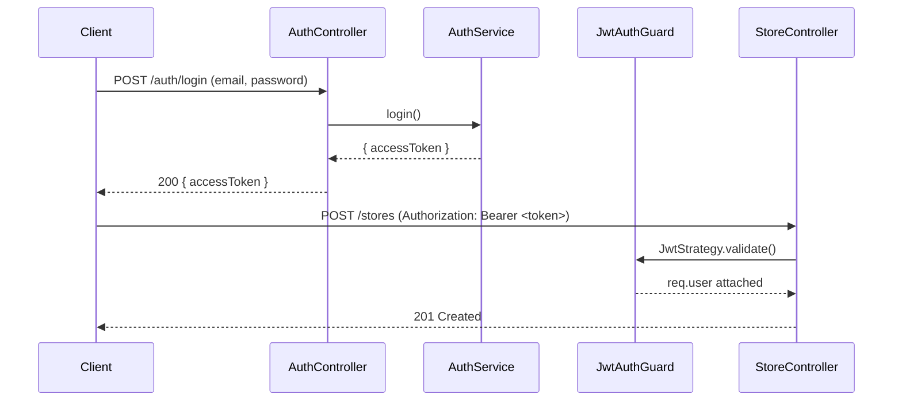

# ২৫.০২. Authentication with JWT and Passport

Module 12-এ তুমি JWT-এর মূল ধারণাটা শিখেছিলে — ইউজার লগইন করলে সার্ভার একটা টোকেন ইস্যু করে, ইউজার প্রতিটা পরের রিকোয়েস্টে সেই টোকেন সাথে নিয়ে আসে, সার্ভার সেটা ভেরিফাই করে বুঝে নেয় ইউজারটা কে। এখন প্রশ্ন হলো — আমাদের Module 24-এর ই-কমার্স প্রজেক্টে (যেখানে সুপার অ্যাডমিন, স্টোর মালিক, কাস্টমার — একাধিক ধরনের ইউজার আছে) এই জিনিসটা NestJS-এর নিয়মে কীভাবে বসাবো?

এখানেই আসে **Passport** — Node.js ইকোসিস্টেমের সবচেয়ে পুরনো আর বহুল ব্যবহৃত অথেন্টিকেশন লাইব্রেরি। Passport নিজে কোনো "স্ট্র্যাটেজি" (যেমন username/password, JWT, Google OAuth) জোর করে চাপায় না — বরং একটা প্লাগেবল কাঠামো দেয়, যেখানে তুমি যেকোনো স্ট্র্যাটেজি বসাতে পারো। NestJS-এর `@nestjs/passport` প্যাকেজ এই Passport-কে NestJS-এর DI সিস্টেমের সাথে সুন্দরভাবে জুড়ে দেয়।

প্রথমে লগইনের সময় ইউজারের ইমেইল-পাসওয়ার্ড যাচাই করার জন্য একটা `LocalStrategy`, আর তারপর প্রতিটা প্রোটেক্টেড রিকোয়েস্টে টোকেন ভেরিফাই করার জন্য একটা `JwtStrategy` বানাতে হয়।

```typescript
// auth/strategies/jwt.strategy.ts
import { ExtractJwt, Strategy } from 'passport-jwt';
import { PassportStrategy } from '@nestjs/passport';
import { Injectable } from '@nestjs/common';

@Injectable()
export class JwtStrategy extends PassportStrategy(Strategy) {
  constructor() {
    super({
      jwtFromRequest: ExtractJwt.fromAuthHeaderAsBearerToken(),
      ignoreExpiration: false,
      secretOrKey: process.env.JWT_SECRET,
    });
  }

  async validate(payload: { sub: string; role: string }) {
    // এই রিটার্ন ভ্যালুটাই req.user হিসেবে কন্ট্রোলারে পাওয়া যাবে
    return { userId: payload.sub, role: payload.role };
  }
}
```

লক্ষ্য করো, `validate()` মেথডটা কোনো ডেটাবেজ কল করছে না — শুধু টোকেনের ভেতরের payload-টা বিশ্বাস করে ব্যবহার করছে, কারণ টোকেনটা সাইন করা, তাই তার সত্যতা secret key দিয়ে নিশ্চিত হয়ে গেছে ইতিমধ্যে (`super()` কলে)। এটাই JWT-এর মূল সুবিধা যেটা Module 12-তে শিখেছিলে — সার্ভারকে প্রতিবার ডেটাবেজে গিয়ে সেশন চেক করতে হয় না।

এখন লগইন এন্ডপয়েন্টে টোকেন ইস্যু করার লজিক:

```typescript
// auth/auth.service.ts
@Injectable()
export class AuthService {
  constructor(
    private usersService: UsersService,
    private jwtService: JwtService,
  ) {}

  async login(email: string, password: string) {
    const user = await this.usersService.findByEmail(email);
    const isMatch = user && (await bcrypt.compare(password, user.password));
    if (!isMatch) throw new UnauthorizedException('ভুল ইমেইল বা পাসওয়ার্ড');

    const payload = { sub: user.id, role: user.role };
    return { accessToken: this.jwtService.sign(payload) };
  }
}
```

আর কন্ট্রোলারে একটা রুটকে প্রোটেক্ট করা এখন এক লাইনের কাজ — `@UseGuards(AuthGuard('jwt'))` বসিয়ে দিলেই NestJS নিজে থেকে `JwtStrategy` চালিয়ে দেখবে টোকেন বৈধ কিনা।

```typescript
// store/store.controller.ts
@UseGuards(AuthGuard('jwt'))
@Post()
createStore(@Req() req, @Body() dto: CreateStoreDto) {
  return this.storeService.create(req.user.userId, dto);
}
```



এখন আমাদের ই-কমার্স প্রজেক্টের প্রতিটা প্রোটেক্টেড রুট বুঝতে পারছে "কে" রিকোয়েস্ট করছে। কিন্তু শুধু "কে" জানলেই তো চলবে না — সুপার অ্যাডমিন যা করতে পারবে, স্টোর মালিক তা পারবে না। "কে" থেকে "সে কী করতে পারবে"-তে যাওয়াটাই হলো পরের লেসনের বিষয় — Authorization আর Role-Based Access Control।
