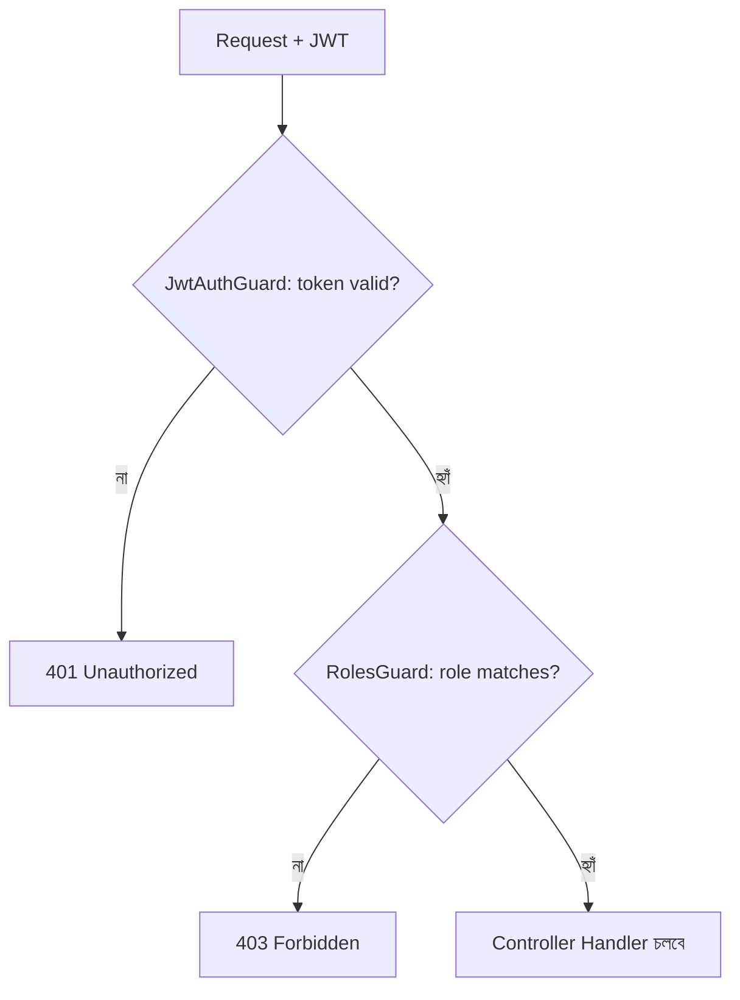

# ২৫.০৩. Authorization and Role-Based Access Control (RBAC)

Module 21-এ ডেটাবেজ স্তরে RBAC নিয়ে কথা হয়েছিলো — কীভাবে একটা ডেটাবেজ ইউজারকে নির্দিষ্ট টেবিলে GRANT/REVOKE দিয়ে অনুমতি দেয়া বা কেড়ে নেয়া যায়। এখন আমরা একই ধারণাটা অ্যাপ্লিকেশন স্তরে নিয়ে আসছি — আমাদের ই-কমার্স প্রজেক্টে তিন ধরনের ইউজার আছে ধরে নাও: `SUPER_ADMIN`, `STORE_OWNER`, `CUSTOMER`। প্রতিটা এন্ডপয়েন্টের একটা নিয়ম আছে কোন রোল সেটা অ্যাক্সেস করতে পারবে।

আগের লেসনে `JwtStrategy.validate()` থেকে আমরা `req.user`-এ `role` বসিয়ে দিয়েছিলাম। এখন সেই রোলটা যাচাই করার জন্য একটা কাস্টম Guard আর একটা কাস্টম Decorator বানাবো — এটাই NestJS-এ RBAC বানানোর প্রচলিত, পরিষ্কার পদ্ধতি।

প্রথমে একটা ডেকোরেটর, যেটা দিয়ে আমরা কন্ট্রোলার মেথডের উপর লিখে দিতে পারবো কোন কোন রোল অনুমোদিত।

```typescript
// common/decorators/roles.decorator.ts
import { SetMetadata } from '@nestjs/common';

export const ROLES_KEY = 'roles';
export const Roles = (...roles: string[]) => SetMetadata(ROLES_KEY, roles);
```

এরপর একটা Guard, যেটা রিকোয়েস্ট পাইপলাইনে বসে ওই মেটাডেটা পড়ে আর `req.user.role`-এর সাথে মিলিয়ে দেখে।

```typescript
// common/guards/roles.guard.ts
import { CanActivate, ExecutionContext, Injectable } from '@nestjs/common';
import { Reflector } from '@nestjs/core';
import { ROLES_KEY } from '../decorators/roles.decorator';

@Injectable()
export class RolesGuard implements CanActivate {
  constructor(private reflector: Reflector) {}

  canActivate(context: ExecutionContext): boolean {
    const requiredRoles = this.reflector.getAllAndOverride<string[]>(ROLES_KEY, [
      context.getHandler(),
      context.getClass(),
    ]);
    if (!requiredRoles) return true; // কোনো @Roles() না থাকলে সবার জন্য খোলা

    const { user } = context.switchToHttp().getRequest();
    return requiredRoles.includes(user?.role);
  }
}
```

`Reflector` জিনিসটা NestJS-এর একটা বিশেষ টুল, যেটা দিয়ে ডেকোরেটরে বসানো মেটাডেটা রানটাইমে পড়া যায়। এই প্যাটার্নটাই Module 22-এ শেখা Decorator Design Pattern-এর হুবহু বাস্তব প্রয়োগ — `@Roles('SUPER_ADMIN')` লেখাটা মেথডের আচরণ না বদলে তার উপর একটা "লেবেল" বসিয়ে দিচ্ছে, আর Guard সেই লেবেল পড়ে সিদ্ধান্ত নিচ্ছে।

এখন কন্ট্রোলারে ব্যবহার:

```typescript
// admin/admin.controller.ts
@UseGuards(AuthGuard('jwt'), RolesGuard)
@Roles('SUPER_ADMIN')
@Delete('stores/:id')
removeStore(@Param('id') id: string) {
  return this.adminService.removeStore(id);
}
```



দুটো Guard একসাথে চেইনে বসানো হলো — প্রথমে `AuthGuard('jwt')` যাচাই করবে ইউজারটা আসলেই লগইন করা কিনা (Authentication), তারপর `RolesGuard` যাচাই করবে তার অনুমতি আছে কিনা (Authorization)। এই দুটো ধারণার পার্থক্যটা মনে রাখা জরুরি — Authentication মানে "তুমি কে সেটা প্রমাণ করো", Authorization মানে "তুমি এটা করার অনুমতি রাখো কিনা"।

এখন আমাদের সিস্টেম জানে কে কী করতে পারবে। কিন্তু যদি কোনো ভুল হয় — টোকেন এক্সপায়ার হয়ে গেছে, ডেটাবেজ কানেকশন ফেইল করেছে, বা ভ্যালিডেশন ভুল — তখন ইউজারকে কীভাবে একটা সুন্দর, বোধগম্য এরর মেসেজ দেখাবো? পরের লেসনে আমরা NestJS-এর এরর হ্যান্ডলিং আর লগিং সিস্টেমে ঢুকবো।
