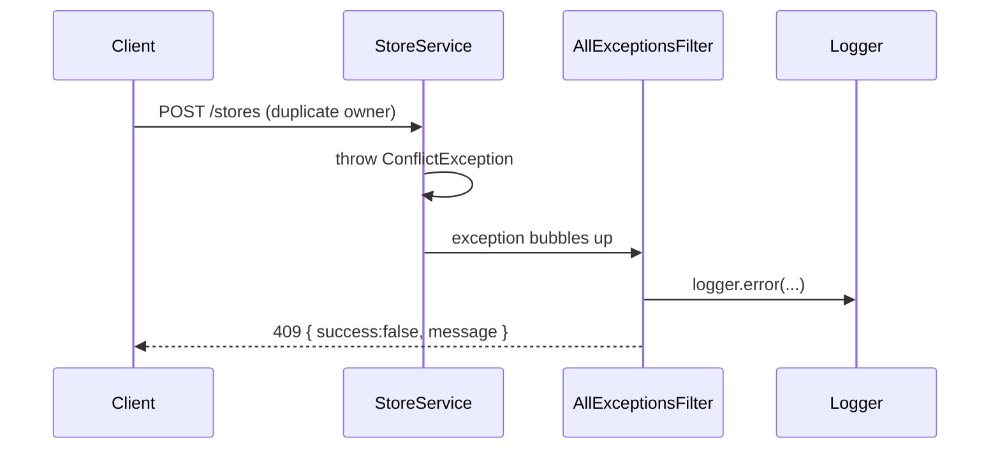

# ২৫.০৪. Error Handling and Logging in NestJS

আমাদের ই-কমার্স প্রজেক্টে যত ফিচার যোগ হচ্ছে, ততই ভুল হওয়ার জায়গাও বাড়ছে — ইউজার ভুল ডেটা পাঠাতে পারে, ডেটাবেজ কানেকশন সাময়িকভাবে বন্ধ হতে পারে, নাই এমন প্রোডাক্ট আইডি দিয়ে রিকোয়েস্ট আসতে পারে। এই মডিউলের প্রথম তিন লেসনে আমরা "কে" আর "কী করার অনুমতি আছে" সামলেছি — এখন সামলাবো "যখন কিছু ভুল হয়, তখন কী হবে"।

Express-এ (Module 7) আমরা একটা কাস্টম error-handling middleware লিখেছিলাম, যেটা চার প্যারামিটার নেয় (`err, req, res, next`) আর চেইনের একদম শেষে বসে। NestJS-এ এই ধারণাটার নাম **Exception Filter**। ডিফল্টভাবে NestJS নিজেই একটা built-in filter দিয়ে সব `HttpException` ধরে সুন্দর JSON রেসপন্স বানিয়ে দেয়, কিন্তু বড় প্রজেক্টে আমরা চাই একটা কনসিস্টেন্ট, কাস্টমাইজড এরর ফরম্যাট — যেটা লগও করবে, ক্লায়েন্টকেও পরিষ্কার তথ্য দেবে।

```typescript
// common/filters/all-exceptions.filter.ts
import {
  ArgumentsHost, Catch, ExceptionFilter,
  HttpException, HttpStatus, Logger,
} from '@nestjs/common';
import { Request, Response } from 'express';

@Catch()
export class AllExceptionsFilter implements ExceptionFilter {
  private readonly logger = new Logger('ExceptionFilter');

  catch(exception: unknown, host: ArgumentsHost) {
    const ctx = host.switchToHttp();
    const res = ctx.getResponse<Response>();
    const req = ctx.getRequest<Request>();

    const status =
      exception instanceof HttpException
        ? exception.getStatus()
        : HttpStatus.INTERNAL_SERVER_ERROR;

    const message =
      exception instanceof HttpException
        ? exception.getResponse()
        : 'অপ্রত্যাশিত সার্ভার এরর';

    this.logger.error(
      `${req.method} ${req.url} -> ${status}`,
      exception instanceof Error ? exception.stack : undefined,
    );

    res.status(status).json({
      success: false,
      statusCode: status,
      path: req.url,
      timestamp: new Date().toISOString(),
      message,
    });
  }
}
```

`@Catch()` ডেকোরেটরে কিছু না লিখলে এটা সব ধরনের এক্সেপশন ধরবে — HttpException হোক বা সাধারণ JavaScript Error। এটাকে গ্লোবালি অ্যাপ্লাই করা হয় `main.ts`-এ।

```typescript
// main.ts
const app = await NestFactory.create(AppModule);
app.useGlobalFilters(new AllExceptionsFilter());
```

এখন আমাদের স্টোর মডিউলে কোনো সার্ভিস মেথড যদি নির্দিষ্ট ব্যবসায়িক নিয়ম ভাঙার জন্য এরর ছুঁড়তে চায়, সে শুধু বিল্ট-ইন এক্সেপশন ক্লাস ব্যবহার করবে, নিজে থেকে try/catch দিয়ে রেসপন্স ফরম্যাট করার দরকার নেই।

```typescript
// store/store.service.ts
async create(ownerId: string, dto: CreateStoreDto) {
  const existing = await this.storeRepo.findOne({ where: { ownerId } });
  if (existing) {
    throw new ConflictException('এই ইউজারের অলরেডি একটা স্টোর আছে');
  }
  return this.storeRepo.save({ ...dto, ownerId });
}
```

`Logger` ক্লাসটা লক্ষ্য করার মতো — NestJS-এর নিজস্ব বিল্ট-ইন লগার, যেটা মডিউল/সার্ভিস অনুযায়ী রঙিন, গোছানো কনসোল আউটপুট দেয়। প্রোডাকশনে আমরা চাইলে এটাকে Winston বা Pino-এর মতো লাইব্রেরি দিয়ে রিপ্লেস করতে পারি (এটা নিয়ে বিস্তারিত Module 32-এ আসবে), কিন্তু এখনই এই বেসিক প্যাটার্নটা রপ্ত করে রাখা দরকার — এরর হ্যান্ডলিং আর লগিং সবসময় একসাথে চলে, কারণ একটা এরর ইউজারকে দেখানো এক জিনিস, আর সেটা ডেভেলপারের জন্য রেকর্ড রাখা আরেক জিনিস।



এখন এরর সামলানো হয়ে গেলো। কিন্তু আমাদের API-টা যেহেতু বাড়ছে, একদিন মোবাইল অ্যাপ আর পুরনো ওয়েব ক্লায়েন্ট একই সাথে ভিন্ন ভিন্ন সংস্করণের API ব্যবহার করবে — আর অনেক রিকোয়েস্ট একসাথে এলে সার্ভারকে রক্ষা করতেও হবে। পরের লেসনে আমরা API Versioning আর Rate Limiting নিয়ে কথা বলবো।
