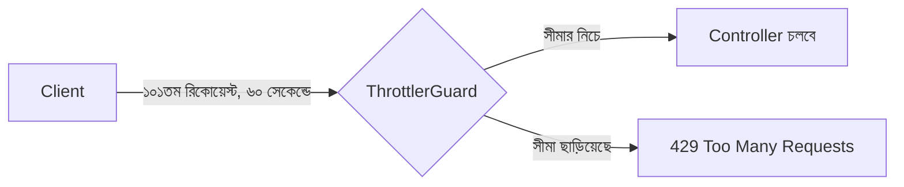

# ২৫.০৫. API Versioning and Rate Limiting

কল্পনা করো আমাদের ই-কমার্স API ছয় মাস চলার পর তুমি প্রোডাক্ট এন্ডপয়েন্টের রেসপন্স স্ট্রাকচার বদলাতে চাও — নতুন ফিল্ড যোগ করা, পুরনো একটা ফিল্ডের নাম বদলানো। কিন্তু ততদিনে একটা মোবাইল অ্যাপ আর একটা পুরনো ওয়েব ড্যাশবোর্ড পুরনো ফরম্যাটের উপর নির্ভর করে চলছে। এই সমস্যার সমাধান হলো **API Versioning** — একই সময়ে একাধিক সংস্করণ পাশাপাশি চালানো, যাতে পুরনো ক্লায়েন্ট ভেঙে না যায়।

NestJS-এ ভার্সনিং চালু করা প্রায় এক লাইনের কাজ।

```typescript
// main.ts
app.enableVersioning({
  type: VersioningType.URI,
  defaultVersion: '1',
});
```

এখন কন্ট্রোলারে ভার্সন উল্লেখ করা যায়:

```typescript
// product/product.controller.ts
@Controller({ path: 'products', version: '1' })
export class ProductControllerV1 { /* পুরনো রেসপন্স ফরম্যাট */ }

@Controller({ path: 'products', version: '2' })
export class ProductControllerV2 { /* নতুন রেসপন্স ফরম্যাট */ }
```

ক্লায়েন্ট এখন `/v1/products` বা `/v2/products` — যেটা তার দরকার, সেটা কল করবে। পুরনো মোবাইল অ্যাপ আপডেট না হওয়া পর্যন্ত `v1`-এই থাকবে, নতুন ওয়েব অ্যাপ `v2` ব্যবহার করবে। এটা অনেকটা Module 24-এ শেখা ডেটাবেজ মাইগ্রেশনের মতোই একটা "ব্রেকিং চেঞ্জ নিরাপদে সামলানোর" কৌশল — শুধু ডেটাবেজ স্কিমার বদলে এখানে API কন্ট্রাক্টের বদল সামলানো হচ্ছে।

দ্বিতীয় বিষয় — **Rate Limiting**। Module 7-তেই তুমি rate limiting মিডলওয়্যারের ধারণার সাথে পরিচিত হয়েছিলে (একজন ইউজার নির্দিষ্ট সময়ে কতবার রিকোয়েস্ট পাঠাতে পারবে তার সীমা)। NestJS-এ এর জন্য অফিসিয়াল প্যাকেজ আছে — `@nestjs/throttler`।

```typescript
// app.module.ts
import { ThrottlerModule, ThrottlerGuard } from '@nestjs/throttler';
import { APP_GUARD } from '@nestjs/core';

@Module({
  imports: [
    ThrottlerModule.forRoot([{ ttl: 60000, limit: 100 }]), // ৬০ সেকেন্ডে ১০০ রিকোয়েস্ট
  ],
  providers: [{ provide: APP_GUARD, useClass: ThrottlerGuard }],
})
export class AppModule {}
```

`APP_GUARD` দিয়ে গ্লোবালি বসিয়ে দিলে পুরো অ্যাপ্লিকেশনের সব রুট এই সীমার আওতায় চলে আসে। তবে কিছু রুটে আলাদা নিয়ম দরকার হতে পারে — যেমন আমাদের লগইন এন্ডপয়েন্টে ব্রুট-ফোর্স অ্যাটাক ঠেকাতে আরও কড়া সীমা দরকার।

```typescript
// auth/auth.controller.ts
import { Throttle } from '@nestjs/throttler';

@Throttle({ default: { limit: 5, ttl: 60000 } }) // ৬০ সেকেন্ডে মাত্র ৫ বার
@Post('login')
login(@Body() dto: LoginDto) {
  return this.authService.login(dto.email, dto.password);
}
```



লক্ষ্য করো, versioning আর rate limiting দুটোই আসলে একই দর্শনের অংশ — একটা API যখন প্রকৃত ইউজারদের হাতে চলে যায়, তখন সেটাকে শুধু "সঠিক কাজ করা" যথেষ্ট না, বরং "পরিবর্তনযোগ্য" আর "টেকসই" হতেও হয়। এটাই একটা প্রজেক্টকে টয় থেকে প্রোডাকশন-গ্রেড সিস্টেমে রূপান্তরিত করে।

কিন্তু এই নতুন নিয়মগুলো — গার্ড, থ্রটলিং, ভার্সনিং — সবকিছু ঠিকমতো কাজ করছে কিনা সেটা কীভাবে নিশ্চিত হবো, বিশেষ করে কোড যত বড় হচ্ছে? হাতে হাতে Postman দিয়ে চেক করা আর টেকসই নয়। পরের লেসনে আমরা NestJS-এ ইউনিট টেস্টিং আর ইন্টিগ্রেশন টেস্টিং শিখবো।
