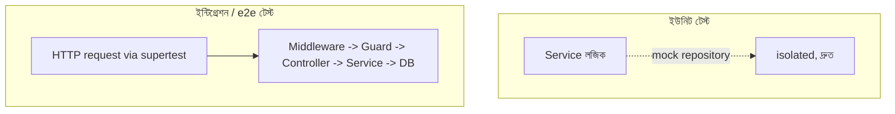

# ২৫.০৬. Unit Testing and Integration Testing in NestJS

আমাদের ই-কমার্স প্রজেক্টে এতদিনে অথেন্টিকেশন, RBAC, এরর হ্যান্ডলিং, ভার্সনিং, রেট লিমিটিং — সব যোগ হয়ে গেছে। এখন একটা স্বাভাবিক ভয় তৈরি হয় — নতুন কিছু যোগ করতে গিয়ে পুরনো কিছু ভেঙে গেলো কিনা সেটা কীভাবে বুঝবো, প্রতিবার হাতে হাতে সব এন্ডপয়েন্ট চেক না করে? উত্তরটা হলো automated testing — কোড লিখে কোডকে যাচাই করা।

NestJS ডিফল্টভাবে **Jest** টেস্টিং ফ্রেমওয়ার্ক নিয়ে আসে, আর এর DI সিস্টেমের কারণে টেস্ট লেখাটা আসলে সহজ হয়ে যায় — কারণ যেকোনো সার্ভিসের নির্ভরতাগুলো (dependencies) সহজেই "মক" (fake ভার্সন) দিয়ে বদলে দেয়া যায়।

প্রথমে একটা **ইউনিট টেস্ট** দেখি — শুধু `StoreService`-এর একটা মেথড, বাকি সব কিছু (ডেটাবেজ) মক করে।

```typescript
// store/store.service.spec.ts
import { Test } from '@nestjs/testing';
import { ConflictException } from '@nestjs/common';
import { StoreService } from './store.service';
import { getRepositoryToken } from '@nestjs/typeorm';

describe('StoreService', () => {
  let service: StoreService;
  const mockRepo = { findOne: jest.fn(), save: jest.fn() };

  beforeEach(async () => {
    const module = await Test.createTestingModule({
      providers: [
        StoreService,
        { provide: getRepositoryToken(Store), useValue: mockRepo },
      ],
    }).compile();

    service = module.get(StoreService);
  });

  it('একই ওনারের দ্বিতীয় স্টোর তৈরি করতে দেবে না', async () => {
    mockRepo.findOne.mockResolvedValue({ id: '1', ownerId: 'owner-1' });

    await expect(
      service.create('owner-1', { name: 'নতুন স্টোর' }),
    ).rejects.toThrow(ConflictException);
  });

  it('নতুন ওনারের জন্য স্টোর তৈরি করবে', async () => {
    mockRepo.findOne.mockResolvedValue(null);
    mockRepo.save.mockResolvedValue({ id: '2', name: 'নতুন স্টোর' });

    const result = await service.create('owner-2', { name: 'নতুন স্টোর' });
    expect(result.id).toBe('2');
  });
});
```

এখানে `Test.createTestingModule` NestJS-এর নিজস্ব DI কন্টেইনার তৈরি করে দিচ্ছে, শুধু এই টেস্টের জন্য — আর `getRepositoryToken(Store)`-এর জায়গায় আমরা আসল ডেটাবেজ রিপোজিটরির বদলে একটা fake অবজেক্ট (`mockRepo`) বসিয়ে দিচ্ছি। এই টেকনিকটাকে বলে **dependency substitution**, আর এটা সম্ভব হচ্ছে কারণ Module 22-এ শেখা Dependency Injection প্যাটার্নটা প্রথম থেকেই আমাদের কোডে বসানো ছিলো — সার্ভিস কখনো সরাসরি `new Repository()` লেখেনি, বরং কনস্ট্রাক্টরে ইনজেক্ট করা হয়েছে।

এবার একটা **ইন্টিগ্রেশন টেস্ট (e2e)** দেখি, যেটা সত্যিকারের HTTP রিকোয়েস্ট পাঠিয়ে পুরো পাইপলাইন (middleware, guard, controller, service) একসাথে যাচাই করে।

```typescript
// test/store.e2e-spec.ts
import { Test } from '@nestjs/testing';
import { INestApplication } from '@nestjs/common';
import * as request from 'supertest';
import { AppModule } from '../src/app.module';

describe('StoreController (e2e)', () => {
  let app: INestApplication;

  beforeAll(async () => {
    const moduleRef = await Test.createTestingModule({
      imports: [AppModule],
    }).compile();
    app = moduleRef.createNestApplication();
    await app.init();
  });

  it('/stores (POST) টোকেন ছাড়া 401 রিটার্ন করবে', () => {
    return request(app.getHttpServer())
      .post('/stores')
      .send({ name: 'টেস্ট স্টোর' })
      .expect(401);
  });

  afterAll(() => app.close());
});
```



দুটো টেস্টের ভূমিকা আলাদা — ইউনিট টেস্ট দ্রুত চলে, নির্দিষ্ট লজিক আলাদাভাবে যাচাই করে; ইন্টিগ্রেশন টেস্ট ধীর কিন্তু নিশ্চিত করে পুরো সিস্টেম বাস্তবে একসাথে কাজ করছে। একটা প্রফেশনাল প্রজেক্টে দুটোই দরকার — অনেকটা Module 24-এ যেভাবে আমরা প্রতিটা মডিউল আলাদাভাবেও টেস্ট করেছিলাম, আবার পুরো ফ্লো-ও একসাথে চেক করেছিলাম, ঠিক সেই একই নীতি।

টেস্টিং দিয়ে আমরা নিশ্চিত হলাম কোড ঠিকভাবে কাজ করছে। কিন্তু কিছু কাজ আছে যেগুলো সরাসরি রিকোয়েস্ট-রেসপন্স চক্রের বাইরে ঘটা উচিত — যেমন অর্ডার হওয়ার পর ইমেইল পাঠানো, বা ইনভেন্টরি আপডেট হওয়ার খবর অন্য সার্ভিসকে জানানো। এই ধরনের কাজের জন্য দরকার ইভেন্ট-ভিত্তিক আর্কিটেকচার, যেটা পরের লেসনের বিষয় — Kafka দিয়ে Event-Driven Architecture।
