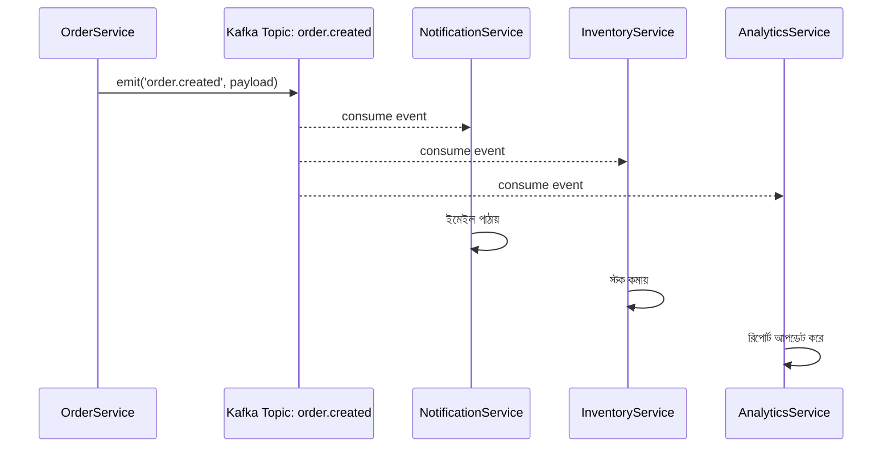

# ২৫.০৭. Event-Driven Architecture with Kafka

আমাদের ই-কমার্স প্রজেক্টে একটা কাস্টমার অর্ডার করলে আসলে অনেকগুলো কাজ ঘটা দরকার — ইনভেন্টরি কমানো, কনফার্মেশন ইমেইল পাঠানো, বিক্রেতাকে নোটিফাই করা, অ্যানালিটিক্সে রেকর্ড রাখা। এখন পর্যন্ত আমরা যেভাবে কোড লিখেছি, `OrderService.createOrder()`-এর ভেতরেই এই সবগুলো কাজ একে একে সরাসরি কল করতে হতো। সমস্যা হলো, এতে সার্ভিসগুলো একে অপরের সাথে শক্তভাবে জড়িয়ে যায় (tight coupling) — ইমেইল সার্ভিস ডাউন থাকলে পুরো অর্ডার তৈরিই আটকে যেতে পারে!

এখানেই দরকার পড়ে **Event-Driven Architecture** — যেখানে একটা সার্ভিস সরাসরি অন্য সার্ভিসকে কল না করে, শুধু "একটা ঘটনা ঘটেছে" এই বার্তাটা প্রকাশ করে দেয় (publish), আর যাদের আগ্রহ আছে তারা সেটা শোনে (subscribe) এবং নিজের কাজ করে। এটা অনেকটা রেডিও স্টেশনের মতো — স্টেশন শুধু সম্প্রচার করে, কে শুনছে সেটা তার জানার দরকার নেই।

**Kafka** হলো এমন একটা সিস্টেম যেটা এই "ঘটনা প্রকাশ ও শোনা"-র কাজটা নির্ভরযোগ্যভাবে, বড় স্কেলে করতে দেয়। NestJS-এর `@nestjs/microservices` প্যাকেজ দিয়ে Kafka সহজে ব্যবহার করা যায়।

```typescript
// order/order.module.ts
import { ClientsModule, Transport } from '@nestjs/microservices';

@Module({
  imports: [
    ClientsModule.register([
      {
        name: 'ORDER_EVENTS',
        transport: Transport.KAFKA,
        options: {
          client: { brokers: ['localhost:9092'] },
          consumer: { groupId: 'order-consumer' },
        },
      },
    ]),
  ],
})
export class OrderModule {}
```

অর্ডার তৈরি হলে সার্ভিস এখন শুধু একটা ইভেন্ট পাঠাবে, বাকিটা নিয়ে মাথা ঘামাবে না।

```typescript
// order/order.service.ts
@Injectable()
export class OrderService {
  constructor(@Inject('ORDER_EVENTS') private client: ClientKafka) {}

  async createOrder(dto: CreateOrderDto) {
    const order = await this.orderRepo.save(dto);
    this.client.emit('order.created', { orderId: order.id, userId: order.userId });
    return order;
  }
}
```

আর যে সার্ভিসগুলো এই ইভেন্টে আগ্রহী — যেমন নোটিফিকেশন সার্ভিস — তারা এভাবে শুনবে:

```typescript
// notification/notification.controller.ts
@Controller()
export class NotificationController {
  @EventPattern('order.created')
  async handleOrderCreated(@Payload() data: { orderId: string; userId: string }) {
    await this.emailService.sendOrderConfirmation(data.userId, data.orderId);
  }
}
```



এই ডায়াগ্রামটা দেখাচ্ছে — `OrderService`-কে জানতেই হচ্ছে না যে তিনটা আলাদা সার্ভিস তার ইভেন্ট শুনছে। ভবিষ্যতে চতুর্থ একটা সার্ভিস (ধরো, লয়্যালটি পয়েন্ট সিস্টেম) যোগ করতে চাইলে `OrderService`-এর একটা লাইনও বদলাতে হবে না — শুধু নতুন সার্ভিস গিয়ে একই টপিক সাবস্ক্রাইব করবে। এটাই ইভেন্ট-ড্রিভেন আর্কিটেকচারের আসল শক্তি — সিস্টেমকে loosely coupled রাখা, যাতে একটা অংশ বদলালে বা ডাউন থাকলে বাকি অংশ প্রভাবিত না হয়।

অর্ডার তৈরির খবর আমরা এখন ব্যাকগ্রাউন্ডে ইভেন্ট দিয়ে ছড়িয়ে দিতে পারছি। কিন্তু ইউজারকে যদি রিয়েল-টাইমে তার অর্ডারের স্ট্যাটাস ("প্রসেসিং", "শিপড", "ডেলিভারড") সরাসরি স্ক্রিনে দেখাতে চাই, পেজ রিফ্রেশ ছাড়াই — তার জন্য দরকার আরেকটা প্রযুক্তি, যেটা পরের লেসনের বিষয় — WebSockets।
