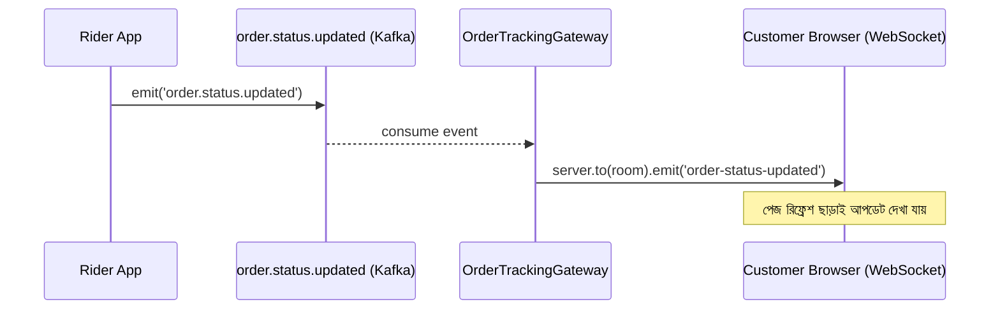

# ২৫.০৮. WebSockets in NestJS for Real-Time Applications

এতদিন আমরা যত API বানিয়েছি, সবগুলোই একটা নির্দিষ্ট প্যাটার্ন মেনে চলেছে — ক্লায়েন্ট একটা রিকোয়েস্ট পাঠায়, সার্ভার একটা রেসপন্স দেয়, কানেকশন শেষ। এই মডেলটার নাম request-response, আর HTTP প্রোটোকল মূলত এভাবেই কাজ করে। কিন্তু আমাদের ই-কমার্স প্রজেক্টের একটা বাস্তব দৃশ্য কল্পনা করো — কাস্টমার তার অর্ডার ট্র্যাকিং পেজ খুলে বসে আছে, আর ডেলিভারি রাইডার লোকেশন আপডেট করছে প্রতি কয়েক সেকেন্ডে। এখানে কাস্টমারকে বারবার রিকোয়েস্ট পাঠিয়ে "নতুন কিছু আছে কিনা" জিজ্ঞেস করানো (একে বলে polling) অপচয়মূলক আর ধীরগতির।

এর সমাধান **WebSocket** — একটা প্রোটোকল যেখানে একবার কানেকশন তৈরি হলে সেটা খোলা থেকে যায়, আর সার্ভার-ক্লায়েন্ট দুই দিক থেকেই যেকোনো সময় বার্তা পাঠাতে পারে, নতুন করে রিকোয়েস্ট ছাড়াই। এটা ফোন কলের মতো — একবার লাইন কানেক্ট হলে দুই পক্ষই যখন খুশি কথা বলতে পারে, প্রতিবার নতুন করে ডায়াল করতে হয় না।

NestJS-এ WebSocket হ্যান্ডল করার কাঠামোর নাম **Gateway**। এটা Socket.IO লাইব্রেরির উপর তৈরি (ডিফল্টভাবে), আর দেখতে অনেকটা কন্ট্রোলারের মতোই — শুধু HTTP রুটের বদলে "ইভেন্ট" শোনে।

```typescript
// order/order-tracking.gateway.ts
import {
  WebSocketGateway, WebSocketServer,
  SubscribeMessage, MessageBody, ConnectedSocket,
} from '@nestjs/websockets';
import { Server, Socket } from 'socket.io';

@WebSocketGateway({ cors: { origin: '*' } })
export class OrderTrackingGateway {
  @WebSocketServer()
  server: Server;

  @SubscribeMessage('join-order-room')
  handleJoinRoom(@MessageBody() orderId: string, @ConnectedSocket() client: Socket) {
    client.join(`order-${orderId}`); // এই অর্ডারের নির্দিষ্ট "রুমে" ঢুকলো
  }

  // Kafka থেকে আসা ইভেন্ট শুনে এই মেথডটা কল হবে (আগের লেসনের সাথে সংযোগ)
  broadcastStatusUpdate(orderId: string, status: string) {
    this.server.to(`order-${orderId}`).emit('order-status-updated', { orderId, status });
  }
}
```

এখানে `join-order-room` একটা কাস্টম ইভেন্ট, যেটা ক্লায়েন্ট পাঠাবে অর্ডার ট্র্যাকিং পেজ খোলার সাথে সাথে। এরপর যখনই রাইডারের লোকেশন বা অর্ডার স্ট্যাটাস বদলাবে, `broadcastStatusUpdate()` কল হয়ে ওই নির্দিষ্ট অর্ডারের রুমে থাকা সবাইকে বার্তা পাঠিয়ে দেবে। লক্ষ্য করো, "রুম" ব্যবহার করার কারণ হলো — আমরা চাই না অর্ডার A-এর আপডেট অর্ডার B ট্র্যাক করা কাস্টমার দেখে ফেলুক।

ফ্রন্টএন্ডে (React বা প্লেইন JS) এভাবে কানেক্ট করা হবে:

```typescript
import { io } from 'socket.io-client';

const socket = io('http://localhost:3000');
socket.emit('join-order-room', orderId);
socket.on('order-status-updated', (data) => {
  console.log(`অর্ডার ${data.orderId} এখন: ${data.status}`);
});
```



এই ডায়াগ্রামটা আগের লেসনের Kafka ইভেন্ট আর এই লেসনের WebSocket-কে একসাথে জুড়ে দিচ্ছে — একটা বাস্তব সিস্টেমে এই দুটো প্রযুক্তি প্রায়ই একসাথে কাজ করে। Kafka ব্যাকএন্ড সার্ভিসগুলোর মধ্যে যোগাযোগ সামলায়, আর WebSocket সেই খবরটা শেষ পর্যন্ত ব্রাউজারে থাকা মানুষের কাছে পৌঁছে দেয়।

রিয়েল-টাইম আপডেট তো হলো, কিন্তু প্রতিবার প্রোডাক্ট লিস্ট বা অর্ডার হিস্ট্রির মতো ডেটা ডেটাবেজ থেকে বারবার পড়া ব্যয়বহুল। Module 21-এ ডেটাবেজ ক্যাশিং নিয়ে সংক্ষেপে কথা হয়েছিলো — পরের লেসনে আমরা NestJS-এ Redis দিয়ে সেটা বাস্তবে বসাবো।
