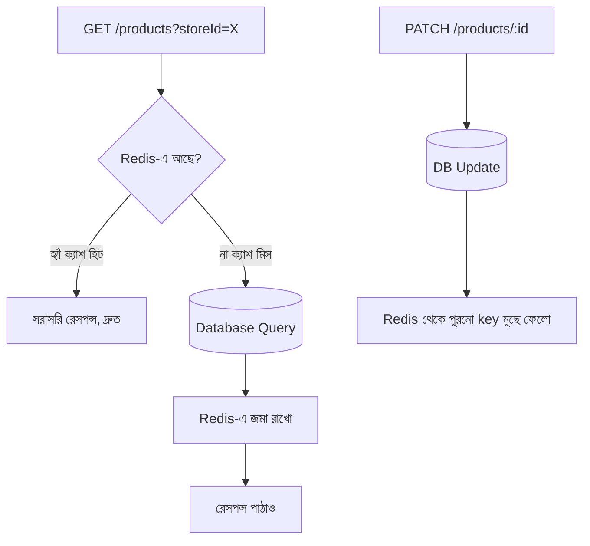

# ২৫.০৯. Caching Strategies with Redis in NestJS

Module 21-এ ডেটাবেজ ক্যাশিং স্ট্র্যাটেজি নিয়ে ধারণা দেয়া হয়েছিলো — বারবার একই কোয়েরি চালানোর বদলে ফলাফলটা কোথাও সাময়িকভাবে জমা রেখে দেয়া, যাতে পরের বার দ্রুত পাওয়া যায়। আমাদের ই-কমার্স প্রজেক্টে প্রোডাক্ট লিস্টিং পেজটাই এর সবচেয়ে ভালো উদাহরণ — হাজার হাজার কাস্টমার একই প্রোডাক্ট ক্যাটালগ দেখছে, প্রতিটা রিকোয়েস্টে ডেটাবেজে গিয়ে জয়েন-সহ কোয়েরি চালানো অপ্রয়োজনীয় চাপ তৈরি করে, যেহেতু প্রোডাক্টের তথ্য প্রতি মিনিটে বদলায় না।

**Redis** একটা in-memory ডেটা স্টোর — মানে ডেটা হার্ড ডিস্কের বদলে RAM-এ রাখে, যার ফলে পড়াশোনার গতি সাধারণ ডেটাবেজের চেয়ে বহুগুণ দ্রুত। এটাকে সাধারণত key-value স্টোর হিসেবে ব্যবহার করা হয় — একটা "চাবি" দিয়ে সরাসরি ডেটা তুলে নেয়া, জটিল কোয়েরি ছাড়াই।

NestJS-এ ক্যাশ ম্যানেজমেন্টের জন্য `@nestjs/cache-manager` প্যাকেজ আছে, যেটা Redis সহ একাধিক ক্যাশ ব্যাকএন্ড সাপোর্ট করে।

```typescript
// app.module.ts
import { CacheModule } from '@nestjs/cache-manager';
import { redisStore } from 'cache-manager-redis-yet';

@Module({
  imports: [
    CacheModule.registerAsync({
      isGlobal: true,
      useFactory: async () => ({
        store: await redisStore({ socket: { host: 'localhost', port: 6379 } }),
        ttl: 60 * 1000, // ডিফল্ট ৬০ সেকেন্ড
      }),
    }),
  ],
})
export class AppModule {}
```

এখন প্রোডাক্ট সার্ভিসে ক্যাশ ম্যানুয়ালি ব্যবহার করা যায় — প্রথমে ক্যাশে খোঁজা, না পেলে ডেটাবেজে যাওয়া, তারপর ফলাফল ক্যাশে বসিয়ে রাখা। একে বলে **cache-aside** স্ট্র্যাটেজি।

```typescript
// product/product.service.ts
@Injectable()
export class ProductService {
  constructor(
    @Inject(CACHE_MANAGER) private cache: Cache,
    private productRepo: Repository<Product>,
  ) {}

  async findAll(storeId: string) {
    const cacheKey = `products:store:${storeId}`;
    const cached = await this.cache.get<Product[]>(cacheKey);
    if (cached) return cached; // ক্যাশ হিট — ডেটাবেজে যাওয়ার দরকার নেই

    const products = await this.productRepo.find({ where: { storeId } });
    await this.cache.set(cacheKey, products, 60 * 1000); // ক্যাশ মিস — ফলাফল জমা রাখলাম
    return products;
  }

  async update(id: string, dto: UpdateProductDto) {
    const product = await this.productRepo.save({ id, ...dto });
    await this.cache.del(`products:store:${product.storeId}`); // ক্যাশ পুরনো হয়ে গেলো, মুছে ফেলো
    return product;
  }
}
```

এখানে সবচেয়ে গুরুত্বপূর্ণ অংশটা হলো `update()` মেথডে — যখনই ডেটা বদলায়, পুরনো ক্যাশ মুছে ফেলা (invalidation) হয়। এটা না করলে কাস্টমার পুরনো, ভুল দাম বা স্টক দেখতে পারে। ক্যাশিং নিয়ে একটা প্রচলিত কথা আছে প্রোগ্রামিং-এ — "ক্যাশ ইনভ্যালিডেশন" কম্পিউটার সায়েন্সের সবচেয়ে কঠিন দুইটা সমস্যার একটা, কারণ কখন ডেটা "বাসি" হয়ে গেছে সেটা সঠিকভাবে ট্র্যাক করা সহজ নয়।



Redis শুধু ক্যাশিং না, সেশন স্টোর, রেট লিমিটার কাউন্টার, এমনকি Module 25-এর ৭ নম্বর লেসনে দেখা ইভেন্ট সিস্টেমের একটা হালকা বিকল্প (Pub/Sub) হিসেবেও ব্যবহার করা যায় — কিন্তু আপাতত ক্যাশিং-ই আমাদের সবচেয়ে জরুরি প্রয়োজন, কারণ এটা সরাসরি প্রোডাক্ট লিস্টিং পেজের গতি বাড়িয়ে দেয়।

এখন প্রশ্ন হলো — আমাদের পুরো ই-কমার্স সিস্টেমটা (order, product, notification, inventory) কি একটাই বিশাল অ্যাপ্লিকেশন হিসেবে থাকা উচিত, নাকি আলাদা আলাদা ছোট সার্ভিসে ভাগ করে দেয়া উচিত? পরের লেসনে আমরা Microservices Architecture নিয়ে কথা বলবো।
