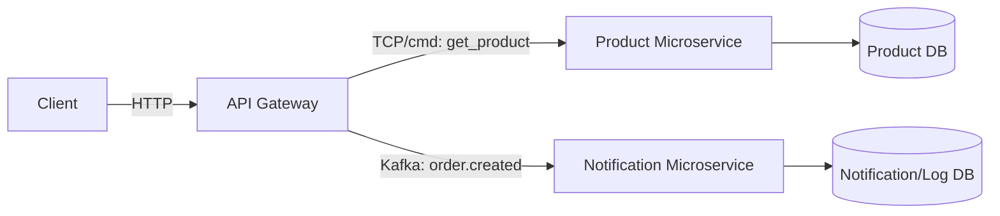

# ২৫.১০. Microservices Architecture in NestJS

এতদিন আমরা যা বানিয়েছি সেটাকে বলে **Monolith** — একটাই অ্যাপ্লিকেশন, একটাই কোডবেজ, একটাই ডিপ্লয়মেন্ট, যার ভেতরে সুপার অ্যাডমিন, সাবস্ক্রিপশন, স্টোর, প্রোডাক্ট — সব মডিউল একসাথে থাকে। Module 23-এ শেখা NestJS-এর মডিউল সিস্টেম এই monolith-এর ভেতরেও কোডকে সুন্দরভাবে আলাদা রাখতে সাহায্য করেছে। কিন্তু একটা প্রশ্ন স্বাভাবিকভাবেই আসে — যখন প্রজেক্ট আরও বড় হবে, একটা বড় টিম একসাথে কাজ করবে, তখন কি পুরো জিনিসটা একসাথে ডিপ্লয় করাই ভালো, নাকি আলাদা আলাদা সার্ভিসে ভাগ করা উচিত?

**Microservices Architecture**-এ পুরো সিস্টেমকে ছোট ছোট, স্বাধীনভাবে চলা সার্ভিসে ভাগ করে ফেলা হয় — যেমন একটা `OrderService`, একটা `ProductService`, একটা `NotificationService` — প্রতিটা নিজের ডেটাবেজ, নিজের ডিপ্লয়মেন্ট, নিজের স্কেলিং নিয়ে আলাদাভাবে চলে। এটা অনেকটা একটা রেস্তোরাঁর কিচেনকে ভাগ ভাগ স্টেশনে ভাগ করার মতো — একজন শুধু গ্রিল সামলায়, একজন শুধু সালাদ, একজন শুধু ডেজার্ট। প্রতিটা স্টেশন স্বাধীন, কিন্তু একটা অর্ডার সম্পূর্ণ করতে সবাইকে সমন্বয় করে কাজ করতে হয়।

NestJS-এ মাইক্রোসার্ভিস বানানোর জন্য `@nestjs/microservices` প্যাকেজ ব্যবহার করা হয় (Module 25-এর ৭ নম্বর লেসনে Kafka দিয়ে আমরা এর একটা ঝলক দেখেছিলাম)। একটা মাইক্রোসার্ভিস সাধারণ HTTP-এর বদলে TCP, Kafka, RabbitMQ বা Redis-এর মতো ট্রান্সপোর্ট লেয়ারে চলতে পারে।

```typescript
// product-service/main.ts — এটা এখন একটা আলাদা, স্বাধীন অ্যাপ্লিকেশন
import { NestFactory } from '@nestjs/core';
import { Transport } from '@nestjs/microservices';
import { AppModule } from './app.module';

async function bootstrap() {
  const app = await NestFactory.createMicroservice(AppModule, {
    transport: Transport.TCP,
    options: { host: '0.0.0.0', port: 4001 },
  });
  await app.listen();
}
bootstrap();
```

```typescript
// product-service/product.controller.ts
@Controller()
export class ProductController {
  @MessagePattern({ cmd: 'get_product' })
  getProduct(@Payload() id: string) {
    return this.productService.findOne(id);
  }
}
```

আর যে সার্ভিসটা মূল API গেটওয়ে হিসেবে কাজ করে (যেখানে কাস্টমার সরাসরি রিকোয়েস্ট পাঠায়), সেটা এই মাইক্রোসার্ভিসকে কল করবে ঠিক যেভাবে সে নিজের কোনো লোকাল সার্ভিস কল করতো।

```typescript
// api-gateway/order.service.ts
@Injectable()
export class OrderService {
  constructor(@Inject('PRODUCT_SERVICE') private productClient: ClientProxy) {}

  async createOrder(dto: CreateOrderDto) {
    const product = await firstValueFrom(
      this.productClient.send({ cmd: 'get_product' }, dto.productId),
    );
    if (product.stock < dto.quantity) throw new BadRequestException('স্টক নেই');
    // ... অর্ডার তৈরি
  }
}
```



মাইক্রোসার্ভিস আর্কিটেকচারের সুবিধা স্পষ্ট — প্রতিটা টিম স্বাধীনভাবে নিজের সার্ভিস ডেভেলপ, টেস্ট, ডিপ্লয় করতে পারে; একটা সার্ভিস ক্র্যাশ করলে পুরো সিস্টেম বন্ধ হয় না; আর যে সার্ভিসে বেশি লোড আসে (ধরো, প্রোডাক্ট সার্চ) সেটাকে আলাদাভাবে স্কেল করা যায়, পুরো অ্যাপ্লিকেশন স্কেল করার দরকার নেই। কিন্তু দাম দিতে হয় জটিলতায় — নেটওয়ার্ক কল ব্যর্থ হতে পারে, ডেটা কনসিস্টেন্সি সামলানো কঠিন, ডিবাগিং করতে একাধিক সার্ভিসের লগ একসাথে দেখতে হয়। তাই ছোট বা মাঝারি প্রজেক্টে monolith-ই যথেষ্ট এবং বাস্তবসম্মত — আমাদের Module 24-এর ই-কমার্স প্রজেক্টও সেই যুক্তিতেই একটা সুগঠিত monolith হিসেবে শুরু হয়েছিলো, যেটাকে দরকার হলে ভবিষ্যতে ধাপে ধাপে মাইক্রোসার্ভিসে ভাঙা যায়।

এখন প্রশ্ন হলো, আমরা যেভাবেই আর্কিটেকচার সাজাই না কেন — monolith বা মাইক্রোসার্ভিস — একটা প্রজেক্টকে সত্যিকারের বড় স্কেলে চালানোর জন্য কোড অর্গানাইজেশন, এনভায়রনমেন্ট কনফিগারেশন, আর গ্রেসফুল গ্রোথের পরিকল্পনা দরকার। পরের লেসনে আমরা ঠিক সেই বিষয়টা নিয়ে কথা বলবো — কীভাবে একটা NestJS প্রজেক্টকে স্কেলযোগ্য করে বানানো হয়।
