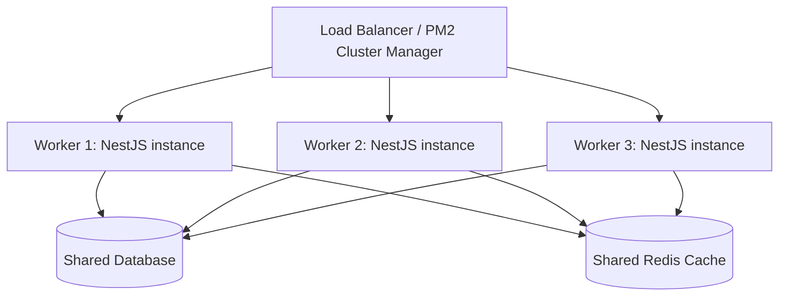

# ২৫.১১. Building a Scalable Project with NestJS

আমরা এই মডিউলে একে একে JWT অথেন্টিকেশন, RBAC, এরর হ্যান্ডলিং, ভার্সনিং, রেট লিমিটিং, টেস্টিং, Kafka, WebSocket, Redis ক্যাশিং, আর মাইক্রোসার্ভিসের ধারণা যোগ করেছি আমাদের Module 24-এর ই-কমার্স প্রজেক্টে। এখন সময় এসেছে থেমে পেছনে তাকানোর — এই সব টুকরো একসাথে জুড়ে একটা **স্কেলযোগ্য** প্রজেক্ট গঠন আসলে কেমন দেখতে হয়?

"স্কেলযোগ্য" শব্দটার দুইটা মানে আছে, দুটোই সমান গুরুত্বপূর্ণ। একটা হলো টেকনিক্যাল স্কেলিং — বেশি ইউজার, বেশি রিকোয়েস্ট সামলানো। আরেকটা হলো টিম স্কেলিং — বেশি ডেভেলপার একসাথে কাজ করলেও কোডবেজ গোলমেলে না হয়ে যাওয়া। দুটোই ফোল্ডার স্ট্রাকচার আর কনফিগারেশনের সিদ্ধান্তের উপর নির্ভর করে।

একটা প্রফেশনাল, স্কেলযোগ্য NestJS প্রজেক্টের ফোল্ডার স্ট্রাকচার সাধারণত এমন হয়, যেখানে প্রতিটা ব্যবসায়িক ডোমেইন (feature) নিজের মডিউলে সম্পূর্ণভাবে থাকে, আর common/shared জিনিস আলাদা।

```
src/
  common/
    decorators/       (@Roles, @CurrentUser)
    filters/          (AllExceptionsFilter)
    guards/           (RolesGuard)
    interceptors/     (TransformInterceptor, LoggingInterceptor)
    middleware/        (RequestLoggerMiddleware)
  config/
    database.config.ts
    app.config.ts
  modules/
    auth/
    users/
    store/
    product/
    subscription/
    order/
    notification/
  main.ts
  app.module.ts
```

এই স্ট্রাকচারটা Module 24-এ আমরা যেভাবে ধাপে ধাপে সাবস্ক্রিপশন, স্টোর, প্রোডাক্ট মডিউল বানিয়েছিলাম তারই স্বাভাবিক বিবর্তন — শুধু এখন `common/` আর `config/` আলাদা করে সাজানো হয়েছে, যাতে নতুন কেউ প্রজেক্টে যোগ দিলে দ্রুত বুঝতে পারে কোথায় কী খুঁজতে হবে।

কনফিগারেশন ম্যানেজমেন্টও স্কেলিং-এর একটা বড় অংশ — হার্ডকোড করা মান (যেমন ডেটাবেজ পাসওয়ার্ড, JWT সিক্রেট) কখনোই সোর্স কোডে থাকা উচিত না। NestJS-এর `@nestjs/config` প্যাকেজ দিয়ে এনভায়রনমেন্ট ভিত্তিক কনফিগারেশন সাজানো হয়।

```typescript
// config/app.config.ts
import { registerAs } from '@nestjs/config';

export default registerAs('app', () => ({
  port: parseInt(process.env.PORT, 10) || 3000,
  jwtSecret: process.env.JWT_SECRET,
  redisHost: process.env.REDIS_HOST || 'localhost',
}));
```

```typescript
// app.module.ts
@Module({
  imports: [
    ConfigModule.forRoot({ isGlobal: true, load: [appConfig] }),
    // ...
  ],
})
export class AppModule {}
```

পারফরম্যান্স স্কেলিং-এর জন্য Node.js-এর একটা সীমাবদ্ধতা মাথায় রাখা দরকার, যেটা Module 5-এ শিখেছিলে — Node.js সিঙ্গেল-থ্রেডেড। তার মানে একটা মাত্র প্রসেস দিয়ে CPU-এর সবগুলো কোর ব্যবহার হয় না। এই সীমাবদ্ধতা কাটানোর জন্য প্রোডাকশনে **PM2** বা Node-এর নিজস্ব `cluster` মডিউল দিয়ে একই অ্যাপ্লিকেশনের একাধিক ইনস্ট্যান্স (worker) চালানো হয়, প্রতিটা আলাদা CPU কোরে।



লক্ষ্য করো, প্রতিটা worker আলাদা প্রসেস হলেও তারা একই ডেটাবেজ আর একই Redis শেয়ার করে — এই কারণেই আগের লেসনে Redis-ভিত্তিক ক্যাশিং গুরুত্বপূর্ণ, কারণ যদি প্রতিটা worker নিজের আলাদা in-memory ক্যাশ রাখতো, তাহলে একটা worker-এ ডেটা আপডেট হলে অন্য worker-এর ক্যাশ পুরনো থেকে যেতো।

এখন আমাদের প্রজেক্ট কোড স্তরে গোছানো, কনফিগারেশন-নিরাপদ, আর একাধিক ইনস্ট্যান্সে চলার উপযোগী। শেষ ধাপ বাকি — এই কোডটাকে আসলে একটা সার্ভারে তুলে, পাবলিক ইন্টারনেটে জীবন্ত করা। পরের এবং এই মডিউলের শেষ লেসনে আমরা NestJS অ্যাপ্লিকেশন প্রোডাকশনে ডিপ্লয় করার প্রক্রিয়া দেখবো।
