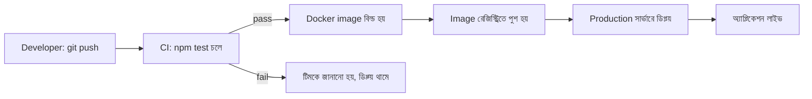

# ২৫.১২. Deploying a NestJS Application to Production

আমাদের Module 24-এ শুরু হওয়া ই-কমার্স প্রজেক্টের যাত্রা এখানে একটা গুরুত্বপূর্ণ মাইলফলকে পৌঁছাচ্ছে — এখন পর্যন্ত সবকিছু আমাদের নিজের কম্পিউটারে (localhost) চলেছে। কিন্তু একটা প্রজেক্ট ততক্ষণ পর্যন্ত "সত্যিকারের প্রোডাক্ট" না, যতক্ষণ না সেটা ইন্টারনেটে থাকা মানুষ ব্যবহার করতে পারে। Module 2-তে ক্লাউডে একটা সাধারণ Node.js সার্ভার ডিপ্লয় করা শিখেছিলে — এখন আমরা সেই একই ধারণাটা একটা পূর্ণাঙ্গ, প্রোডাকশন-গ্রেড NestJS অ্যাপ্লিকেশনের জন্য প্রয়োগ করবো।

প্রথম ধাপ — **Docker**। প্রোডাকশনে ডিপ্লয় করার সবচেয়ে নির্ভরযোগ্য পদ্ধতি হলো অ্যাপ্লিকেশনকে একটা "কন্টেইনারে" প্যাক করা, যাতে ডেভেলপারের কম্পিউটারে যা চলে, সার্ভারেও ঠিক একইভাবে চলে — কোনো "আমার মেশিনে তো কাজ করছিলো" সমস্যা থাকে না।

```dockerfile
# Dockerfile
FROM node:20-alpine AS build
WORKDIR /app
COPY package*.json ./
RUN npm ci
COPY . .
RUN npm run build

FROM node:20-alpine
WORKDIR /app
COPY --from=build /app/dist ./dist
COPY --from=build /app/node_modules ./node_modules
COPY package*.json ./
EXPOSE 3000
CMD ["node", "dist/main.js"]
```

এখানে **multi-stage build** ব্যবহার করা হয়েছে — প্রথম স্টেজে TypeScript কোড কম্পাইল করে জাভাস্ক্রিপ্টে রূপান্তর করা হচ্ছে, দ্বিতীয় স্টেজে শুধু কম্পাইল হওয়া ফাইল আর প্রয়োজনীয় ডিপেন্ডেন্সি রাখা হচ্ছে — এতে ফাইনাল ইমেজের সাইজ ছোট থাকে, যা ডিপ্লয়মেন্টকে দ্রুত করে।

আমাদের প্রজেক্ট শুধু NestJS অ্যাপ না — সাথে PostgreSQL ডেটাবেজ, Redis ক্যাশ, আর Kafka ব্রোকারও লাগবে (আগের লেসনগুলোতে যোগ করা)। `docker-compose` দিয়ে পুরো সিস্টেমটা একসাথে চালানো যায়।

```yaml
# docker-compose.yml
services:
  api:
    build: .
    ports: ["3000:3000"]
    env_file: .env
    depends_on: [postgres, redis]
  postgres:
    image: postgres:16
    environment:
      POSTGRES_DB: ecommerce
      POSTGRES_PASSWORD: ${DB_PASSWORD}
    volumes: ["pgdata:/var/lib/postgresql/data"]
  redis:
    image: redis:7-alpine
volumes:
  pgdata:
```

এরপর একটা **CI/CD pipeline** — যেখানে কোড GitHub-এ পুশ করার সাথে সাথে স্বয়ংক্রিয়ভাবে টেস্ট (আগের লেসনের Jest টেস্ট) চলে, তারপর বিল্ড হয়, তারপর সার্ভারে ডিপ্লয় হয়ে যায় — মানুষ হাতে কিছু না করেই। এটা Module 37-এ Git বিস্তারিতভাবে শেখার পরে আরও পরিষ্কার হবে, কিন্তু মূল ধারণাটা এখনই বোঝা দরকার।



প্রোডাকশনে আরও কিছু বিষয় মাথায় রাখতে হয় — HTTPS দিয়ে ট্রাফিক এনক্রিপ্ট করা (Module 21-এর এনক্রিপশন ধারণার সাথে সংযুক্ত), এনভায়রনমেন্ট ভ্যারিয়েবল দিয়ে সিক্রেট আলাদা রাখা (আগের লেসনে দেখা `ConfigModule`), আর হেলথ-চেক এন্ডপয়েন্ট রাখা যাতে লোড ব্যালেন্সার বুঝতে পারে সার্ভার জীবিত আছে কিনা।

```typescript
// health/health.controller.ts
@Controller('health')
export class HealthController {
  @Get()
  check() {
    return { status: 'ok', timestamp: new Date().toISOString() };
  }
}
```

এই লেসন দিয়ে আমাদের NestJS Advanced মডিউল শেষ হলো — routing/middleware থেকে শুরু করে authentication, RBAC, error handling, versioning, testing, event-driven architecture, WebSocket, caching, microservices, scalability, আর শেষে deployment পর্যন্ত, পুরো একটা enterprise-grade ব্যাকএন্ড সিস্টেম বানানোর সম্পূর্ণ পথ পাড়ি দেয়া হলো। কিন্তু আমাদের API আরও উন্নত করার জায়গা এখনও বাকি — এখন পর্যন্ত আমরা মূলত GET আর POST নিয়ে কাজ করেছি বেশি। পরের মডিউলে আমরা ফিরে যাবো POST রিকোয়েস্ট আর ফাইল আপলোডের খুঁটিনাটি নিয়ে, আরও গভীরভাবে।
